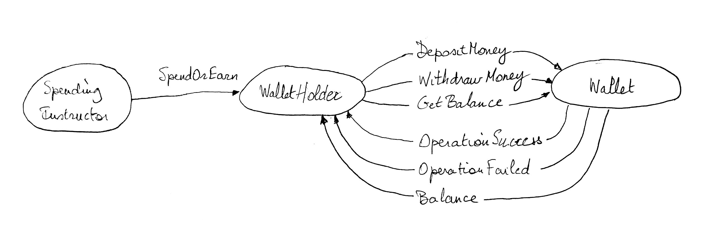
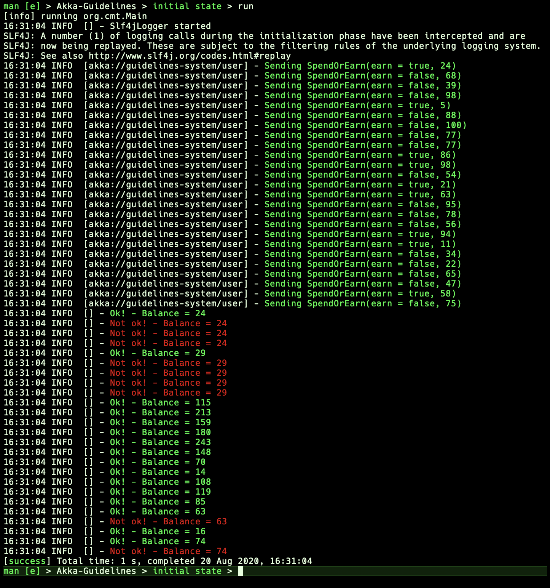

## Introduction 

The Phoenix project uses Akka with Scala extensively. More precisely, it utilises
the _Akka Typed_ library, which allows developers to build Akka Actor based code
that is strictly typed checked.

Some of the benefits of building an actor based application using _Akka Typed_ are:

- An actor's protocol and the corresponding messages can be encoded in a formal
  way. This makes it easier for a developer to write code that enforces the 
  protocol: the Scala compiler will not compile code that attempt to send
  messages to an actor that are not part of the protocol of that actor. 
  Also, the formal definition of the protocol makes it easy for anyone who
  is reading an _Akka Typed_ based actor implementation
- The biggest benefit of having an _Akka Typed_ based actor implementation is
  that any refactoring of the code can be done with great confidence: the Scala
  compiler has your back covered!
- All of the important supplementary Akka functionality such as Akka Cluster (
  which includes Akka Cluster Singleton, Akka Cluster Sharding, etc.), Akka
  Persistence, etc. now have an _Akka Typed_ API. In general, these API are
  much easier and simple compared to the corresponding implementations in
  _Akka Typed_'s predecessor which is Akka Classic 

### _Akka Typed_ - FP versus OOP style

_Akka Typed_ leaves some choice in how you implement an Actor. For starters,
_Akka Typed_ gives you the option to use a 
[Functional Programming (FP) style](https://doc.akka.io/docs/akka/current/typed/actors.html#functional-style)
or an
[Object Oriented (OOP) style](https://doc.akka.io/docs/akka/current/typed/actors.html#object-oriented-style).

_In the Phoenix project the choice was made to exclusively use the FP style._

### FP Actor Coding guidelines

After having opted for the FP style, it makes sense to try to adhere to a set
of coding guidelines as these will give the actor code a uniform and easy to
"recognise" style and organisation.

### Defining an Actor's protocol

In general, the messages defined in an actor's protocol can be divided in
logical groups:

- _Commands_: these messages define the "language" of an actor. In other words,
  one can see them as the "public interface" on an actor.
- _Responses_: these are the messages that an actor can send in response to
  a received message.
- depending on the type of the actor, some other messages may come into play.
  For example, a Persistent actor will have a certain number of _Events_
  messages that can also be considered to be part of its protocol

One of the best practices of coding up an actor's protocol is to put it in
a [companion] Scala object and to use _Scala_ sealed traits to encode them
as a so-called [Algebraic data type](https://en.wikipedia.org/wiki/Algebraic_data_type) (ADT).

Let's illustrate this with an example. Let's look at two actors that model
a wallet (actor `Wallet`) and a user that owns that wallet (actor `WalletHolder`).
We will also have an entity that instructs the wallet owner to randomly deposit
or withdraw money to or from the wallet. The following sketch illustrates the
different actors and the flow of messages between them. 



A sample run of such a system may look as follows:



Let's look at the protocols for the `Wallet` and `WalletHolder` actors.

#### The `Wallet` protocol definition

```
object Wallet {
  type Decimal = BigDecimal

  // Wallet protocol
  // Wallet commands
  sealed trait Command
  final case class DepositMoney(amount: Decimal, replyTo: ActorRef[Wallet.Response])
    extends Command
  final case class WithdrawMoney(amount: Decimal, replyTo: ActorRef[Wallet.Response])
    extends Command
  case class GetBalance(replyTo: ActorRef[Wallet.Response])
    extends Command

  // Wallet Responses
  sealed trait Response
  final case class Balance(balance: Decimal)
    extends Response
  final case class OperationSuccess(balance: Decimal)
    extends Response
  final case class OperationFailed(balance: Decimal)
    extends Response
}
```
#### The `WalletHolder` protocol definition

```
object WalletHolder {
  // My Protocol
  // Commands
  sealed trait Command
  final case class SpendOrEarn(earn: Boolean, amount: Decimal)
    extends Command

  // Responses - We're not responding, so this is empty...
}
```

#### Note:

In case we are dealing with a Persistent actor, we also need to define some
Events in a similar way:

```
object Wallet {
  ...
  
  // Wallet Events
  sealed trait Event
  final case class MoneyDeposited(amount: Decimal)
    extends Command
  final case class MoneyWithdraw(amount: Decimal)
    extends Command
}
```

That completes the section on defining an actor's protocol. However, for the sake
of completeness, we took a bit of a shortcut while using terminology: we mixed
to concept _protocol_ with the _messages_ that are used to define the true
protocol. The latter defines the _allowable_ flow of messages. For example, sending
a `WithdrawMoney` message to the `Wallet` actor can result in two scenarios:

- The requested amount to withdraw exceeds the balance, in which case, the
  withdrawal doesn't happen and an `OperationFailed` message is sent in reponse
  to the request
- There's enough money in the wallet, the balance is updated and an
  `OperationSuccess` is sent back to the requestor

### Handling responses in Akka Typed

If we want to handle responses from an Actor to which we sent a message, we face
an interesting problem: the message cannot be sent by the responding Actor with
the protocol definition listed in the previous section, as it is not part
of the set of messages that the receiving actor "understands"...

Akka Typed gives us a solution for this problem: We extend the actor's
internal protocol so that includes the response messages while at the same
time preserving the actor's public protocol. This solution unfortunately has to
work around a limitation of the Scala Type inference system and this results in
the introductions of _message adapters_ and _message wrappers_.

Compared with Akka Classic, Akka Typed necessitates another fundamental change: in
Akka Classic, we had the convenient `sender` method, that returned the `ActorRef`
of the actor that sent the message that is currently processed. There is no longer
a `sender` method in Akka Typed. Hence, in Akka Typed, if we want a response
from an Actor, we need to send our own `ActorRef` as part of the message.

With all this said, we can look at some code that apply what we said above.

#### Sending a reponse to a message in a receiving actor

Let's look at the `Wallet` actor who's on the "receiving side" of a 2-actor
message exchange. Using
[the `Wallet` protocol definition](#the-wallet-protocol-definition) as listed
above, we can see how, for example, a `WithDrawMoney` message is handled:

```
Behaviors.receiveMessage {
  case WithdrawMoney(amount, replyTo) =>
    if (amount <= balance) {
      val newBalance = balance - amount
      replyTo ! OperationSuccess(newBalance)
      running(newBalance)
    }
    else {
      replyTo ! OperationFailed(balance)
      Behaviors.same
    }
  case ... => ... // Other messages
```

Remember that `replyTo`'s type is `ActorRef[Wallet.Response]`, in other words,
when sending a message to the `Wallet` actor, the sending actor should pass an
`ActorRef` of that type in the `replyTo` field of the message.

#### Receiving a response to a message

In the receiving actor, we need to make some changes that will extend the
actor's internal protocol.

The modified protocol looks as follows:

```
object WalletHolder {
  // My Protocol
  // Commands
  sealed trait Command
  final case class SpendOrEarn(earn: Boolean, amount: Decimal)
    extends Command
  // Response wrappers
  private final case class WalletResponseWrapper(response: Wallet.Response)
    extends Command

  // Responses - We're not responding, so this is empty...
}
```

We see that a _private_ `WalletResponseWrapper` message  was added which has
a single field `resonse` of type `Wallet.Response` that _wraps_ the response.
Marking the message as _private_ ensures that we don't extends the `WalletHolder`'s
protocol.

In the `WalletHolder` actor's implementation, we have the following code
(reduced to its essence to illustrate the key concepts described in this
paragraph):

```
class WalletHolder private (context: ActorContext[WalletHolder.Command],
                            wallet: ActorRef[Wallet.Command]) {

  private val walletResponseAdapter: ActorRef[Wallet.Response] =
    context.messageAdapter(walletResponse => WalletResponseWrapper(walletResponse))

  def operational(): Behavior[WalletHolder.Command] =
    Behaviors.receiveMessage {
      case SpendOrEarn(true, amount) =>
        wallet ! Wallet.DepositMoney(amount, walletResponseAdapter)
        Behaviors.same
      case WalletResponseWrapper(walletResponse) =>
        walletResponse match {
          case Wallet.OperationSuccess(balance) =>
            log.info("Ok! - Balance = {}", balance)
            Behaviors.same
          case Wallet.OperationFailed(balance) =>
            log.info("Not ok! - Balance = {}", balance)
            Behaviors.same
          case Wallet.Balance(balance) =>
            log.info("New Balance = {}", balance)
            Behaviors.same
        }
    }
}
```

The key take-aways from this code are:

- we use the `messageAdapter` method available on the actor's `context` to
  generate an `ActorRef` of the desired type (`Wallet.Response`), as pass
  it a function that transforms the response into a wrapped response
- we pass the message adapter (`walletResponseAdapter`) in the `replyTo`
  field of the message to be sent (`wallet ! Wallet.DepositMoney(amount, walletResponseAdapter)`)
- the handling of the reponse is done in two steps:
  - we pattern match on the wrapped response to extract the actual response
  - using the actual response, we can pattern match to match the different
    types of response messages
  
  
### Adding an Actor Factory

 
