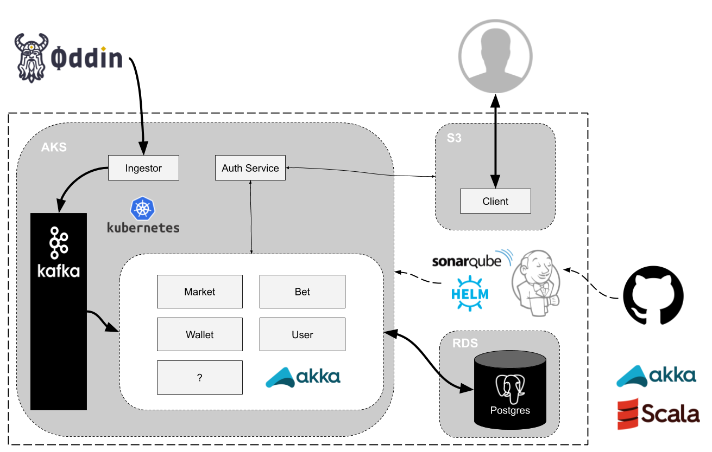

## First Phase

This aim of this page is to introduce you to the high-level design of the E-Sports Betting platform that will be delivered in the 'first phase' of the project (due for delivery on Jan 1st, 2021).

### Overview

The current design looks like this:

 
 
* A single Akka Cluster provides the application layer on which several Bounded Contexts are deployed. 
* The Akka cluster is deployed onto a Kubernetes cluster.
* Akka Persistence JDBC allows persistent Actors to read/write events to from Postgres
* Postgres is provided by an AWS RDS managed instance.
* Kafka is used to provide a durable messaging layer primarily for data incoming from our data supplier, Oddin.
* Data from Oddin is received via a separate Akka Streams application which runs on Kubernetes but outside the main application cluster.
* CI/CD Pipeline builds, tests, scans code and delivers built images to Kubernetes via Helm charts.
