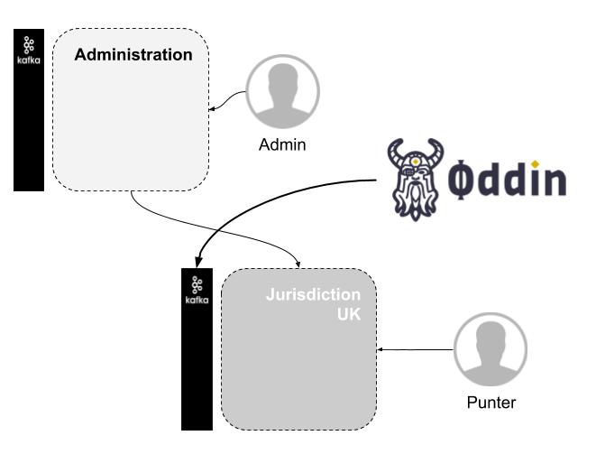
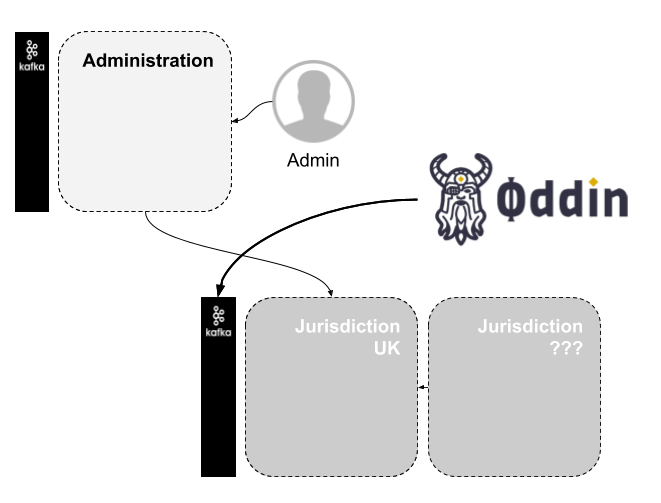
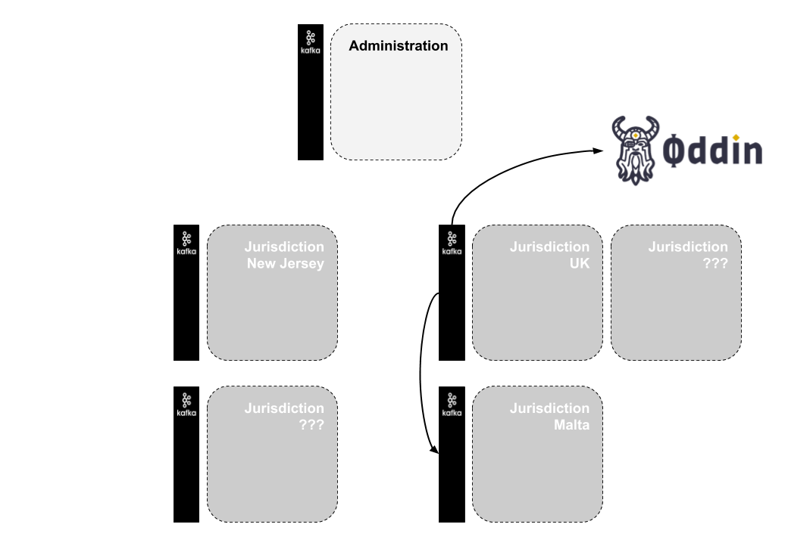
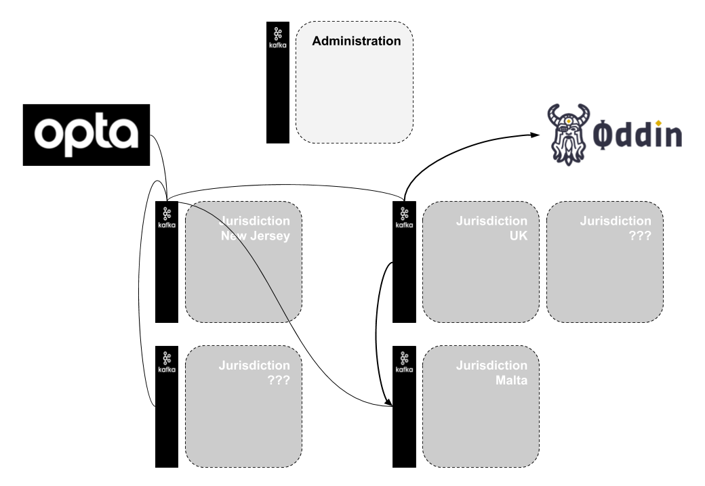

## Beyond MVP

Beyond Jan '21 the E-Sports platform will be required to support more features:

* Multiple instances of the system deployed in different geographical regions due to regulatory requirements in local jurisdictions.
* Single access point for administration (Customer Services, Traders, etc) abstracting the multiple deployments to provide back-office staff with a single view on the entire system.
* Data for Odds, Fixtures, etc, cannot be consumed by every Jurisdiction independently.

### Jurisdictions

To accommodate these requirements we plan to take what has been built in the first phase and establish that as the deployable unit for what we will refer to in future as a __Jurisdiction__.

A Jurisdiction:

* Is a self-contained deployment - it has everything it needs to provide the necessary services to players.
* Is isolated from all other Jurisdictions.
* Can be deployed into a single Kubernetes namespace.

### Administration Cluster

In order to administer these multiple jurisdictions we have a new deployable unit - the Adminstration Cluster.

The Administration Cluster provides services for back-office staff, e.g.:

* Customer Services representatives can interact directly with any customer in any jurisdiction.
* Traders can trade any market in any jurisdiction.
* Business can access aggregated reports that are capable of encompassing any combination of (or all) jurisdictions.

## Step-by-Step

### Step 1

Building up this overview step-by-step we can start with a single Jurisdiction and the single Adminstration Cluster:

 
* Punters connect directly to the Jurisdiction Cluster.
* Back-Office staff connect directly to the Administration Cluster.
* Oddin data is being ingested by this single Jurisdiction.

### Step 2

A Second Jurisdiction can be deployed in the same geographical region (perhaps the same AWS account, or even the same Kubernetes cluster) as the first, consuming the same data.

### Step 3

More Jurisdiction Clusters can be deployed in different geographical regions, each operating independently of each other but each accessible from the central Administration Cluster.

### Step 4

Allowing these other Jurisdiction Clusters to share data is then a matter of mirroring topics from the Kafka cluster belonging to the Jurisdiction which is the source of the data to the other Jurisdictions. This in no way impacts the Jurisdiction operations, it's merely a matter of configuring Mirror Maker appropriately in each Jurisdiction Cluster.
