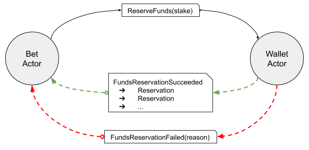

## Overview

When placing a Bet a portion of the Customer's current Wallet balance must be reserved to cover the liability of the bet. For a `Back` bet this liability is the stake the Customer is setting for the Bet. 

However, because of the various promotional activities on a betting site (Bonus funds, free bets, etc) It is not as straightforward as we might hope to calculate the liability, reserve funds and settle the Bet appropriately.

The process described here supports all the known use-cases.

## The Process

The process of reserving funds for a Bet involves both the Bet and Wallet entities to co-operate.

Funds must be reserved from the Wallet. The process of reserving funds involves:

* The Wallet entity calculating how the requested amount will be made up from the available types of funds available in the Wallet.
* The calculated funds being transferred from the Wallet into the Bet entity.

The `Bet` sends a `ReserveFunds` command to the `Wallet` which responds with either a `ReserveFundsFailure` response or a `ReserveFundsSuccess` response which contains a `FundsReservation` object (described below.)

> ### Fund Types
>
> The Wallet consists of several balances:
>
> * The usual/expected `Real Money` balance, which represents funds which have been deposited into the Wallet by the Customer.
> * There are also `Bonus Funds` which are deposited into the Customer Wallet by a Brand and which are available for betting but may not be withdrawn until some rule has been met (some turnover of `Bonus Funds` in the Wallet, for instance)

### Reservation

The `FundsReservation` object is essentially a `Set[Reservation]`.

Each `Reservation` in the set represents the fraction of the total stake which is represented by a specific currency.

So, `Reservation` looks like:

| Property | Type             | Description                                                |
|----------|------------------|------------------------------------------------------------|
| currency | Enum             | The type of currency this Reservation represents           |
| amount   | BigDecimal(11,2) | The amount of this type of currency represented in the Bet |

When a `Reservation` has been supplied by a Wallet the funds are removed from the Wallet. They are transferred to the requesting entity (the Bet in this case) and must be managed by the requesting Entity from that point forward.