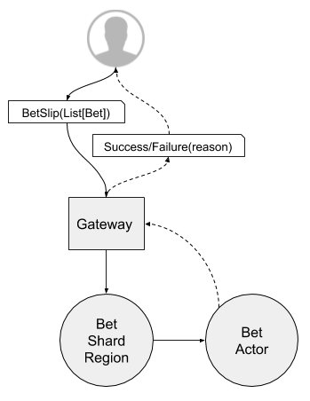
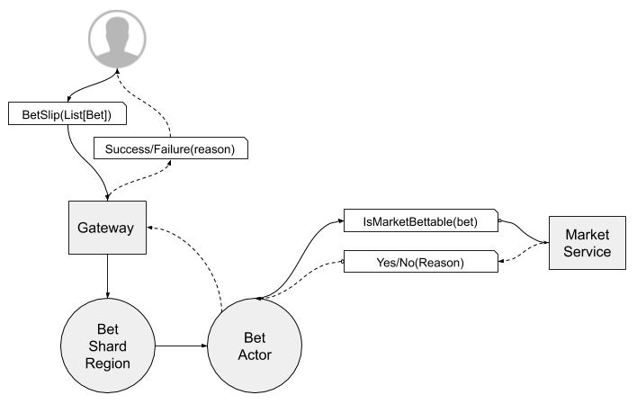
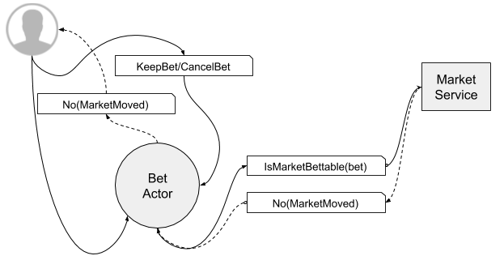
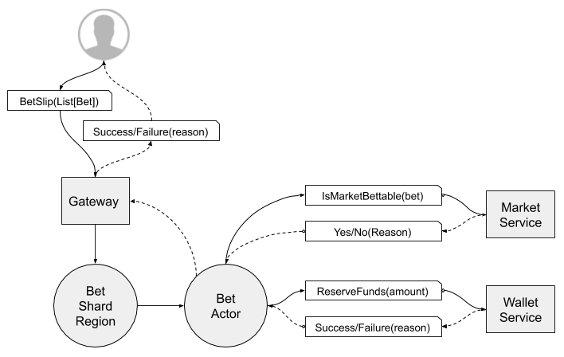
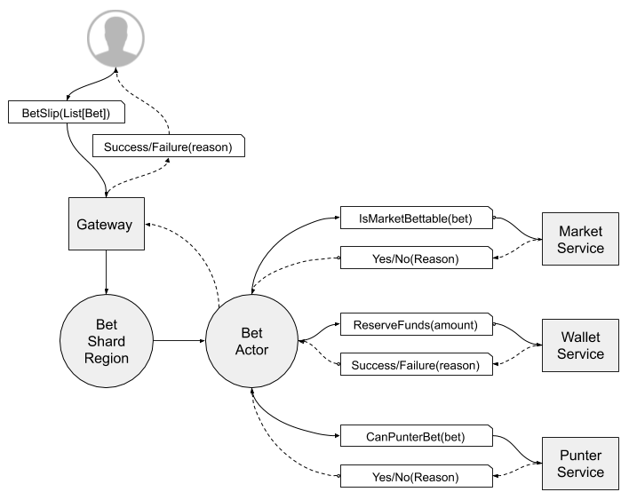
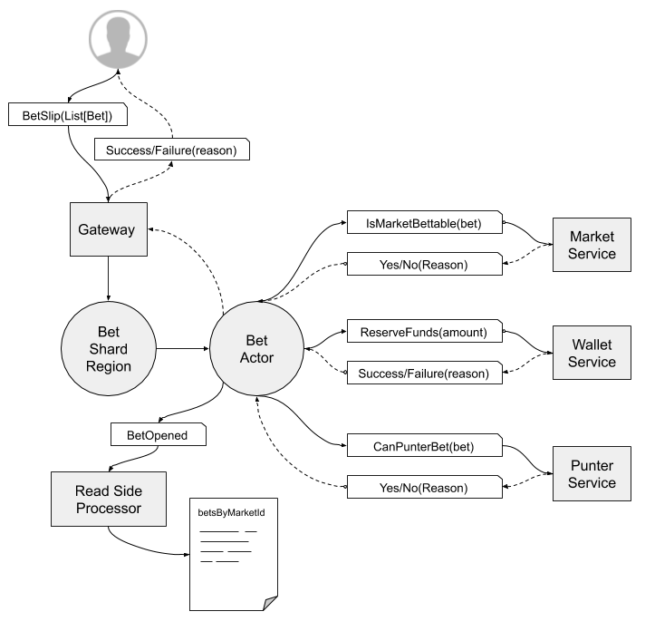

## Placing Bets

Key to the operation of the platform is the ability for Punters to place Bets on Markets.

## Step-by-step

Bet placement works as follows:

### Step 1 - Accepting a Bet

A Punter requests a Bet is placed by sending a Betslip. 

> A `Betslip` is merely a `List[Bet]` at this point.

The system creates a new Persistent 'Bet' Actor in a `Pending` state and responds to the Punter to acknowledge the Bet request has been received and is now persisted in the system.

> The following steps (2,3,4) happen in parellel.

### Step 2a - Checking the Market

In order to establish if the Bet can be placed the system needs to check with the Market.

If:

* Requested Odds for the Selection has changed

The Punter needs to be made aware of the odds movement and asked if he/she wants to continue, accepting the new odds.

If the Punter accepts the new odds the system needs to check again with the Market for a odds change during the interaction with the Punter.

If:

* The Market is frozen.
* The Market has been capped for exposure and this Bet would over-expose the Operator on the Market

The Bet will be refused - the Punter will be provided with a meaningul message explaining the reason for the refusal.

### Step 2b - Reserving Funds

While the Market is being checked we also request that the Punter's Wallet transfer the funds to the Brand wallet.

If the Punter doesn't have enough funds in their Wallet the Bet fails and the Punter is informed of the reason.

### Step 2c - Checking the Punter

While the Market and Wallet are being checked we also check with the Punter themselves. We must confirm that the Punter:

* Is allowed to bet
  * They haven't self-excluded via Gamstop
  * They aren't in a Timeout period
* Is allowed to bet the required stake - there are no capped limits on their account.

### Step 3 - Opening the Bet

If all 3 checks in Step 2 are successful the Bet is placed into the `Open` state where it will remain until it is completed by either a Result on the Market the bet is related to or there's a reason to Void/Cancel the Bet.

### Step 4 - Recording the Bet

When the Bet is placed into the `Open` state it emits an Event that is processed by a read side processor (CQRS) which adds the Bet to the list of Bets associated with the given Market. This allows us to easily identify every bet on a particular market during the settlement phase.
