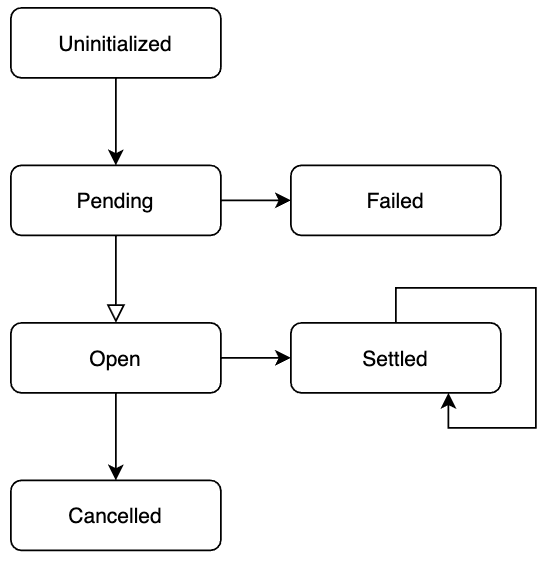

## What is a FixedOddsBet?

A Bet involves a Punter risking funds from their Wallet on the outcome of a Market.
When the Result of the Market becomes known (e.g. An Event is complete and a winner has been decided) all Bets on that Market are Settled.
If the Punter chose the winning Selection then an amount equal to the Stake of the FixedOddsBet multiplied by the Odds of the Selection is credited to the Punter’s Wallet.
If the Punter did not select the winning outcome they lose their stake.

> For MVP we only require ‘bookmaker’ style bets - these are Back bets (where the chosen Selection is expected to win) which are placed against the bookmaker, as opposed to Exchange Bets which require matching against another Punter’s Lay for the same Market/Selection.

> For MVP we are focused only on Single Bets - as opposed to combination bet types such as Accumulators, where the proceeds from a successful bet are used as the stake for a subsequent bet.

## FixedOddsBet Structure

A FixedOddsBet has the following properties:

| Name           | Type             | Description                                                                                                       |
|----------------|------------------|-------------------------------------------------------------------------------------------------------------------|
| `betId`        | `String`         | Unique identifier for the Bet. This MUST be unique for every bet… ever…                                           |
| `punterId  `   | `String`         | Unique identifier for the Punter who placed the Bet.                                                              |
| `marketId`     | `String`         | Unique identifier for the Market this Bet applies to.                                                             |
| `selectionId`  | `String`         | Unique identifier for the outcome of the Market the Punter is betting on.                                         |
| `stake`        | `Decimal(11, 2)` | The amount of money the Punter is staking on the outcome.                                                         |
| `currencyCode` | `String`         | The Currency the Punter is using for their stake.                                                                 |
| `odds`         | `Decimal(6, 2)`  | The Odds for the Selection at the time the Punter placed the Bet. This is the Odds the Punter is accepting.       |

## FixedOddsBet Lifecycle

FixedOddsBets have a strict lifecycle that defines their behaviour.

| Status        | Description                                                                                                                                                                                                            |
|---------------|------------------------------------------------------------------------------------------------------------------------------------------------------------------------------------------------------------------------|
| Uninitialized | The initial (empty) state for all bets. Bets remain in this state only long enough for them to be persisted.                                                                                                           |
| Pending       | The Bet has been created, given a unique Id and has been persisted. Now we check to see what constraints need to be satisfied in order for the Bet to move to either Open or Failed.                                   |
| Failed        | If the Bet cannot be placed (see Placing a Bet below) then it moves into the Failed state and stores the reason for the failure in its state.                                                                          |
| Open          | If the Bet can be placed it is moved into the Open state. The Bet is now waiting for a Result from the Market it is associated with. It cannot be cancelled by the Punter, it CAN be cancelled by Customer Services. |
| Cancelled     | If, for some reason, the Bet cannot be resolved the Bet moves into the ‘Cancelled’ State and stores the reason for cancellation.                                                                                       |
| Settled       | When a Result is received for a Market then all Bets related to that Market are settled (won or lost).                                                                                                                 |

> ### Resettlement
>
>A `Settled` Bet can also be re-Settled if a Market Result is received in error or for some other, unforeseen reason, the Result is incorrect.

The reasons for a FixedOddsBet being cancelled are:

> ### Cancellation
>
> * Market Abandoned - the Event was cancelled/postponed or for any reason, there will not be a Result from the Market
> * Customer Services - The CS team cancelled the bet (perhaps due to some Responsible Gambling issue).

## Process Implementation

More detailed documentation is available regarding:

* [Placing Bets](bet-placement.md)
* [Reserving Funds for a Bet](bet-placement-funds-reservation.md)