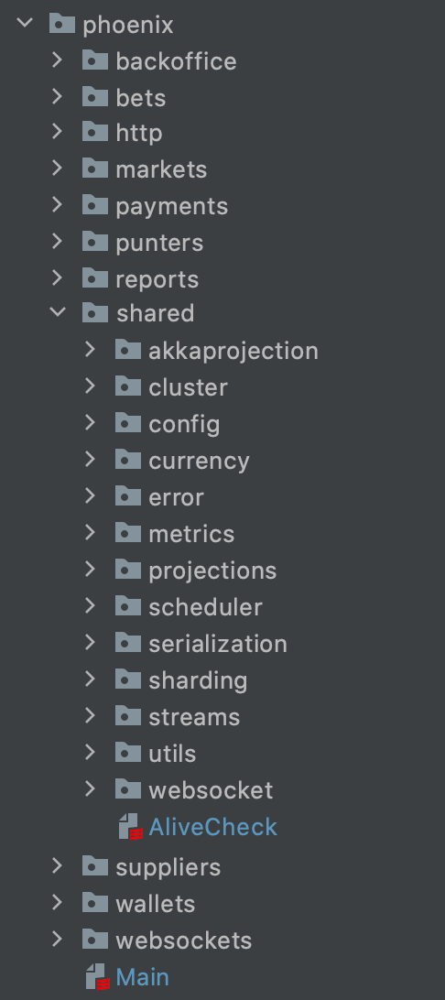

## Code Organization and Architecture
### Motivation
One of the easiest ways to make code more maintainable is to have a clean folder structure that allows readers to easily find features. 

For that, it's important to have a consistent layout in the project that follows some rules.

### Production Code
The top level directory should have N folders, one for each `context`, so when anyone checkouts the code it should be clear from root level
what are the `contexts` (Uncle Bob: [Screaming Architecture](https://blog.cleancoder.com/uncle-bob/2011/09/30/Screaming-Architecture.html))

Examples of contexts could be: bets, punters, wallets ...
This means that anything that is not a `context` should be hidden from top level package.
To achieve this we should keep all folders not containing dedicated `context` into `phoenix.shared` package like:



#### Contexts
Inside a specific `context`, we should put three folders (ordered by visibility/layers not alphabetical):

* `domain` - service traits injected into the application level use cases, domain models and services (services operating only on domain classes, e.g. market lifecycle transitions).
* `application` - hosting application layer use cases, which orchestrate calls to different services.
* `infrastructure` - services implementations, marshallers, http controllers...

This is based on an Onion / Clean / Hexagonal / Ports and Adapters architecture.
More on the topic: [Explicit Architecture](https://herbertograca.com/2017/11/16/explicit-architecture-01-ddd-hexagonal-onion-clean-cqrs-how-i-put-it-all-together/)

Main boundaries:
* `domain` layer can operate only on `domain` code. Cannot access any external service (even with ports/interfaces, so not even traits for repositories are allowed),
  if it's required then it should be moved to next layer.
* `application` layer can access `domain` code and use traits/interfaces of external dependencies (repositories, different `contexts` Operation, or external service),
  that will be injected from `Module`
* `infrastructure` layer can access `application` and `domain` code, contains implementations of all `outgoing` ports used in `context`, eg TwilioClient, SFTPClient, SlickRepositories ...
* `domain/bounded context` (name to propose, maybe `es`: event sourcing) - this is a special subfolder dedicated to all Akka related stuff (AkkaBoundedContext implementation, Entities, Projections, Sharding).
  Ideally it should be `infrastructure` but it's tightly coupled with domain, and would be hard(overengineering) to split.

Note that some features might not need all the layers. Sometimes we have a very simple use case (eg CRUD for creating a punter)
 that might suffice without an Application level use case, because it's just a single repository call. 

Example (simplified from what we have):
```
/src/main/scala/phoenix/
├── punter
│   ├── PunterModule.scala (dependency injection / port exposure to other contexts)
|   ├── PunterConfig.scala
│   ├── punterSubdomain
│   │   ├── application
│   │   ├── domain 
│   │   └── infrastructure
│   ├── application
│   │   ├── BetValidator.scala
│   │   ├── Login.scala
│   │   └── Logout.scala
│   ├── domain
│   │   ├── bounded context
│   │   │   └── everything bounded context & akka related (eg punter state, actor commands, events...)
│   │   ├── PunterBoundedContext.scala (the trait)
│   │   ├── PunterModel.scala
│   │   └── PunterRepository.scala
│   └── infrastructure
│       ├── websocket
│       │   └── emiter
│       ├── controller
│       │   ├── PunterRoutes.scala
│       │   └── TapirCodecs.scala
│       ├── events
│       |   └── EventHandler.scala
│       ├── SlickPunterRepository.scala
│       ├── PunterProjectionRunner.scala 
│       └── PunterFormats.scala
├── shared (every sort of "library" goes here)
├── wallet  
│   ├── application
│   │   ├── ...
│   │   └── ...
│   ├── domain
│   │   ├── ...
│   │   └── ...
│   └── infrastructure
│       ├── ...
│       ├── ...
│       └── ...
```

In this example:
 
* `PunterRoutes` could have injected both the `Login` and `Logout` Operations. 
* `Login` Operation could have injected the `PunterRepository`.
* `PunterConfig` is placed on `context` top package, it might be used in different layers (case classes), we might have configuration for external services (Twilio token), projection configuration, etc.
  It's creation (from .config files using pureconfig) should be moved to `infrastructure` - but this might lead to big granularity, and it's a trade off.
* `PunterModule` this code is about to wire up all dependencies (similar to `PunterCoolOffModule`). We should not wire up things in `BoundedContext.apply()` implementations,
  because it's not BC responsibility (that should act as Facade to Akka), and some modules do not expose any Actors (like `reports` now), so we do not want dummy BC.

### Test Code
As in production code, we should have a top-level folder for each `context`.

Inside a specific `context`, we should put four folders:

* `acceptance` - tests that test full features, starting from the outermost layer (http request or consuming an event from a queue).
* `integration` - tests that test repository implementations.
* `unit` - tests that don't fit any other definition. Eg: features / use cases tests with mocked dependencies, or a test for a specific JSON marshaller should go here.
* `support` - test infrastructure. Stuff the tests need to run, eg test doubles or data generators.

Note that this should be the ideal path for a full feature. Some features won't need that much complexity nor amount of tests, so pragmatism and common sense needs to always be applied here.

Example (simplified from what we have):
```
/src/test/scala/phoenix/
├── punter
│   ├── acceptance
│   │   ├── LoginAcceptanceSpec.scala
│   │   └── LogoutAcceptanceSpec.scala
│   ├── unit
│   │   ├── LoginFeatureSpec.scala
│   │   └── LogoutFeatureSpec.scala
│   ├── support
│   │   ├── PunterRepositoryTestDouble.scala
│   │   └── PunterDataGenerator.scala
│   └── integration
│       └── SlickPunterRepositoryIntegrationSpec.scala
├── wallet  
│   ├── acceptance
│   │   └── ...
│   ├── unit
│   │   └── ...
│   ├── support
│   │   └── ...
│   └── integration
│       └── ...
```

In this example:

* `LoginAcceptanceSpec` would test the login route directly, doing a http request.
* `LoginFeatureSpec` would test the specific application level logic, injecting test doubles into the use case.
* `SlickPunterRepositoryIntegrationSpec` would test this specific implementation of the repository.
