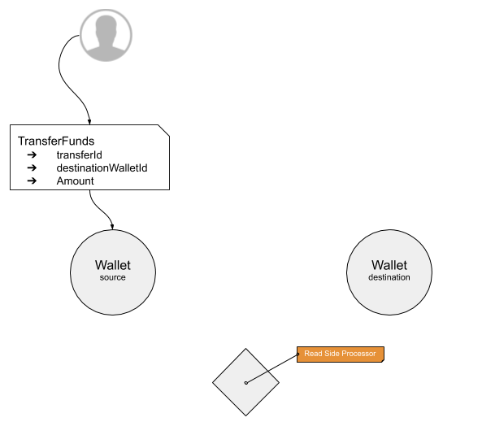
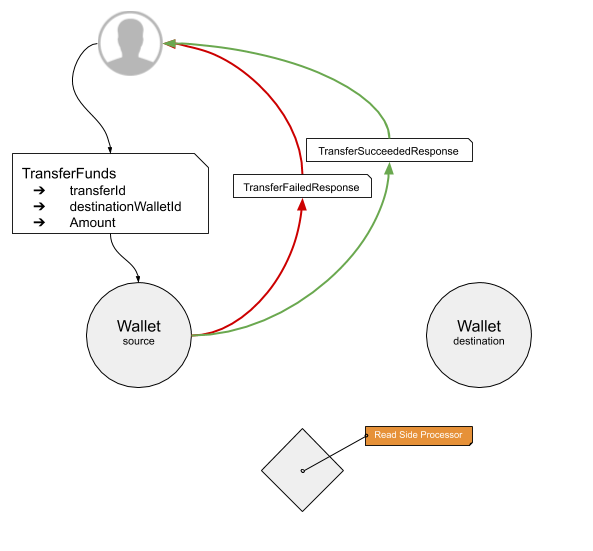
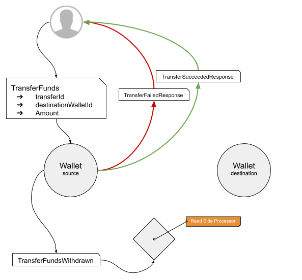
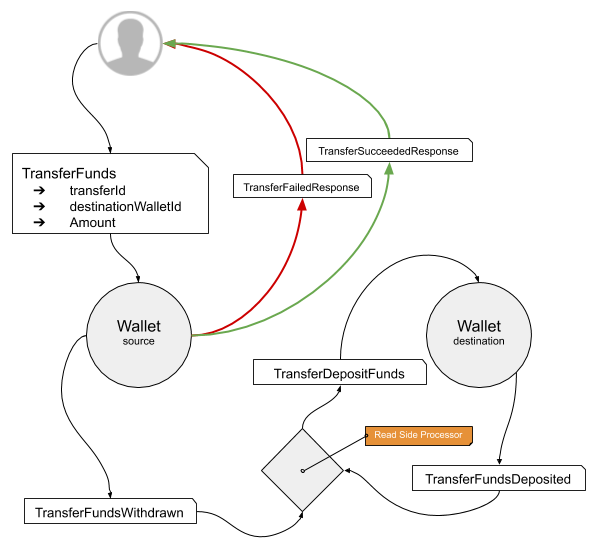
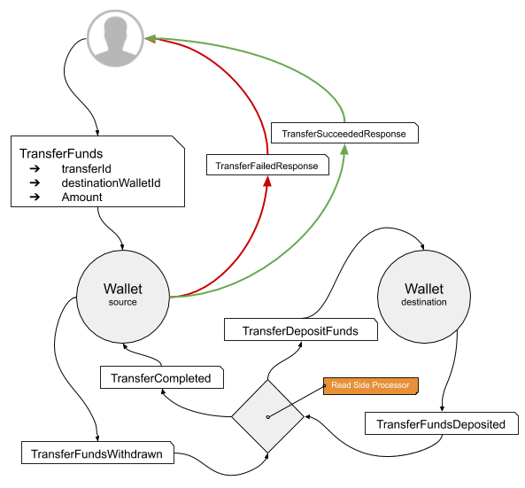

## Overview

There is one key use-case where it's necessary to transfer funds between Wallets: Betting. The process is usually a case of transferring money from a Customer's Wallet to the Wallet belonging to the Brand the Customer is betting against. And, conversely, when the bet is a winner, transferring money from the Brand Wallet back to the Customer.

In a Reactive System this kind of transfer of a value between 2 entities is achieved in an eventually consistent way with a minimum of locking using an Asynchronous Messaging pattern.

The pattern takes advantage of the features of Event Sourcing and CQRS to enable resilience and failure handling and more closely mimics the accountant's ledger, where each transaction is logged and failure results in a compensating action in the log rather than a transactional approach which wipes out any evidence of the attempt ever having happened.

## The Process

The Process consists of X steps:

1. Creating a Transaction
2. Withdrawing Funds
3. Depositing Funds
4. Completing the Transaction

### Creating a 'Transaction'

A `TransferFunds` command is created which contains:

* `transferId` - a unique identifier for the transfer.
* `destinationWalletId` - where the funds are being transferred to.
* `amount` - the amount of money being transferred.

The `TransferFunds` command is send to the Wallet from which the funds will be taken.

### Withdrawing Funds

When the __source__ Wallet receives the command the first thing it must do is check the `transferId` against recent transfers to see if this transfer is still in-flight and the request is a retry (see 'Failure Scenarios' below).

If the Wallet cannot support the transfer - if it has insufficient funds, for instance - then it replies to the sender of the command with a `TransactionFailed` response which contains a `reason` for the failure.

If the Wallet has sufficient funds to support the transfer it generates the `TransferFundsWithdrawn` command. 

> The `Tx` prefix allows the distinction to be drawn between the different types of withdrawal from a Wallet. 

Once the Event has been persisted the `TransferSucceededResponse` is sent to the originator of the transfer.

The persisted event is also consumed by a Read Side Processor (RSP) which handles the second phase of the transfer.

> Failure Scenarios: 
>
> * If the node on which the source wallet lives fails before the Event is persisted then the originator will time-out and will have to retry
> * If the node on which the source wallet lives fails after the Event is persisted but before the reply is sent then the originator will time out and will have to retry
>
> The originator has no way to distinguish between the 2 modes of failure so when a `TransferFunds` request is received the source Wallet needs to check recent transfers to see if there's a recent failure in the set which simply needs confirming to the originator.

### Depositing Funds

When the RSP receives the `TransferFundsWithdrawn` Event it can check the Event for the `destinationWalletId` and send a `TransferDepositFunds` command to the destination Wallet.

The destination Wallet receives the `TransferDepositFunds` command and acts on it as it would with any other `DepositFunds` command, by generating an Event describing the desired state change, consuming it after persisting and changing its internal state and then dispatching the Event publicly.

The `TransferFundsDeposited` event is then consumed by the RSP

> Failure Scenarios:
>
> * If the Node on which the RSP lives fails before the `TransferFundsWithdrawn` event is consumed the RSP is automatically brought back up on a new node and will continue consuming from its last offset - so it will always _eventually_ consume the event.
> * If the RSP fails before consuming the `TransferFundsDeposited` event, as above, it will be resurrected by the cluster and will _eventually_ consume the event.
> * Failure of the destination Wallet during Event processing is resilient via Event Sourcing.

### Completing the Transaction

The final phase of the transfer involves the RSP sending a final command to the source wallet indicating the transfer has completed successfully. 

This `TransferCompleted` message allows the source Wallet to remove the provided `transferId` from its list of current in-flight transfera. 

