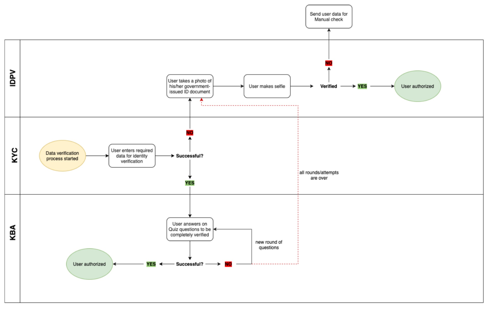
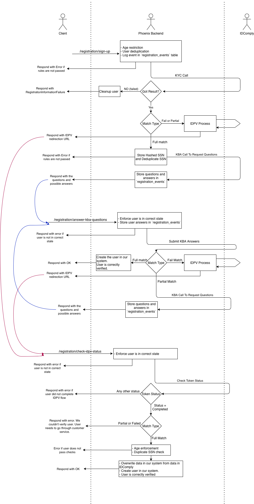

# IDComply - User registration process

ID-Comply is a KYC (Know Your Customer) and AML (Anti Money Laundering) solution built by GeoComply.

We use it via an HTTP API in the user registration flow, to guarantee that the users we have in our system exist, are
who they say they are and are able to participate in our business.

This implementation was first done in this ticket: https://eegtech.atlassian.net/browse/PHXD-1126, so you will be
able to find more information, such as the documentation from IDComply there if you see anything missing here.

# Acronyms

* IDPV = Id Photo Verification
* KYC = Know Your Customer
* KBA = Knowledge Based Authentication
* SSN = Social Security Number

# Top Level View



The most important thing that can be noted from the top level view is that:

* The user starts with a KYC check
    * If successful, the user will go through a KBA check.
        * If the KBA check succeeds, the user is verified.
        * If the KBA check fails, the user goes through the IDPV check.
    * If NOT successful, the user will go through a IDPV check.

The IDPV check can result in success, at which point the punter is verified, or failure, at which point customer service
needs to get involved.

# Fitting the flow into our system


(Note that this diagram is done in Draw.io, and the XML to modify it is found next to the diagram image. Please edit
both accordingly.)

## Entry point

The user will always start the registration process at the endpoint:

```
/registration/sign-up
```

Some extra data such as name, username, last four digits of the SSN, etc is passed in the request body. Take a look at
swagger/openAPI for more information.

At this point we do some basic checks before any interaction with ID Comply:

- Age restriction
- User deduplication (check if user already exists)

We also take advantage of a table called `registration_events`, in which we store a log of how the registration process
looks like for every user.<br>
At this point we store an event to log that the user started the registration process.

After that, we do the first call to IDComply (abstracted in the `IdComplyService` port), for KYC.<br>
We pass the user information to IDComply, and they answer back with the KYC result, which can be one of: `FailMatch`
, `PartialMatch` or `FullMatch`.<br>
On the non-happy path, this request can fail if there is an issue with the punter (eg: they are on a deceased list).
Note that IDComply doesn't handle lifetime self-exclusions here.

On any non-happy path in the whole registration process (not only on the KYC result, for subsequent steps too) we
cleanup the `registration_events` table for the relevant user, so that he can start the process back if needed and
because we don't need the data in this case.

At this point, if we get either a `FailMatch` or a `PartialMatch`, we go through the IDPV process.<br>
This involves an extra call to IDComply, in which we create an IDPV token. In the same request, we specify a redirection
endpoint, which is gonna be used by the IDComply website to know where to redirect after a finished IDPV flow.<br>
We take note of going through this flow via a record in the `registration_events` table.<br>
We use the IDPV token to construct an URL which we include in the API response.<br>
The frontend is then supposed to redirect to the constructed URL.<br>
The user will then go through the IDPV flow, which involves submitting documents and perhaps other things (that is
handled by IDComply). After the process is finished the user is gonna be redirected back to the URL we specified when
creating the token.

Alternatively, if we get a `FullMatch`, we construct the full SSN, using both the first 5 digits
of the SSN given by IDComply in the KYC response and the last 4 digits of the SSN given by the user.<br>
Using the full SSN, we check that it's not duplicated, using a database table: `ssns`.<br>
Afterwards, we do a KBA call to IDComply, which supplies us with questions and answers. We pass the information forward
to the frontend as part of the API response, and record the interaction in the `registration_events` table.

At this point the frontend is going to choose the next option depending on the path the user went through.

## Answering questions

If the punter was asked for answers (KBA flow), this is the next step.

```
/registration/answer-kba-questions
```

We use the latest event from the `registration_events` table to check if the user is in the correct state to answer
questions.<br>
We make sure to store the answers from the users in the `registration_events` table.<br>
We then make a call to IDComply to submit the KBA answers, which can result in a Full, Partial or Failed match.<br>

A Failed match means we go through the IDPV flow, as described previously.<br>
A Partial match means we go through the KBA (questions and answers) flow again, as described previously.<br>
A Full match means the user is correctly registered. We update the punter profile accordingly and create the missing
parts in our system.

## Check IDPV flow status

If the punter went through IDPV, the frontend is supposed to call this endpoint after the IDPV flow is complete.

```
/registration/check-idpv-status
```

We first guard using the `registration_events` table that the user is in the correct step.

We then make a call to IDComply using the token (retrieved from the same `registration_events` event).<br>
If the token status is `completed`, we proceed to check the match status. Any other status results in failure.

If the match status is partial or failed, the user failed the registration process and needs to go through customer
service.<br>
If the match status is a full match, we do some sanity checks:

- Age restriction check
- User deduplication by SSN (as we get the full SSN in the IDComply response). We use the same SSN procedure as
  before, using a database table.

We then update the user profile. We assume the data from IDComply is the truth, so we override any data that is not
matching. We also update the registration status to success and create the punter in the system.
