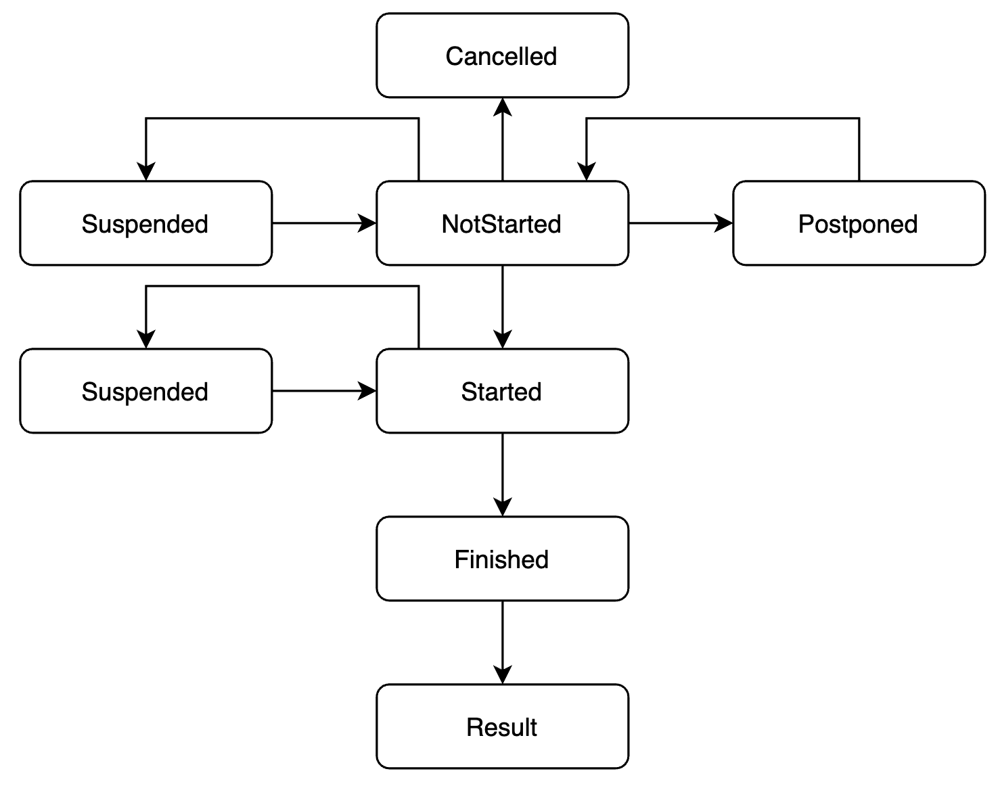

> This document is referring purely to Fixed Odds Betting 

## Overview

The data relating to Fixtures, Markets, Selections, Odds etc are fundamental to the system. These data define what can be bet on and the odds at which those bets can be struck.

There is a hierarchical structure to the Market Data Taxonomy:

**Sport** → **Competition** → **Fixture** → **Market** → **Selection** → **Odds**
 
> Sport and Competition are primarily names given to levels of the hierarchical structure used for navigation - they’re not features which affect betting.

> The Market is the Aggregate Root for the Market Service - Selections and their Odds can be accessed and interacted with only via the Market they relate to. All the Market Service Events are dispatched relative to the Market Entity.


## Definitions

### Sport

Within the context of E-Sports a Sport refers to the game being played e.g. League of Legends, DotA2, etc.

**Sport Structure**

| Property  | Type   | Description                                                 |
|-----------|--------|-------------------------------------------------------------|
| sportId   | String | The unique identifier for this Sport                        |
| fullName  | String | The full name of the Sport (e.g. Defence of the Ancients 2) |
| shortName | String | The abbreviated name for the Sport (e.g. DotA2)             |

## Competition

A Competition refers to the competitive structure in which the Fixture is being played. For instance, in Soccer this might refer to the Premier League 20/21, In Football it may refer to the NFL 20/21, etc

**Competition Structure**

| Property             | Type   | Description                                |
|----------------------|--------|--------------------------------------------|
| competitionId        | String | The unique identifier for this Competition |
| competitionFullName  | String |                                            |
| competitionShortName | String |                                            |

## Fixture

A Fixture represents an instance of a game being played - a match - two teams playing a soccer game for instance, or two teams playing Call of Duty - something that will involve a period of gameplay that will last a predetermined amount of time after which an outcome will be determined.

Fixtures can have zero or more Markets associated with them.

Bets cannot be placed on a Fixture, only a Market.

**Fixture Structure**

| Property     | Type   | Description                                                                           |
|--------------|--------|---------------------------------------------------------------------------------------|
| fixtureId    | String | A unique identifier for this Fixture                                                  |
| startTimeUtc | Long   | Milliseconds after Epoch at which the gameplay for this Fixture is expected to start. |
|              |        |                                                                                       |

**Fixture Events**

| Event                                 | Description                 |   |
|---------------------------------------|-----------------------------|---|
| FixtureCreated(eventId, startTimeUtc) | A new Fixture is available  |   |
|                                       |                             |   |

## Markets

A Market represents something which a Bet can be placed on. A Market is associated with a Fixture. A Fixture can have many Markets but a Market can only ever be associated with a single Fixture. 

A Market is a proposition with 2 or more outcomes, known as Selections. 

A Market will, at some point in the future either have a Result - that is, one of those outcomes will be determined to have happened and the other possible outcomes have not happened, or it will be cancelled and there will never be an outcome. 

Bets placed on the winning outcome are winning Bets, everything else is a losing Bet.

| Property    | Type                                                                                                 | Description                                                     |
|-------------|------------------------------------------------------------------------------------------------------|-----------------------------------------------------------------|
| marketId    | String                                                                                               | The unique identifier for this Market                           |
| marketType  | Enum(AntePost&#124;InPlay)                                                                           | See below                                                       |
| selections  | Set[Selection]                                                                                       | The possible outcomes of this Market that Customers can bet on. |
| marketState | Enum(NotStarted&#124;Started&#124;Finished&#124;Result&#124;Suspended&#124;Postponed&#124;Cancelled) | The current state of the market (defines the Market Behaviour)  |

### Market Events

| Event                                                        | Description                                                                                                                                                     | 
|--------------------------------------------------------------|-----------------------------------------------------------------------------------------------------------------------------------------------------------------|
| MarketCreated(marketId, marketType, selections, marketState) | A new Market has become available                                                                                                                               |
| MarketStarted(marketId)                                      | Gameplay has started for the Market with id marketId.                                                                                                           |
| MarketFinished(marketId)                                     | Gameplay has finished for the Market with id marketId.                                                                                                          |
| MarketResult(marketId, result)                               | A Result is available for the Market with id marketId                                                                                                           |
| MarketSuspended(marketId, reason)                            | Market with id marketId has been suspended                                                                                                                      |
| MarketCancelled(marketId, reason)                            | Market with id marketId has been cancelled                                                                                                                      | 
| MarketPostponed(marketId, reason)                            | Market with id marketId has been postponed                                                                                                                      |
| MarketOddsChanged(marketId, selections)                      | The Odds of one or more of the Selections available on the Market with id marketId have changed, selections contains the Selections with their current Odds     |

### Market Types
A Market can be one of 2 possible types:

* **AntePost** - literally meaning ‘before the off’ an AntePost bet is placed on an Event either before the gameplay for that Event starts or very shortly after it starts (for instance before the ‘bell’ in a horse race).
* **InPlay** - An InPlay Market is only available for betting after the gameplay for an Event has begun and before the gameplay completes. InPlay Markets typically have a lifetime shorter than the Event time and relate to the ‘next’ type of thing to happen (next Goal, next Touchdown, next Kill etc). 

### Market Lifecycle

Markets move through different states during their lifetimes and the state they are in defines their current behaviour.



| Status     | Description                                                                                                                                                                             |
|------------|-----------------------------------------------------------------------------------------------------------------------------------------------------------------------------------------|
| NotStarted | The default initial state for a Market. This state indicates that gameplay for this Market has not yet started.                                                                         |
| Started    | Indicates that the gameplay for this market has begun. A Started Market may still be able to accept AntePost bets - the BettingState is handled separately see below).                  |
| Finished   | Indicates that the gameplay for this market has completed and a Result should be expected soon. A Finished Market should never resume play.                                             |
| Result     | Indicates that a Result has been established for this Market (we have a winner).                                                                                                        |
| Suspended  | Indicates that the current Market state has been temporarily changed and may or may not resume.                                                                                         |
| Postponed  | Indicates the Event this Market is associated with will not happen at the expected time but at some time in the future. Open Bets on this Market will have to be handled appropriately. |
| Cancelled  | Indicates the Event this Market is associated with will not happen at all. Open Bets on this Market will have to handled appropriately.                                                 |

## Selection

A Selection is one possible outcome of a Market, for instance:

Each runner in a horse race will be a distinct Selection.

Home team, Away team or Draw in a Soccer match ‘win’ Market will each be distinct Selections.

Over or Under the specified value in an over/under Market will be the two possible Selections.

A Selection has an Odds associated with it which represents the Price the bookmaker is currently offering for Customers to place Bets at.

Selections are unique within the system. Manchester United playing in the Premier League last year are the same Manchester United playing in the Champions League next year. The selectionId always refers to the same Team as an organisation.

The selectionName property gives Traders the opportunity to customise the Selection name for specific Markets.

### Selection Structure

| Property      | Type         | Description |
|---------------|--------------|-------------|
| selectionId   | String       |             |
| selectionName | String       |             |
| odds          | Decimal(6,2) |             |

## Odds
A Customer can Place a Bet on a Selection from a Market at a Price, which corresponds to the Odds.

Odds have three common representations:

* Fractional - for instance, 9/1 or 11/2 (common in the UK.)
* American - e.g. 200, 500 (common in the US.)
* Decimal - e.g. 1.45, 4.5 (common on Exchanges such as Betfair.)

Odds in the system are stored in their Decimal form as this makes it trivial to perform common operations (reductions, increases etc.)

### Odds vs. Probability

The Odds offered for a Selection on a Market relates to the probability that the outcome the selection represents is going to be the outcome of the Market.

Odds are always stored as Decimals with precision/scale 6/2. This is because a logical certainty is represented by a Decimal odds of 1.00 - 
something with the odds of 1.00 is definitely going to happen. A completely impossible outcome is represented by an odds of 1000.00.

This may not seem to make sense at first, how can `1.00` be a logical certainty but `1000.00` be _less_ likely (shouldn't it be `0.00`?)

The answer lies in the fact that expressing probability isn't the primary purpose of the Odds - Odds are primarily describing how much you should expect to win if the outcome you've chosen wins.

For instance, an Odds of 1.20 would provide you with profit of £2 on a £10 stake.

`profit = (odds - 1) * stake`

The smaller the Odds the fewer the rewards, because the outcome is more likely to happen.
The larger the Odds the greater the rewards, because the outcome is less likely to happen.

### Ticks

A ‘tick’ is an Odds increment - a step up or down from one odds to the next odds above or below.
The lower the odds, the smaller the increments, the table below describes the increment values for different ranges between 1.00 and 1000.00

| Odds       | Increment |
|------------|-----------|
| 1.01 → 2   | 0.01      |
| 2→ 3       | 0.02      |
| 3 → 4      | 0.05      |
| 4 → 6      | 0.1       |
| 6 → 10     | 0.2       |
| 10 → 20    | 0.5       |
| 20 → 30    | 1         |
| 30 → 50    | 2         |
| 50 → 100   | 5         |
| 100 → 1000 | 10        |

Ticks can be used by Traders to automatically trade markets at different odds to that received from an external supplier.
By setting a Market to trade X ‘ticks’ above the incoming odds the system can automatically pull the next valid odds X increments above what is received and dispatch that as part of a OddsChangedEvent.
 
 ## Exposure
  
  For each market that's available for betting we need to keep track of our `Exposure` on this market. Exposure values on markets help are used by the Trading Team to indicate when `Odds` on market selections need to change and/or when markets should be frozen/capped in order to manage risk.
  
  ### What is Market Exposure?
  
  Here's a definition of exposure as it relates to fixed-odds betting:
  
  > "The amount of money a bookmaker stands to lose (the loss they're exposed to) on any particular event or wager. The size of the exposure for any event depends on the monetary value of the bets taken for the markets offered and also the odds that are given.
  
 The term '_market_ exposure' can lead people astray. What we're really looking at is '_selection_ exposure'. That is, we want to know:
  
  "For each market, what is the profit/loss in the event of each selection winning"
  
  So, we need to keep 2 values for each selection: 
  
  1. Total staked on that selection (this will be the amount we win if any of the other selections win - expressed the other way around, the total amount punters lose if any of the other selections win).
  2. `stake * (odds - 1)` for that selection (this will be the amount we lose if the selection wins - again, conversely, it's the amount we have to pay out if this selection is the winner).
  
  > Loss is `decimal odds - 1` because the bettor is staking an amount of money and, if they win, they'll get that stake back PLUS their winnings. If they stake £1 at decimal 2 (evens) they'll get £2 back, that's their stake plus £1 - so we lose £1. If they bet £10 @ 1.1 they receive £11 in return but their profit is only £1.
  
  Let's call (1) `whatWeWinIfThisSelectionLoses` and (2) `whatWeLoseIfThisSelectionWins`
  
  There's only ever one winner in a market (one selection wins, the other selections lose) - so we need to know:
  
  ```
  for (market in markets):
      for (selection in market.selections):
          let loss = selection.whatWeLoseIfThisSelectionWins
          let theOtherSelections = market.selections - selection
          let profit = theOtherSelections.map(_.whatWeWinIfThisSelectionLoses).sum
          profit - loss
  ```
  
  The inner `for` loop there returns the Profit/Loss (P&L) for each selection.
  
  I'll try and make it easier with an example rather than the pseudocode:
  
  Consider a market with 2 selections, `Trevor` and `Tom`. `Trevor` is the favourite (naturally), so people are placing more bets and bets with higher stakes on him (in order to maximise their returns).
  
  Bets on `Tom`
  
  | Stake | Odds | What we win if Tom loses | What we lose if Tom wins |
  |-------|------|--------------------------|--------------------------|
  | £10   | 3.0  | £10                      | £10 * (odds - 1) = £20   |
  | £5    | 4.0  | £5                       | £15                      |
  
  Bets on `Trevor`
  
  | Stake | Odds | What we win if Trevor loses | What we lose if Trevor wins |
  |-------|------|--------------------------|--------------------------|
  | £100  | 1.5  | £100                     | £100 * (odds - 1) = £50  |
  | £50   | 2.1  | £50                      | £55                      |
  
  If Trevor wins we take the sum of the `What we lose if Trevor wins` column and the sum of the `What we win if * loses` columns for all other selections and add those two values together:
  
  Losses = £105
  Profits = £15
  P&L = **-£140**
  
  If Tom wins we take the sum of the `What we lose if Tom wins` column and the sum of the `What we win if * loses` columns for all our competitors and add those 2 values together:
  
  Losses = £25
  Profits = £150
  P&L = £125
  
  So the Traders on the system would see a market that looks something like this:
  
  #### Trevor vs. Tom - Thumb War!
  
  Trevor P&L = -£140
  Tom P&L = £125
  
  The negative P&L on Trevor would be bright red flashing Comic Sans to help them recognise they need to do something about this - by providing more attractive odds on Tom and or less attractive odds on Trevor, or by cutting their losses and suspending the market (in reality they'd also be hedging this risk by laying (betting against) Tom on Betfair, but that's a whoooole other discussion for another time).
