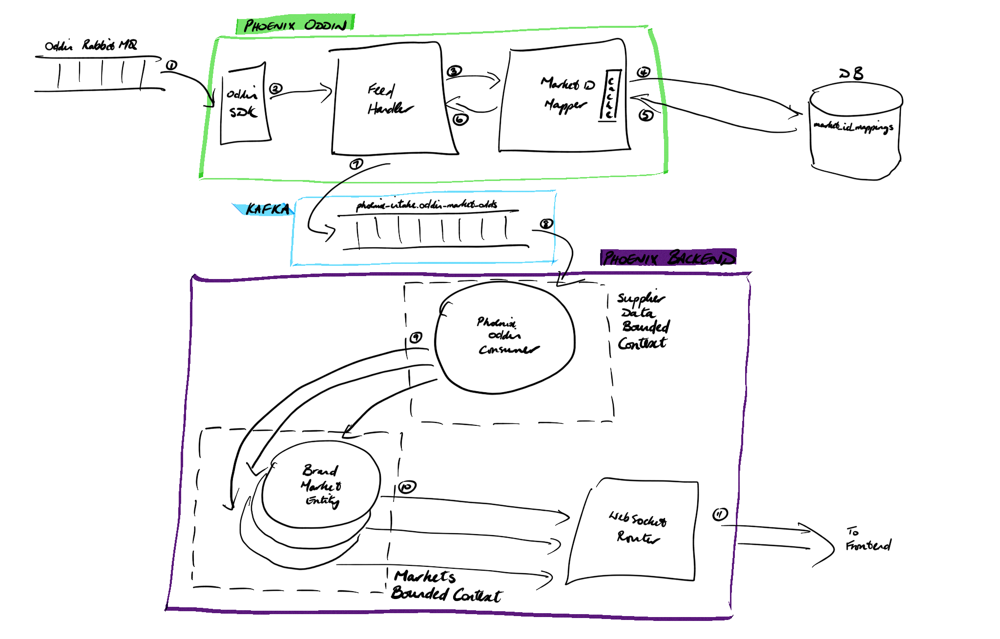

## Overview

We want the ability to switch supplier for individual markets while the system is running. There a few situations where that might be desirable:

- We have multiple external providers and for a given market, an Operator / Trader decides that the data from one supplier is more up-to-date or reliable or "better" in some other way for the given market
- A Trader wants to "ride" a price from an external provider by adding or subtracting a fixed interval to the original price, and wants the ability to switch between the adjusted price and the original price
- A Trader wants to explicitly and manually push a price for a given market and use this to override the external provider price

A single Market will only ever have prices supplied to it by a single supplier but that supplier can be changed at runtime as necessary. For MVP there will be a single supplier (Oddin)

Note, this feature is currently about being able to switch per brand-market, which is the most fine-grained level. We can imagine more coarse-grained configuration that might be built on this:
- Configuring per-brand (e.g. all the markets for a given brand will use Supplier A)
- Configuring globally, across brands (e.g. all Total-Kills markets, regardless of brand, will use Supplier A)

## Other constraints

We should be able to track the provenance of each price that a bet is placed on -- e.g. we should be able to guarantee that a bet was placed at the latest price seen and agreed by the punter and we should be able to track the origin of this price all the way to the original source.

The likely solution that we will take here is to assign a unique correlationId generated at the moment we ingest data from the external source, and track this unique correlationId in the logs and in the latest state of each brand-market "entity".

## Architecture

In very broad terms, taking the example of Oddin, we will ingest data from this supplier and immediately write data into a Kafka topic. On the other end of Kafka, in the Phoenix Backend application, we will consume this data from Kafka. Here is a simple sketch showing the main flow for one type of data --  market odds.

Here we describe each step in the above architecture sketch as it goes through each of:
- Phoenix Oddin
- Kafka
- Phoenix Backend

### Phoenix Oddin

We have introduced a separately deployable application called Phoenix Oddin that ingests data from Oddin and publishes to Kafka to be consumed downstream by the Phoenix Backend application.

#### Steps 1-2

When the Phoenix Oddin application starts up it connects to the Oddin Rabbit MQ via the SDK (Kotlin library) provided by Oddin. The SDK takes care of managing the connection and also of parsing XML messages from Rabbit MQ and deserialising them into domain objects. We immediately transform these SDK domain objects into Phoenix Oddin domain objects.

> &#8505; **NOTE**: When transforming an Oddin `MarketWithOdds` object into a Phoenix Oddin `MarketOddsChangeEvent` object we perform an initial manipulation of the Oddin Market ID. Oddin sends us Market IDs that are always numbered `1, 2, ...`. This means that if we just look at the plain Market ID that they send us, the market-odds data for two different fixtures might share the same Market ID `1, 2, ...` etc. Therefore, when we transform Oddin's `MarketWithOdds` object into the Phoenix Oddin `MarketOddsChangeEvent`, we prefix the plain Market ID with the fixture ID (which is in their "URN" format -- e.g. `od:match:17841`). We also add a `market` prefix to make the IDs more human readable, so we end up with Oddin Market IDs of the form `od:match:17841:market:11`, `od:match:17853:market:11`, `od:match:17853:market:12`, etc.

#### Steps 3-6
Before publishing to Kafka, inside Phoenix Oddin we map Oddin Market IDs to Phoenix Market IDs (i.e. UUIDs). So at Step 3, for every market-odds update for a given market, inside Phoenix Oddin we call the `Market ID Mapper` to retreive a UUID for a given Oddin Market ID.

To ensure that an Oddin Market ID is always mapped to the same Phoenix Market ID, the mappings are stored in a DB table `market_id_mappings`. But as an optimisation, to avoid going to the DB for every market-odds change, we keep an in-memory cache of the mappings. So Steps 4-5 are only performed either when we encounter a new Oddin Market ID (in which case we generate a UUID and save the mapping in the DB) or if the mapping exists but has been expired out of the cache so that we do not leak memory.

#### Step 7

The final step in Phoenix Oddin is the publishing of market-odds data to a Kafka topic called `phoenix-intake.oddin-market-odds`. (At the time of writing this name is hard-coded, but there is a ticket to allow topic names to be set in a configuration file: see https://eegtech.atlassian.net/browse/PHXD-597)

### Kafka

The messages published to the `phoenix-intake.oddin-market-odds` Kafka topic are keyed by Phoenix Market ID (i.e. UUIDs).

The topic is partitioned to allow scalability on the consumer side in the Phoenix Backend. We can e.g. start a Kafka consumer on each node of the Phoenix Backend cluster, where these consumers are part of the same consumer group. Using Phoenix Market IDs as keys and as the basis of partitioning (i.e. a given key is always assigned to the same partition), each consumer can be assigned one partition to consume from, and Kafka takes care of message ordering within that partition (i.e we can maintain the constraint that all the messages for a given Phoenix Market ID are consumed in the right order).

### Phoenix Backend

#### Steps 9-10

In the Phoenix Backend application the `SupplierDataBoundedContext` takes care of consuming data from the `phoenix-intake.oddin-market-odds` topic.

At the time of writing the consumer is a cluster singleton (meaning there is only one instance for the entire Phoenix Backend application). However, as mentioned above, assuming the topic is partitioned and all the messages for a given Phoenix Market ID are also published on to the same partition, we should be able to start a consumer on each of the nodes in Phoenix Backend application, where each of these consumers will be part of the same Kafka consumer group.

The market-odds data is then pushed to each `MarketEntity` corresponding to the Phoenix Market ID in a specific market-odds update.

> &#8505; **NOTE**: At the time of writing, when we consume data from the `phoenix-intake.oddin-market-odds` topic we auto-commit the offset. This means that if further downstream (e.g. when pushing the data to a `MarketEntity`) there is a failure, then we do not replay the message from Kafka, thus currently giving us "at most once" semantics.

#### Steps 10-11

Each `MarketEntity` has the ability to generate what is called a `SourceRef` that allows holder of this `SourceRef` to stream market-odds updates for that specific market in realtime.

Via the `MarketsBoundedContext`, the `WebSocketRouter` is able to request one of these `SourceRef`s for each market that the Frontend wants to subscribe to. The stream of market-odds updates from each `SourceRef` is then piped down a Websocket channel to the Frontend.

## Road map

### Avro serialisation

For first implementation we use JSON serialisation. The medium-term aim is to use AVRO serialisation to Kafka

### Separate "raw Oddin" Kafka topic from "transformed market odds" Kafka topic

For more resilience, when messages arrive from Oddin we should immediates write the raw data to a separate Kafka topic without doing _any_ processing (such as mapping Oddin Market IDs to Phoenix Market IDs). Any subsequent processing step should then read from this "raw Oddin" topic, do any necessary transformations, and then publish the transformed data onto the `phoenix-intake.oddin-market-odds` topic to be consumed downstream by the Phoenix Backend application.

### Log (topic) compaction

Log compaction can also be done based on Phoenix Market ID. Use of Kafka's log compaction feature to make sure that whenever we first connect to a supplier for a given market, we get the most up-to-date information rather than having to consume all updates that were pushed to Kafka since the last connection.

### Manual offset commiting and "at least once" delivery

As mentioned above, at the time of writing, when we consume data from the `phoenix-intake.oddin-market-odds` topic, we have "at most once" delivery of each message in the Phoenix Backend. We eventually want to move to manual commiting of offsets which means that if there is a failure after we first read data from the topic, we can replay the same data, which allows us to achieve "at least once" semantics.
