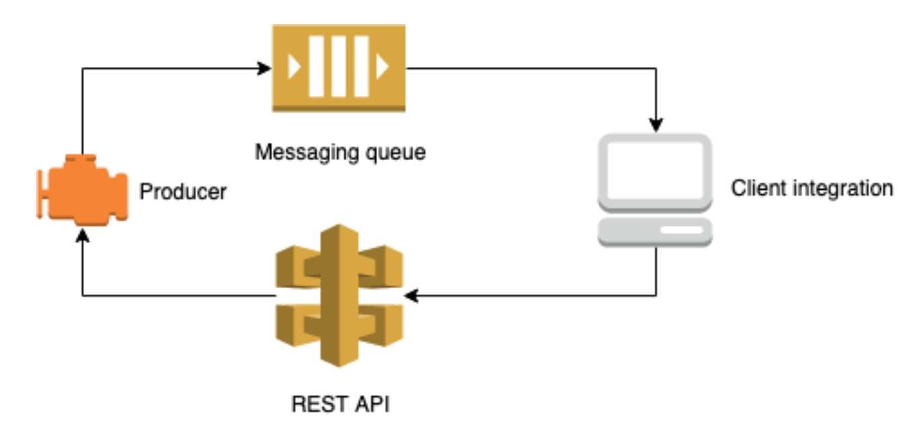

## Introduction

`Oddin` is an AI-powered, fully automated platform processing various different sources of data and calculating multiple
 live betting opportunities. The Oddin odds feed is separated into two parts: a high performance messaging feed through 
 AMQP (Advanced Message Queuing Protocol), and a classic REST based XML API.
 
 
 
 ## Integration
 
Information about current integration with Oddin can be found on [wiki page](https://eegtech.atlassian.net/wiki/spaces/GMX3/pages/1593507920/Oddin)