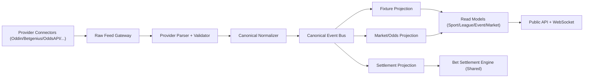

# Multi-Sport Vertical Expansion Technical Design

Date: 2026-03-06  
Program root: `/Users/johnb/Desktop/PhoenixBotRevival/Phoenix-Sportsbook-Combined`

## 1) Objective

Extend the sportsbook platform from esports-only behavior to a sport-agnostic architecture that supports additional verticals (MLB, NFL, NCAA Baseball, NBA, UFC, and future sports) without structural refactors for each new sport.

This design preserves current esports behavior while introducing reusable abstractions for ingestion, domain modeling, APIs, and frontend routing.

## 2) Current-State Constraints (As-Is)

1. Feed ingestion paths are heavily shaped by current esports providers and message structures.
2. Frontend sportsbook route tree is esports-centric (`/esports-bets/...`).
3. Existing domain has core sport/tournament/fixture/market entities, but end-to-end flow still assumes esports-oriented route and view composition.
4. Adapter and mapping logic is split by provider and partially coupled to provider/event semantics.

## 3) Target Architecture (To-Be)

### 3.1 Design Principles

1. Sport-agnostic core engine: bet placement, wallet, lifecycle, and settlement remain shared.
2. Adapter boundary for providers: sport/provider differences terminate in ingestion adapters.
3. Canonical data model first: UI and core services consume canonical events, never provider-native payloads.
4. Config-driven expansion: adding a new sport is primarily configuration plus mapping, not platform rewrites.
5. Backward compatibility: current esports endpoints/routes stay valid during migration.

### 3.2 Ingestion Architecture

### 3.3 Ingestion Components

1. `ProviderConnector` interface (new abstraction):
   - `fetchSnapshots(sportKey, cursor)`
   - `streamUpdates(sportKey)`
   - `streamSettlements(sportKey)`
   - `health()`
2. `SportRegistry` (config):
   - maps canonical `sportKey` (`esports`, `mlb`, `nfl`, `ncaa_baseball`, `nba`, `ufc`) to provider sport IDs/slugs.
3. `CanonicalNormalizer`:
   - converts provider payloads into canonical event envelopes.
4. `CanonicalEventEnvelope`:
   - required fields: `provider`, `sportKey`, `leagueKey`, `eventKey`, `eventType`, `occurredAt`, `sequence`, `idempotencyKey`, `payloadVersion`.
5. Topic partitioning strategy:
   - partition key = `sportKey:eventKey` for ordering and horizontal scale.
6. Independent pipelines per sport:
   - fixtures, markets/odds, settlements run independently per sport but reuse shared projection and engine code.

### 3.4 Settlement Handling

1. Settlement input remains provider-specific but normalized to canonical `MarketSettlementEvent`.
2. Shared settlement engine applies:
   - settle, resettle, cancel, refund logic with existing wallet safety and idempotency.
3. Sport-specific edge rules (e.g., baseball void conditions, UFC outcome types) are implemented as pluggable policy modules behind a shared `SettlementPolicy` contract.

## 4) Domain Model Changes

### 4.1 Core Model Enhancements

1. `Sport` becomes first-class in all event/market/bet lifecycles.
2. `League` becomes explicit and queryable independently of tournament semantics.
3. `EventHierarchy` supports:
   - `sport` -> `league` -> `season` (optional) -> `event` -> `market`.
4. Preserve esports compatibility:
   - esports tournaments map to `league/season/event` model with legacy aliases.

### 4.2 Entity-Level Additions

1. `Fixture/Event`:
   - add `sportKey`, `leagueKey`, `seasonKey` (nullable), `eventType`, `startTime`, `status`.
2. `Market`:
   - add `sportKey`, `leagueKey`, `eventKey`, `marketTemplateKey`, `lineType`.
3. `BetLeg`:
   - require `sportKey` + `leagueKey` to support mixed reporting and controls.
4. `SportPolicies`:
   - configurable rule set per sport for market availability and settlement edge cases.

### 4.3 Migration Strategy for Existing Data/Behavior

1. Backfill existing esports rows with `sportKey=esports`.
2. Map current tournament IDs to canonical league/season identifiers.
3. Keep existing IDs stable; introduce canonical keys as additive fields.
4. Keep legacy serializers/DTOs until clients move to new contracts.

## 5) API Design Changes

### 5.1 New/Expanded Read APIs

1. `GET /api/v1/sports`
2. `GET /api/v1/sports/{sportKey}/leagues`
3. `GET /api/v1/sports/{sportKey}/events?leagueKey=&status=&page=`
4. `GET /api/v1/sports/{sportKey}/events/{eventKey}`
5. `GET /api/v1/sports/{sportKey}/events/{eventKey}/markets`

### 5.2 Existing Compatibility APIs

1. Keep current esports endpoints live.
2. Implement compatibility adapter:
   - esports route handlers proxy to canonical sport endpoints with `sportKey=esports`.
3. Deprecation process:
   - mark esports-only endpoints deprecated after multi-sport frontend cutover.

### 5.3 WebSocket/Realtime

1. Standardize channels:
   - `sport^{sportKey}`
   - `league^{sportKey}^{leagueKey}`
   - `event^{sportKey}^{eventKey}`
   - `market^{marketId}`
2. Keep legacy channels active during transition.

## 6) Frontend Architecture and Routing

### 6.1 Route Structure (Target)

1. `/sports` (all sports landing)
2. `/sports/[sportKey]` (sport home)
3. `/sports/[sportKey]/[leagueKey]` (league view)
4. `/sports/[sportKey]/[leagueKey]/match/[eventKey]` (event detail)
5. `/sports/[sportKey]/[leagueKey]/match/[eventKey]/markets/[marketKey]` (optional deep market route)

### 6.2 Navigation

1. Add top-level sports selector with persisted last-sport preference.
2. Keep one application shell (header/sidebar/betslip/account unchanged).
3. Replace esports-specific menu defaults with configurable sport menu registry.

### 6.3 UI Composition

1. Reuse current fixture list and event components as generic building blocks.
2. Isolate sport-specific presentation (e.g., period names, scorecards, stat widgets) behind a `SportPresentationRegistry`.
3. Ensure same UX grammar across verticals:
   - list -> event -> market selection -> betslip.

## 7) Performance and Scalability Strategy

1. Independent ingestion workers per sport/provider.
2. Horizontal scaling by sport partitions (`sportKey:eventKey`).
3. Shared read model storage with indexed `sportKey`, `leagueKey`, `eventKey`.
4. Cache sports/leagues/event lists with short TTL and event-driven invalidation.
5. Backpressure + dead-letter on ingestion streams to avoid cross-sport blast radius.

## 8) Separation of Concerns

1. Shared:
   - wallet, bet validation, placement lifecycle, settlement orchestration, risk controls.
2. Sport-specific:
   - feed parsing, market taxonomy mapping, display labels, special settlement policies.
3. Rule:
   - no provider logic in core domain; no sport-specific branching in shared engine unless behind explicit policy interfaces.

## 9) Implementation Plan (Phased)

### Phase 1: Contract and Registry Foundation

1. Define canonical envelope and sport registry schema.
2. Introduce provider adapter interfaces.
3. Add compatibility layer for current esports contracts.

### Phase 2: Domain Model Expansion

1. Add `sportKey/leagueKey/seasonKey` fields and migrations.
2. Update projections/read models and serializers.
3. Backfill esports data to canonical keys.

### Phase 3: Ingestion Refactor

1. Move existing esports ingestion into adapter pattern.
2. Split fixture/market/odds/settlement processors into sport-aware workers.
3. Add idempotency + ordering guarantees per partition.

### Phase 4: API Expansion

1. Implement `/sports/*` APIs and canonical query model.
2. Add versioned compatibility wrappers for legacy esports endpoints.
3. Update websocket channel contract with sport/league/event scopes.

### Phase 5: Frontend Multi-Sport Routing

1. Introduce `/sports/[sportKey]/...` route tree.
2. Add navigation sport switcher and league pages.
3. Migrate shared components to sport-agnostic props/contracts.

### Phase 6: First New Sport Vertical (Pilot)

1. Launch MLB end-to-end (ingest -> markets -> settlement -> UI).
2. Validate operational runbooks and performance baselines.
3. Fix abstraction gaps before adding additional sports.

### Phase 7: Scale-Out to NFL/NBA/UFC/NCAA Baseball

1. Add each vertical through adapter + mapping + presentation modules.
2. Reuse shared core services without forked logic.
3. Enable per-sport feature flags for controlled rollout.

### Phase 8: Hardening and Decommission

1. Run cross-sport load and chaos validation.
2. Decommission esports-only route/path assumptions.
3. Finalize docs/runbooks and close transition checklist.

## 10) Regression Test Strategy

### 10.1 Test Layers

1. Unit tests:
   - parser/normalizer mapping, settlement policy modules, routing helpers.
2. Contract tests:
   - canonical API response shape per sport and compatibility endpoints.
3. Replay tests:
   - deterministic ingestion replay across mixed sports.
4. Integration tests:
   - ingest -> projection -> API -> bet -> settlement lifecycle per sport.
5. Frontend E2E:
   - Sport -> League -> Match -> Market -> Betslip across all enabled verticals.

### 10.2 Mandatory Regression Matrix

1. Esports non-regression:
   - existing route + odds updates + settlement flows unchanged.
2. New sport baseline:
   - at least one full event lifecycle per new sport in CI fixtures.
3. Cross-sport concurrency:
   - simultaneous odds updates and settlements across >= 3 sports.
4. Compatibility:
   - legacy esports endpoints must remain green until formal deprecation.

### 10.3 Quality Gates

1. Fail build if canonical contract drift is detected.
2. Fail build if replay idempotency invariants fail.
3. Fail build if p95 odds-update apply latency exceeds threshold.
4. Fail build if esports regression suite fails.

## 11) Delivery Artifacts

1. This design document.
2. API schema diff document for `/sports/*` endpoints.
3. DB migration scripts for canonical keys.
4. Sport adapter conformance checklist (one per sport).
5. Frontend route migration checklist and compatibility map.
6. Regression dashboard report covering esports + each onboarded sport.

## 12) Initial Backlog Seeds (Execution)

1. MS-001: Canonical sport registry and adapter contracts.
2. MS-002: Domain migration adding `sportKey/leagueKey/seasonKey`.
3. MS-003: Esports ingestion moved behind adapter boundary.
4. MS-004: `/api/v1/sports` read API suite.
5. MS-005: Frontend `/sports/[sportKey]` routing scaffold.
6. MS-006: MLB pilot feed integration and UI rendering.
7. MS-007: Multi-sport settlement policy interface and first non-esports policy.
8. MS-008: Cross-sport replay + load regression pack in CI.

