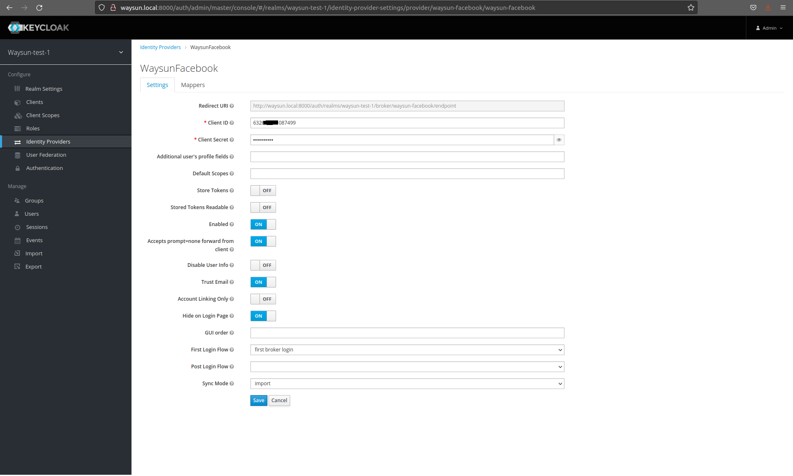
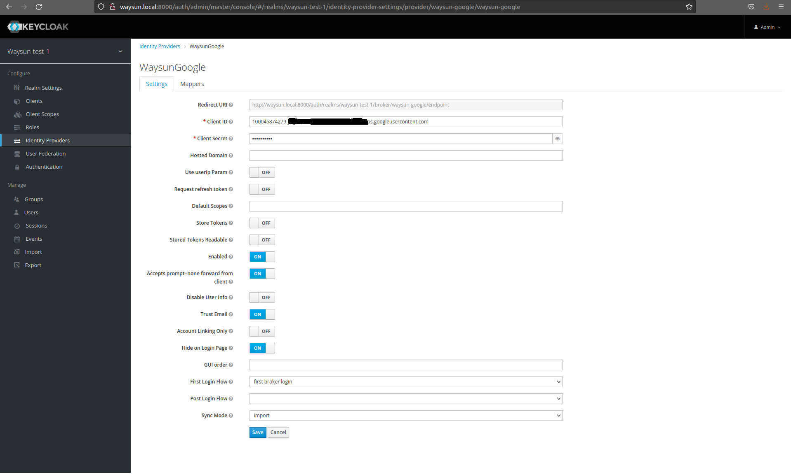
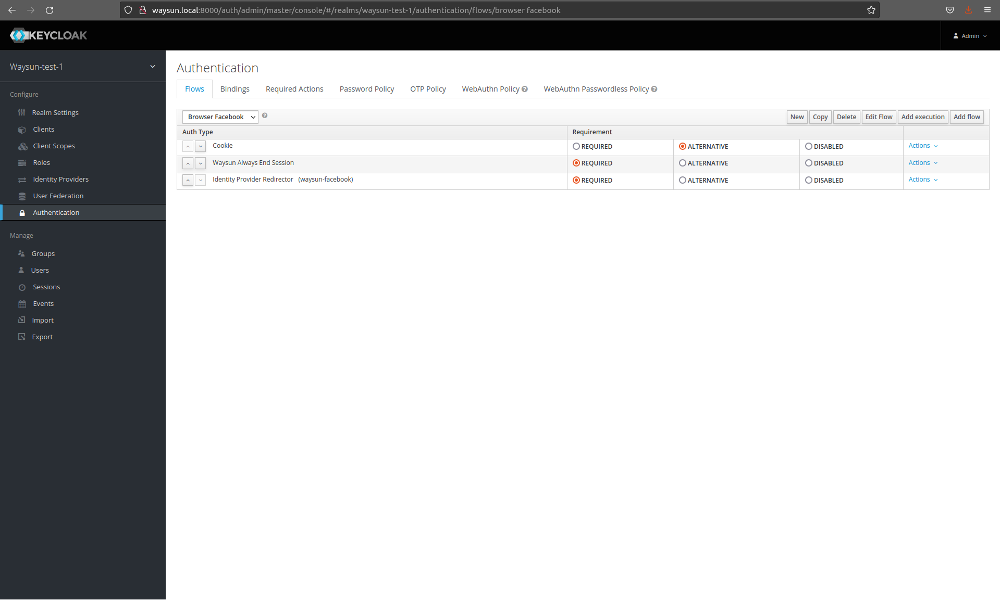
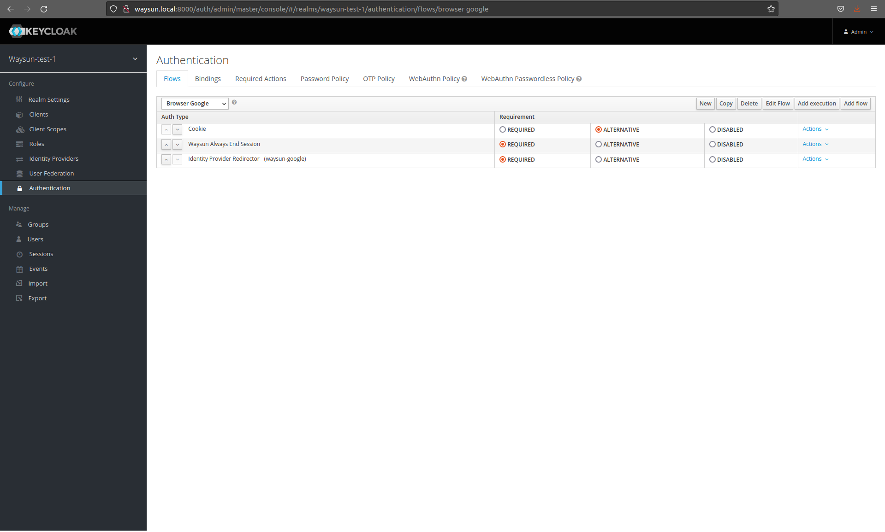
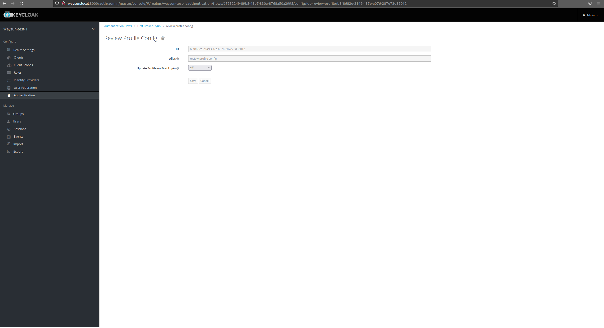
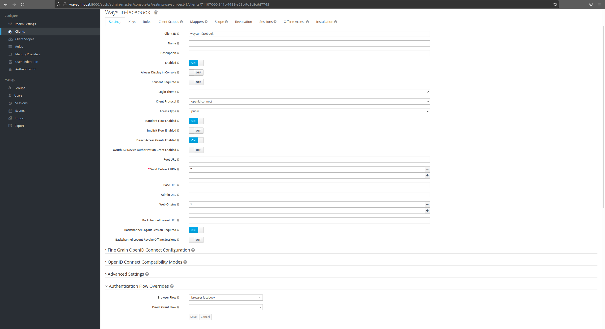
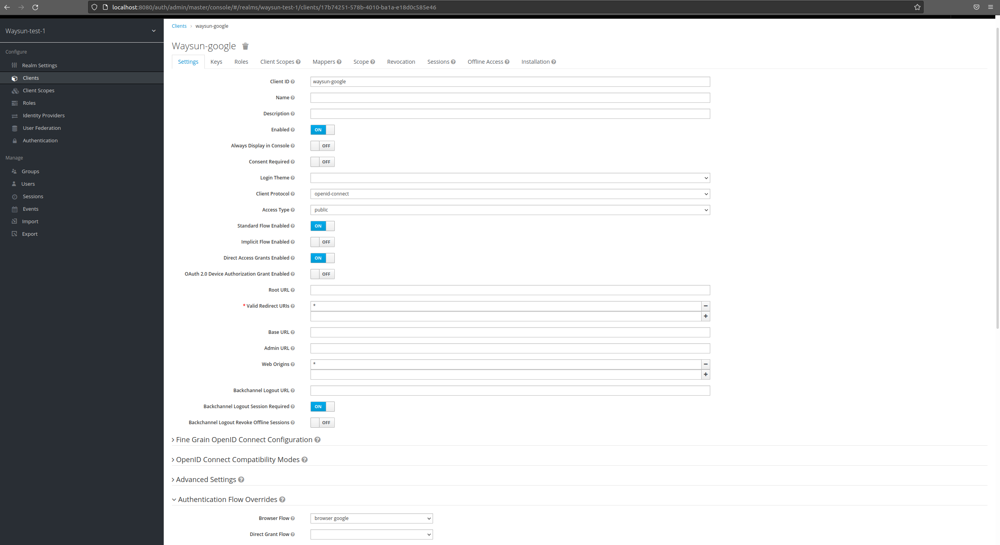

How to configure Keycloak to be able to log in via Facebook or Google and switch accounts

## Table of Contents

- [Requirements](#requirements)
- [Create Realm](#create-realm)
- [Create Identity Providers](#create-identity-providers)
- [Configure Authentication](#configure-authentication)
- [Create Clients](#create-clients)

## Requirements

It's needed to create test apps for web apps in GCP and Facebook for developers. We'll use client id and client secret
from these apps.

In GCP in a new Client ID for Web application (in Credentials) we need to set URIs in Authorised JavaScript origins
to `http://localhost:8000` and URIs in Authorised redirect URIs
to `http://localhost:8000/auth/realms/stella-test-1/broker/stella-google/endpoint`.

In Facebook in Basic Settings of the app we need to set Site URL
to `http://localhost:8000/auth/realms/master/broker/stella-facebook/endpoint`.

## Create Realm

Create a new realm called `stella-test-1`

## Create Identity Providers

In `Identity Providers` use `Add provider` to add the providers as shown below:

## Configure Authentication

In Authentication create the copies of `browser` called `browser facebook` and `browser google` configured as shown on
the screenshots:

Change `First Broker Login` authentication flow. In `Review Profile` step expand `Actions` and choose `Configure`. After
that change `Update Profile on First Login` to `off`.

## Create Clients

In `Clients` config create two new clients:

