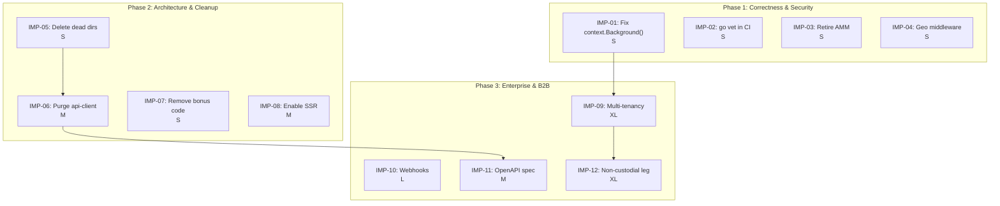

# Taya NA Predict — Improvement Plan

**Date:** 2026-06-14 · **Companion to:** [AUDIT_REPORT.md](AUDIT_REPORT.md) (same date)
**Strategic option:** Option A — Evolve in place (Go + Next.js; CLOB stays; AMM retired; on-chain leg built per ADRs; enterprise layer built on the hardened core)
**Ground rules:** every task is sized for one Claude Code session; money-path fixes write their failing test FIRST; structural deletions use `git rm` (history preserved); `go build ./... && go test ./...` and `yarn test` must be green before any commit. Paths are relative to repo root; `GW` = `apps/Phoenix-Predict-Combined/go-platform/services/gateway`, `FE` = `apps/Phoenix-Predict-Combined/talon-backoffice/packages`.

Effort: S ≤ ½ day · M ≈ 1 day · L ≈ 2–3 days · XL ≈ 1–3 weeks. All tasks reference audit finding IDs.

> **Note on prior audit findings.** The Jun-12 audit's top findings (COR-01, COR-02, COR-04, COR-05, SEC-02, SEC-03, PERF-03, P2-07) have been verified as fixed. This plan addresses the remaining open findings only. See AUDIT_REPORT.md §3 for the full disposition table.

---

## Phase 1 — Correctness & Security

*Goal: eliminate remaining money-path and security issues. No feature work. The platform runs while this proceeds.*

### IMP-01 · Fix `context.Background()` in payment paths · S

- **Finding(s):** COR-06
- **Files:**
  - `GW/internal/payments/crypto_rail.go` (line 146)
  - `GW/internal/payments/db_service.go` (line 55)
- **Approach:** Replace `context.WithTimeout(context.Background(), paymentDBTimeout)` with `context.WithTimeout(ctx, paymentDBTimeout)` in both files. Both functions already receive `ctx` from their callers or can be threaded through. Verify the caller chain (HTTP handler → service → these functions) passes the request context.
- **Acceptance criteria:**
  - `grep -rn "context.Background()" GW/internal/payments/ --include="*.go" | grep -v _test.go` returns 0
  - `go build ./...` and `go test ./internal/payments/...` pass
- **Effort:** S (1 hour)
- **Risk:** Low
- **Dependencies:** None

### IMP-02 · Add `go vet` to CI · S

- **Finding(s):** SEC-05, QUAL-04
- **Files:**
  - `.github/workflows/test.yml` or new `.github/workflows/guard-go-vet.yml`
  - `GW/cmd/gateway/migrate_legacy_loyalty.go` (lines 39-41)
- **Approach:** Add `go vet ./...` step to Go CI. Fix the 3 warnings (unexported struct fields with json tags — export them or remove tags).
- **Acceptance criteria:**
  - `go vet ./...` returns 0 warnings
  - CI fails on new `go vet` warnings
- **Effort:** S (30 minutes)
- **Risk:** Low
- **Dependencies:** None

### IMP-03 · Retire AMM code path · S

- **Finding(s):** COR-03 (prior, mitigated), AMM retirement note
- **Files:**
  - `GW/internal/prediction/amm.go` (delete)
  - `GW/internal/prediction/amm_test.go` (delete if exists)
  - `GW/internal/prediction/service.go` (simplify AMM rejection to hard error)
  - `GW/internal/prediction/types.go` (AMMYesShares, AMMNoShares fields)
  - New migration: `GW/migrations/040_retire_amm.sql`
- **Approach:**
  1. Verify no active market uses AMM: `SELECT count(*) FROM prediction_markets WHERE execution_mode != 'order_book'` → must be 0
  2. Delete `amm.go` (and test file if present)
  3. Add migration: `ALTER TABLE prediction_markets ADD CONSTRAINT chk_execution_mode CHECK (execution_mode = 'order_book');`
  4. Simplify the AMM rejection in `PlaceOrder` to a hard error
  5. Keep the float64 DB columns for now (no data migration needed) but remove LMSR logic
- **Acceptance criteria:**
  - `grep -rn "LMSR\|CostForTrade\|func.*AMM" GW/internal/prediction/ --include="*.go" | grep -v _test.go` returns 0
  - `go build ./...` and `go test ./...` pass
  - DB constraint prevents AMM market creation
- **Effort:** S (2-3 hours)
- **Risk:** Medium — must verify no active market uses AMM mode first
- **Dependencies:** None

### IMP-04 · Geo gate as middleware · S

- **Finding(s):** SEC-04
- **Files:**
  - `GW/internal/http/pretrade_gate.go`
  - `GW/cmd/gateway/main.go` (route registration)
- **Approach:** Extract the geo/compliance gate into an `http.Handler` middleware wrapping all money-path routes (`/api/v1/orders`, `/api/v1/wallet/deposit`, `/api/v1/wallet/withdraw`, `/api/v1/bot/orders`). Individual handlers no longer call the gate function. `permissiveBetaComplianceMode()` still works in staging/demo.
- **Acceptance criteria:**
  - A new money-path handler is covered by the middleware automatically
  - Existing money-path tests pass
  - Permissive mode still works in staging
- **Effort:** S (3-4 hours)
- **Risk:** Medium — must not break staging compliance path
- **Dependencies:** None

---

## Phase 2 — Architecture & Cleanup

*Goal: remove dead weight, consolidate API surface, improve frontend architecture.*

### IMP-05 · Delete dead directories · S

- **Finding(s):** ARCH-01
- **Directories to delete:**
  - `apps/Phoenix-Predict-Combined/phoenix-frontend-brand-viegg/` (1.0 GB)
  - `apps/Phoenix-Predict-Combined/phoenix-backend/` (18 MB)
  - `archive/` (632 MB)
  - `tmp/` (19 MB)
  - `.codex-reviews/` (128 KB)
  - `.context/` (4 KB)
- **Do NOT delete:** `revival/` (active Go module path `phoenix-revival/platform`)
- **Approach:** `git rm -r` each directory. Single commit with rationale.
- **Acceptance criteria:**
  - `du -sh .` shows ~1.7 GB reduction
  - `go build ./...` passes
  - `yarn install --frozen-lockfile && yarn test` passes
  - No CI workflow references deleted paths
- **Effort:** S (1 hour)
- **Risk:** Low — directories are unreferenced; git history preserves them
- **Dependencies:** None

### IMP-06 · Purge sportsbook leakage from api-client · M

- **Finding(s):** ARCH-02, ARCH-03
- **Files:**
  - `FE/api-client/src/client.ts`
  - `FE/api-client/src/prediction-client.ts`
  - `e2e/player-app/responsive.spec.ts`, `e2e/backoffice/trading.spec.ts`, `e2e/player-app/betslip.spec.ts`
- **Approach:**
  1. Delete sportsbook methods from `client.ts` (~15 methods: fixtures, freebets, selections, match-tracker, betslip)
  2. Build out `prediction-client.ts` as the canonical typed prediction API client
  3. Update `fetch()` call sites in `app/` and `office/` to use prediction client
  4. Delete sportsbook e2e test files
- **Acceptance criteria:**
  - `grep -rn "fixtures\|betslip\|selections\|freebets\|match_tracker\|sport_key" FE/api-client/src/ --include="*.ts"` returns 0
  - `tsc --noEmit` passes
  - `yarn test` passes
- **Effort:** M (4-6 hours)
- **Risk:** Medium — must verify no active code depends on deleted methods
- **Dependencies:** IMP-05 (delete dead dirs first)

### IMP-07 · Remove bonus/freebet/loyalty dead code · S

- **Finding(s):** ARCH-02
- **Files:**
  - `GW/internal/bonus/` (entire package)
  - `GW/internal/loyalty/` (if exists)
  - `GW/cmd/gateway/migrate_legacy_loyalty.go`
  - `GW/cmd/gateway/main.go` (remove bonus route registration)
- **Approach:** Delete packages if no prediction-market code imports them. Remove route registrations.
- **Acceptance criteria:**
  - `go build ./...` passes
  - `go test ./...` passes
  - `grep -rn "bonus\|freebet\|FreebetGranter" GW/internal/ --include="*.go" | grep -v _test.go | grep -v migration` returns 0
- **Effort:** S (2-3 hours)
- **Risk:** Low-Medium — verify import graph first
- **Dependencies:** None

### IMP-08 · Enable SSR for key pages · M

- **Finding(s):** ARCH-04
- **Files:**
  - `FE/app/app/predict/page.tsx` (discovery)
  - `FE/app/app/market/[ticker]/page.tsx` (market detail)
  - `FE/app/app/category/[slug]/page.tsx` (category filter)
- **Approach:** Remove `"use client"` from these 3 pages. Extract interactive elements (trade ticket, WS price updates) into client components. Fetch initial data server-side.
- **Acceptance criteria:**
  - `curl -s http://localhost:3000/predict | grep -c "market"` returns > 0
  - Market detail page renders with initial data in HTML source
  - Interactive elements (trade ticket, WS) still work after hydration
- **Effort:** M (6-8 hours)
- **Risk:** Medium — SSR data fetching must handle auth context
- **Dependencies:** None

---

## Phase 3 — Enterprise & B2B

*Goal: build the enterprise features needed for multi-tenant, partner-facing deployment.*

### IMP-09 · Wire multi-tenancy query scoping · XL

- **Finding(s):** ENT-01
- **Files:**
  - `GW/internal/prediction/sql_repository.go` (all query methods — ~20+ functions)
  - `GW/internal/wallet/service.go` (wallet queries)
  - `GW/internal/http/` (auth middleware — extract tenant from session/API key)
  - New migration for RLS policies
- **Approach:**
  1. Add `tenant_id` to the request context (auth middleware extracts from session or API key)
  2. Add `AND tenant_id = $N` to every query in sql_repository.go
  3. Add RLS policies as defense-in-depth
  4. Write integration tests: tenant A cannot see tenant B's data
- **Acceptance criteria:**
  - Creating market as tenant A, querying as tenant B returns empty
  - All repo methods include tenant_id in WHERE clauses
  - `go test ./internal/prediction/... -run TestTenant -v` passes
- **Effort:** XL (2-3 weeks)
- **Risk:** High — touches every query. Must be methodical with full test coverage.
- **Dependencies:** Migration 037 already has columns

### IMP-10 · Build webhook dispatcher · L

- **Finding(s):** ENT-02
- **Files:**
  - `GW/internal/webhooks/` (new package)
  - `GW/internal/http/webhook_handlers.go` (new — endpoint CRUD)
  - `GW/cmd/gateway/main.go` (wire dispatcher worker)
- **Approach:**
  1. Endpoint CRUD API (gated by `partners:write` permission)
  2. Dispatcher worker: poll `webhook_deliveries WHERE status='pending' AND next_attempt_at <= NOW()`, claim with `FOR UPDATE SKIP LOCKED`, POST HMAC-signed payload, mark delivered or reschedule with backoff
  3. Enqueue deliveries post-commit on settlement/void/lifecycle events (same seam as WS notifier)
  4. Headers: `X-TNA-Signature: sha256=hmac(secret, payload)`, `X-TNA-Delivery-Id`
- **Acceptance criteria:**
  - Partner registers endpoint via API
  - Market settlement triggers delivery
  - Failed deliveries retry with exponential backoff
  - Max-retries exhausted → status = `failed`
- **Effort:** L (1-2 weeks)
- **Risk:** Medium — schema already exists (migration 039), this is implementation
- **Dependencies:** None

### IMP-11 · Build gateway OpenAPI spec · M

- **Finding(s):** ENT-03
- **Files:**
  - `GW/openapi.yaml` (new)
  - `.github/workflows/guard-openapi-drift.yml` (update)
- **Approach:** Write OpenAPI 3.1 spec for all `/api/v1/` endpoints. Request/response schemas match `types.go` structs. Use `guard-openapi-drift.yml` to prevent drift. Generate TypeScript client to replace hand-rolled fetches.
- **Acceptance criteria:**
  - Spec covers all public + authenticated endpoints
  - CI validates spec against route registration
  - `npx openapi-typescript openapi.yaml -o types.ts && tsc --noEmit types.ts` passes
- **Effort:** M (1 week)
- **Risk:** Low
- **Dependencies:** IMP-06 (api-client cleanup)

### IMP-12 · Build non-custodial settlement leg · XL

- **Finding(s):** A2-01
- **Files:**
  - `contracts/src/` (implement interfaces)
  - `services/relayer/` (new Go or TS service)
  - `services/bridge-watcher/` (new Go or TS service)
  - `packages/cashier-sdk/` (wire to real providers)
  - `services/cashier-api/` (replace mock provider)
- **Sub-phases:**
  - **12a:** Implement `IHulaCashierCollateral.sol` — access control, reentrancy guards, UUPS upgradeability. Foundry tests. External audit before testnet.
  - **12b:** Bridge-watcher: subscribe to on-chain events, confirmation depth, reorg detection.
  - **12c:** Relayer: claim settlement actions, submit with nonce management, gas estimation, retry.
  - **12d:** Wire cashier-api to real providers.
- **Acceptance criteria:**
  - E2E testnet: deposit → trade → settlement → on-chain payout → confirmation
  - Reorg test: simulated reorg freezes deposits
  - Nonce management: concurrent submissions don't gap
- **Effort:** XL (2-3 months)
- **Risk:** HIGH — requires external smart contract audit before mainnet
- **Dependencies:** IMP-09 (tenancy — cashier should be tenant-aware from start)

---

## Task dependency graph

*Tasks without dependency arrows are independently executable.*

---

## Suggested first sprint

These 6 tasks are independent, low-risk, and parallelizable:

| Task | Effort | Rationale |
|---|---|---|
| **IMP-01** Fix `context.Background()` | 1h | Payment correctness |
| **IMP-02** Add `go vet` to CI | 30m | CI coverage gap |
| **IMP-05** Delete dead directories | 1h | 1.7 GB cleanup |
| **IMP-03** Retire AMM code path | 2-3h | Remove high-risk dead code |
| **IMP-07** Remove bonus/loyalty code | 2-3h | Dead sportsbook code removal |
| **IMP-04** Geo gate as middleware | 3-4h | Defense in depth |

**Sprint total: ~10-15 hours.** After completion, all Phase 1 items are closed and the codebase is 1.7 GB lighter with ~200 fewer lines of dead or risky code.

---

## CI guardrails to add

| Check | Current | Action |
|---|---|---|
| `go vet ./...` | ❌ Missing | Add per IMP-02 |
| `grep context.Background() payments/` | ❌ Missing | Add after IMP-01 to prevent regression |
| `grep ": any\|as any" app/` (excl. generated) | ❌ Missing | Prevent `any` introduction in player app |
| e2e prediction flow tests | ❌ Missing | Future sprint — build basic smoke test |
| `go build ./...` | ✅ Exists | — |
| `go test -race ./...` | ✅ Exists | — |
| `tsc --noEmit` | ✅ Exists | — |
| `guard-money-path.yml` | ✅ Exists | — |
| `guard-db-migrations.yml` | ✅ Exists | — |
| `guard-conventions.yml` | ✅ Exists | — |
