# Taya NA Predict — Improvement Plan

**Date:** 2026-06-12 · **Implements:** AUDIT_REPORT.md §4 recommendation — **Option A: evolve in place** (Go + Next.js; CLOB stays; AMM retired; on-chain leg executed per ADRs; enterprise layer built on the hardened core).
**Ground rules for executing agents:** every task is sized for one Claude Code session; money-path fixes write their failing test FIRST; structural deletions are reversible (git mv to `archive/` or a branch — never destroy history); `go build ./... && go test ./...` (gateway+auth) and the frontend gates must be green before any commit. Paths are relative to repo root; `GW` = `apps/Phoenix-Predict-Combined/go-platform/services/gateway`, `FE` = `apps/Phoenix-Predict-Combined/talon-backoffice/packages`.

Effort: S ≤ ½ day · M ≈ 1 day · L ≈ 2–3 days. All tasks reference audit finding IDs.

---

## Phase 1 — Correctness & security (fix in current code; the platform runs while everything else proceeds)

### P1-01: Status-guarded settle and void transitions (kill the double-pay race)
- **Findings:** COR-01 (CRITICAL)
- **Files:** `GW/internal/prediction/sql_repository.go` (`PersistResolvedMarketAtomic`, `PersistVoidedMarketAtomic`, new guarded update helper), `GW/internal/prediction/settlement.go`, `GW/internal/prediction/settlement_*_test.go` (new race test)
- **Approach:**
  1. Write the failing test first: two goroutines on one `closed` market — one `ResolveMarket`, one `VoidMarket` — against a real Postgres test DB (pattern: existing `*_test.go` suites use one); assert exactly one succeeds and total credits equal either payouts or refunds, never both.
  2. Add `transitionMarketStatusWithExec(ctx, exec, marketID, from []MarketStatus, to MarketStatus, …)` that runs `UPDATE prediction_markets SET status=$to … WHERE id=$1 AND status = ANY($from)` and returns `ErrStaleMarketStatus` when `RowsAffected != 1` (copy the proven pattern from `PersistProposalAtomic`, `sql_repository.go:954-975`).
  3. In `PersistResolvedMarketAtomic`, replace the blind `updateMarketWithExec` with the guarded transition (`from: closed|proposed_resolution|disputed → settled`) **as the first statement in the tx**, so a concurrent void/settle aborts before any credit is written. Keep the field updates (result, prices) in the same statement.
  4. Same in `PersistVoidedMarketAtomic` (`from: any non-terminal → voided`).
  5. Map `ErrStaleMarketStatus` to a clean 409 "market already settled/voided" in `settlement.go` / the admin handlers instead of a raw SQL error.
  6. Run the new test 50× with `-race -count=50`.
- **Acceptance:** the race test passes; concurrent settle+void can never both commit; a second settle attempt returns 409, not a unique-violation string.
- **Verify:** `cd GW && go test ./internal/prediction/ -run 'TestSettleVoidRace|TestSettlement' -race -count=20 && go test ./... `
- **Effort:** M · **Risk:** low — guard tightens behavior; rollback = revert one commit. Watch: `FinalizeResolution` path must include `proposed_resolution/disputed` in `from`.
- **Deps:** none. **Do this first.**

### P1-02: Revalidate maker fill state inside the match lock, with bounded retry
- **Findings:** COR-02 (HIGH)
- **Files:** `GW/internal/prediction/sql_exchange_repository.go`, `GW/internal/prediction/service.go` (`placeExchangeOrder`), `GW/internal/prediction/exchange_concurrency_test.go` (new)
- **Approach:**
  1. Failing test first: two concurrent takers vs one resting maker (full and partial overlap variants); assert maker row's `filled_quantity` never decreases and no phantom `remaining_quantity` survives commit.
  2. In `PersistMatchAtomic`, after the advisory lock, `SELECT id, filled_quantity, remaining_quantity, status FROM prediction_orders WHERE id = ANY($makerIDs) FOR UPDATE` and compare against the plan's assumed pre-fill state.
  3. On mismatch, return a typed `ErrBookChanged` (do not write stale absolutes). Change `updateOrderFillStateWithTx` for makers to **relative** updates (`filled_quantity = filled_quantity + $delta`) guarded by `AND remaining_quantity >= $delta`, or keep absolutes now verified safe by step 2 — prefer relative; it makes the write idempotent against plan drift.
  4. In `placeExchangeOrder`, on `ErrBookChanged` re-load makers and re-plan, bounded to 3 attempts, then reject with "book moved, please retry".
  5. Keep the existing seller-oversell and market-status revalidation untouched; extend the test to cover taker-sell overlap.
- **Acceptance:** concurrency test green under `-race -count=20`; no spurious rejection in the partial-overlap case (re-plan fills what's actually available); maker rows never regress.
- **Verify:** `cd GW && go test ./internal/prediction/ -run 'Exchange' -race -count=10 && go test ./...`
- **Effort:** L · **Risk:** medium — touches the hot match path; mitigate with the bench suite (`exchange_bench_test.go`) before/after; rollback = revert, the old behavior is money-safe (only state-corrupting).
- **Deps:** P1-01 (shares test scaffolding).

### P1-03: Make the legacy AMM path safe pending retirement
- **Findings:** COR-03 (HIGH)
- **Files:** `GW/internal/prediction/service.go` (`PlaceOrder` AMM branch, line ~631-895), `GW/internal/prediction/sql_repository.go` (`PersistFilledOrderAtomic`), tests
- **Approach:**
  1. Failing test: two concurrent AMM buys on one AMM-mode market; assert no lost update of `amm_yes_shares` and position quantity sums correctly.
  2. Fix the swallowed error at `service.go:825`: `existing, err := s.repo.GetPosition(…)` — on a non-`ErrNoRows` error, **fail the order** (never build a fresh snapshot over an unknown existing position).
  3. Take `pg_advisory_xact_lock(hashtext(marketID))` inside `PersistFilledOrderAtomic`, then re-read market AMM state and recompute cost inside the tx (move `ExecuteTrade` math or re-derive deltas); alternatively reject with retry-once on serialization failure (40001) — pick the lock approach for symmetry with the book path.
  4. Gate new-market creation: assert no admin path can create `execution_mode='amm'` markets (grep + handler validation), so the path only serves pre-019 stragglers until P2-09 deletes it.
- **Acceptance:** concurrent AMM test green; transient GetPosition error rejects the order instead of resetting a position; no new AMM markets creatable.
- **Verify:** `cd GW && go test ./internal/prediction/ -run 'AMM|Amm' -race -count=10 && go test ./...`
- **Effort:** M · **Risk:** low-medium — legacy path; rollback trivial.
- **Deps:** none (parallel with P1-02).

### P1-04: Stop ignoring money/settlement/audit write errors
- **Findings:** COR-04 (MED-HIGH), COR-08
- **Files:** `GW/internal/wallet/service.go` (:598, :677-679), `GW/internal/prediction/service.go` (:883, :1036, :1070, :1087-1091), `GW/internal/prediction/settlement.go` (8 sites), `GW/internal/alphacashier/service.go` (:411 + recordAudit sites), `GW/internal/bonus/service.go` (:242, :336), `GW/internal/payments/db_service.go` (:130, :213, :329-334)
- **Approach:**
  1. `wallet/service.go:598`: check the held-funds SUM error; on error return it (fail closed). Add a unit test that injects a failing query.
  2. For each remaining `_ =` site, triage into: (a) must-fail (money math, holds, releases) → return the error; (b) must-log-and-count (audit/lifecycle writes) → `slog.Error` + a new `audit_write_failures_total` counter; never silent.
  3. Fix the lying comment at `service.go:1087-1091` (actually log).
  4. Thread the back-office override flag through `ResolveMarketRequest` (COR-08) so `RecordSettlement(…, override)` is honest.
  5. Auth: `services/auth/internal/http/handlers.go:949,996` — log failed token invalidations (the :597 bug itself is P1-05).
- **Acceptance:** `grep -n '_ = ' GW/internal/{wallet,prediction,alphacashier,payments,bonus}/*.go | grep -v _test` returns only documented-benign sites (each with a `// best-effort:` comment); new tests for the Hold error path pass.
- **Verify:** `cd GW && go test ./... && go vet ./...`
- **Effort:** M · **Risk:** low — behavior only gets stricter; watch for tests that relied on silent failure.
- **Deps:** none.

### P1-05: Fix logout revocation; revoke sessions on password change; per-IP login limiter
- **Findings:** SEC-01 (HIGH), SEC-05 (MEDIUM)
- **Files:** `apps/Phoenix-Predict-Combined/go-platform/services/auth/internal/http/handlers.go` (:597, :814-866, :764, :1264-1278, :604-621), `session_store.go`, `redis_session_store.go`, tests
- **Approach:**
  1. Failing test: login → logout → assert the old access token is rejected by `/api/v1/auth/session` (this test fails today).
  2. Fix the double digest: pass the **raw** token at `handlers.go:597` (`DeleteByAccessToken(tokenToInvalidate)`); same audit for every `digestToken(` call site against store method contracts.
  3. `ChangePassword`: delete the user's sessions after a successful hash update; test.
  4. Add a per-IP login limiter alongside the per-username one (Redis limiter already exists — reuse `redis_rate_limiter.go`); key by remote addr resolved via a `TRUSTED_PROXY_CIDRS` check, not raw leftmost XFF; apply the same `extractIP` fix to the register limiter.
  5. Require auth + ownership on `DELETE /api/v1/auth/sessions/{id}`.
- **Acceptance:** logout invalidates server-side immediately (test); password change kills live sessions (test); spray across N usernames from one IP throttles (test).
- **Verify:** `cd …/services/auth && go test ./... -race`
- **Effort:** M · **Risk:** low. Rollback = revert; no schema changes.
- **Deps:** none.

### P1-06: Put the bot/partner API behind the compliance gate; close the key-lifecycle gaps
- **Findings:** SEC-02 (HIGH), G gap (partner keys)
- **Files:** `GW/internal/http/bot_handlers.go`, `GW/internal/http/pretrade_gate.go`, `GW/internal/prediction/botauth.go`, `GW/internal/prediction/repository.go` (`DeactivateAPIKey`), tests
- **Approach:**
  1. Failing test: bot-key order from a geo-blocked country header → expect 403 (passes through today).
  2. Call `checkComplianceGates(r, userID, SurfaceTrade)` in the bot order handler (`bot_handlers.go:79-114`) — same gate, distinct audit tag `surface=bot`.
  3. Longer-term hardening in the same PR: move the geo/KYC gate *into* `Service.PlaceOrder` behind an injected checker (the RG gate already lives there — same pattern), so no future transport can forget it; keep the HTTP-layer call for early 403s.
  4. Expose `DELETE /api/v1/bot/keys/{id}` (revoke, owner or admin) wired to `DeactivateAPIKey`; set a default expiry at issuance; gate key **creation** behind an explicit flag (`BOT_KEYS_SELF_SERVE`, default off in prod — partners get admin-issued keys).
  5. Tests for revoked/expired key rejection.
- **Acceptance:** geo-blocked bot order → 403 with audit log; revoked key → 401; self-serve issuance off by default in prod boot validation.
- **Verify:** `cd GW && go test ./internal/http/ ./internal/prediction/ -run 'Bot|Compliance' -race && go test ./...`
- **Effort:** M · **Risk:** low — additive enforcement. Rollback: revert.
- **Deps:** none.

### P1-07: Make the geo signal spoof-resistant end to end
- **Findings:** SEC-03 (HIGH), CMP-04 residuals
- **Files:** `apps/Phoenix-Predict-Combined/docker-compose.yml` (:49-50), `docker-compose.demo.yml`, `Caddyfile`, `GW/internal/http/pretrade_gate.go`, `GW/cmd/gateway/main.go`, docs
- **Approach:**
  1. Remove the host port publish for gateway in the demo topology: bind `127.0.0.1:18080:18080` in base compose (devs keep localhost access) and ensure the demo overlay exposes **nothing** — Caddy reaches the gateway over the compose network.
  2. Add an edge-shared-secret defense: Caddy sets `X-Edge-Auth: {$EDGE_SHARED_SECRET}` on proxied requests; gateway (when `GEO_TRUSTED_PROXY_MODE=require`) rejects any request missing/mismatching it (constant-time compare) **before** reading the country header. Boot-fail prod if the secret is unset while require-mode is on.
  3. Export denial counters as Prometheus metrics (`geo_denials_total{reason,surface}`, `geo_missing_signal_total`) via the existing `/metrics` route instead of the in-process int (`pretrade_gate.go:51`).
  4. Integration test: forged `CF-IPCountry` direct to the gateway with require-mode on → 403 regardless of header value.
  5. Document the topology + firewall expectations in `docs/compliance/geofencing-kyc.md`.
- **Acceptance:** direct-origin forged-header request denied in require-mode; demo box exposes only Caddy; metrics visible at `/metrics`.
- **Verify:** `cd GW && go test ./internal/http/ -run 'Geo|PreTrade' && go test ./...`; `docker compose -f docker-compose.demo.yml config | grep -A3 'gateway:' | grep -c 'ports' # expect 0`
- **Effort:** M · **Risk:** medium — a wrong edge secret bricks prod traffic; land env docs + demo deploy first (same mitigation as the prior compliance PRs). Rollback: unset require-mode flag.
- **Deps:** none.

### P1-08: Patch the framework layer
- **Findings:** SEC-04 (HIGH-patchable)
- **Files:** `FE/app/package.json`, `FE/office/package.json`, `talon-backoffice/yarn.lock`
- **Approach:** bump `next` to ≥16.2.5 in app + office; bump `jsonwebtoken` 8→9 in both (only `decode` is used — verify signature unchanged); `yarn install`; run full FE gates; production builds.
- **Acceptance:** `yarn audit --level high` shows no Next.js middleware advisories; both `npm run build` pass.
- **Verify:** `cd talon-backoffice && yarn install --frozen-lockfile && (cd packages/app && npm run typecheck && npm test && npm run build) && (cd packages/office && npx tsc --noEmit && npm run build)`
- **Effort:** S · **Risk:** low (patch releases). Rollback: lockfile revert.
- **Deps:** none.

### P1-09: Clamp all pagination; add the two missing money-table indexes
- **Findings:** PERF-01 (HIGH), PERF-02 (HIGH)
- **Files:** `GW/internal/http/prediction_handlers.go` (`intQueryParam` :1093-1103 + call sites), `GW/internal/http/wallet_handlers.go` (:61-70), `GW/internal/http/prediction_admin_handlers.go` (:206-213), new `GW/migrations/032_perf_indexes.sql`, `GW/internal/wallet/service.go` (code-created schema)
- **Approach:**
  1. Give `intQueryParam` a max parameter; clamp: public lists ≤100, authed lists ≤200, admin ≤500. Table-driven handler tests for `pageSize=1000000` → clamped, not 4xx.
  2. Migration 032: `CREATE INDEX idx_imported_markets_hash8 ON imported_markets ((upper(substr(external_hash,1,8))))`; `CREATE INDEX idx_wallet_ledger_user_id ON wallet_ledger (user_id, id DESC)`; `CREATE INDEX idx_pred_markets_status_volume ON prediction_markets (status, volume_cents DESC)`. Plain CREATE INDEX is fine at current scale; note the `CONCURRENTLY` upgrade path for live-prod in the migration comment (goose: would need `-- +goose NO TRANSACTION`).
  3. Mirror the wallet_ledger index in the code-created schema (`wallet/service.go:1670-1681`) so memory→db bootstraps match.
  4. `EXPLAIN ANALYZE` the market-list and ledger queries before/after against seeded data; record in the PR.
- **Acceptance:** all list endpoints reject/clamp absurd pageSize (tests); EXPLAIN shows index scans for the LATERAL match and ledger reads.
- **Verify:** `cd GW && go test ./... && GATEWAY_DB_DSN=… go run ./cmd/migrate up` (fresh DB job)
- **Effort:** M · **Risk:** low. Rollback: drop indexes / revert clamps.
- **Deps:** none.

### P1-10: Non-blocking WebSocket fan-out
- **Findings:** PERF-03 (HIGH)
- **Files:** `GW/internal/ws/client.go` (:233-238), `GW/internal/ws/hub.go` (:137-139, :167-172), `GW/internal/ws/handler.go` (connect path), tests
- **Approach:**
  1. Failing test: a deliberately-stalled client must not delay delivery to a healthy client beyond X ms.
  2. `SendMessage`: add a `default:` (or short timeout) branch — on full buffer, mark client slow, drop the message, and schedule disconnect (`c.cancel()`); the client's reconnect+refetch path already handles resync.
  3. `Broadcast` (producer side): non-blocking enqueue with a drop-and-count fallback so PlaceOrder handlers can never block on the hub (`prediction_handlers.go:485-507` callers unchanged).
  4. Add `ws_dropped_messages_total`, `ws_clients_disconnected_slow_total` metrics; add a max-connections cap (env, default 10k) checked before upgrade.
  5. Run the ws test suite + a 1k-client soak in the existing bench harness if present; otherwise a short custom soak test.
- **Acceptance:** stalled-client test green; PlaceOrder latency unaffected by a wedged subscriber (test asserts <50ms delivery to healthy client while one client is stalled).
- **Verify:** `cd GW && go test ./internal/ws/ -race -count=5 && go test ./...`
- **Effort:** M · **Risk:** medium — message drops are by-design lossy now; document that clients must treat WS as cache-invalidation, not source of truth (portfolio already polls). Rollback: revert.
- **Deps:** none. (Cross-instance pub/sub is P2-07; this fixes the single-instance failure mode first.)

### P1-11: Test the unattended money path (workers) and freeze the race-class with tests
- **Findings:** TEST-01 (HIGH)
- **Files:** `GW/internal/prediction/workers/{closer,settler,reconciler,expirer}_test.go` (new), `FE/api-client` (minimal client tests)
- **Approach:**
  1. Unit tests for `MarketCloser` (closes past-`close_at` markets, skips others), `AutoSettler` (feeds-empty no-op; with a fake feed settles once, idempotent on second tick, **and respects P1-01's guard when racing a void**), `SweepExpiredRestingOrders`, `Reconciler` (drift report on an artificially broken market).
  2. Fake repo/wallet already exist in the package tests — reuse.
  3. api-client: replace `--passWithNoTests` with at least endpoint-path tests for `prediction-client.ts` (the app's wallet-client tests are the pattern).
  4. Wire both into CI's existing Go/FE jobs (no new workflow needed).
- **Acceptance:** `go test ./internal/prediction/workers/` exists and passes; api-client `npm test` runs ≥1 real suite.
- **Verify:** `cd GW && go test ./internal/prediction/workers/ -race && cd FE/api-client && npm test`
- **Effort:** M · **Risk:** none (tests only).
- **Deps:** P1-01 (tests its guard from the worker side).

### P1-12: Wire sanctions screening into the live cashier path
- **Findings:** CMP-01 (HIGH)
- **Files:** `GW/internal/alphacashier/service.go` (deposit intent + withdrawal request), new `GW/internal/compliance/screening.go` (port the logic out of dead `internal/cashier/policy.go`), config, tests
- **Approach:**
  1. Port the address-screening policy types from `internal/cashier/policy.go` into `internal/compliance` (the live package) — provider seam like IDV's: `SCREENING_PROVIDER` env, fail-closed in prod when enforcement is on, manual-review default otherwise.
  2. Call screening on: wallet-connect (challenge verify), deposit submit-tx (`from` address), withdrawal request (`to` address). Sanctions hit → quarantine status on the intent/request + back-office review queue flag (tables in migration 030 already carry status fields).
  3. Boot validation: prod requires `SCREENING_ENFORCEMENT=true` or `…_ACK_DISABLED=true` (same pattern as KYC flags, `cmd/gateway/main.go:267-273`).
  4. Tests: hit → quarantined, never auto-credited; provider-down → fail closed in prod.
- **Acceptance:** a listed address cannot complete deposit credit or withdrawal approval; boot policy covers the new flag.
- **Verify:** `cd GW && go test ./internal/alphacashier/ ./internal/compliance/ -race && go test ./...`
- **Effort:** L · **Risk:** low-medium (flag-gated). Rollback: ack-disable flag.
- **Deps:** none.

### P1-13: In-app two-person withdrawal control + custodial runbook
- **Findings:** A2-04 (HIGH)
- **Files:** `GW/internal/alphacashier/service.go` (:460-557), `GW/internal/http/alpha_cashier_admin_handlers.go`, migration 033 (approval columns), `docs/cashier/WITHDRAWAL_RUNBOOK.md` (new), office cashier-review container
- **Approach:**
  1. Schema: `approved_by`, `second_approved_by` on withdrawal requests; CHECK they differ.
  2. Enforce: `MarkWithdrawalBroadcasted` requires two distinct RBAC `cashier:write` approvers when `WITHDRAWAL_TWO_PERSON=true` (default true in prod boot validation; the SDK's two-person helper logic is the spec).
  3. Office: cashier-review UI shows approval state; second approver flow.
  4. Write the runbook: hot-wallet handling, signer policy, daily limits, reconciliation cadence (`cmd/reconciliation-report` exists — schedule it), incident steps.
  5. Tests: same-admin double-approve rejected; broadcast without 2 approvals rejected.
- **Acceptance:** withdrawal cannot reach broadcast state with one approver in prod config; runbook exists and references real commands.
- **Verify:** `cd GW && go test ./internal/alphacashier/ -race && go test ./...`
- **Effort:** L · **Risk:** low (flag-gated, alpha rail is default-off).
- **Deps:** none.

### P1-14: Reorg watch on credited deposits
- **Findings:** A2-03 (HIGH)
- **Files:** `GW/internal/alphacashier/evm.go`, new `GW/internal/alphacashier/reorg_watcher.go` worker, migration (deposit `finalized_at` column), tests with a fake EVM client
- **Approach:**
  1. After credit, keep the deposit in `credited_pending_finality`; a worker re-checks the tx receipt/block hash at N×confirmations (e.g., 64) or `finalized` tag, then marks `finalized`.
  2. If the tx vanishes/reorgs: freeze the credited amount via a wallet `Hold` (idempotent key `alpha-cashier:reorg:<txhash>`), alert (notify channel exists), and open a back-office review item — never silent.
  3. Worker follows the existing `MarketCloser` shape (interval tick, ctx cancel); add tests with a fake client flipping receipts.
- **Acceptance:** simulated reorg → balance held + review item, no withdrawal of orphaned funds possible; normal path finalizes.
- **Verify:** `cd GW && go test ./internal/alphacashier/ -race -run 'Reorg' && go test ./...`
- **Effort:** L · **Risk:** medium (new worker on a money path; flag-gate `ALPHA_CASHIER_REORG_WATCH=true`). Rollback: flag off.
- **Deps:** P1-13 (shares review-queue plumbing).

---

## Phase 2 — Architecture & organization cleanup

### P2-01: Archive the dead two-thirds (reversible)
- **Findings:** ORG-01
- **Files/dirs:** `services/codex-prep`, `libs/phoenix-core`, `review/`, `tmp/`, `configs/workspace`, `Phoenix-Sportsbook-Combined`, `apps/Phoenix-Predict-Combined/{phoenix-frontend-brand-viegg,revival,phoenix-backend}`, `FE/mock-server`, `scripts/Makefile`, root `Makefile`
- **Approach:** (1) re-verify zero references for each (`git grep -l <name> -- ':!archive' ':!docs'`); (2) create branch `archive/2026-06-pre-cleanup` as a full snapshot; (3) `git mv` each tree under `archive/<original-path>` in ONE commit per top-level dir (reviewable, revertable); (4) fix the root `Makefile` include; (5) add `archive/README.md` indexing what moved and why, with the audit finding IDs.
- **Acceptance:** repo root contains only live trees + `archive/`; full build/test matrix still green; `git log --follow` preserves history for moved files.
- **Verify:** the full Verification-log command set from the audit (§5 items 4–17) re-run green.
- **Effort:** M · **Risk:** low with the snapshot branch; rollback = `git revert` per commit.
- **Deps:** Phase 1 complete (don't mix cleanup into correctness PRs).

### P2-02: Delete dead office code; extend quality gates to the whole office package
- **Findings:** ARCH-03, QUAL-01/02
- **Files:** ~145 dead files under `FE/office/{containers,components,lib,types}` (the BFS list from the audit), `FE/office/gate.sh`, office `console.*`/`any` in the ~49 live occurrences
- **Approach:** (1) regenerate the reachability list (BFS from App Router entries) in-session and diff against the audit's; (2) `git mv` the dead set to `archive/office-sportsbook-ui/` (one commit); (3) extend `gate.sh` scans from `app/` to the whole package; (4) fix the live violations the wider gate now catches (add an office `lib/logger.ts` mirroring app's; kill the `console.log("Selected punter")`; type the live slices); (5) `tsc --noEmit` + build.
- **Acceptance:** office gates scan the full package and pass; office source file count drops ~50%; build + typecheck green.
- **Verify:** `cd FE/office && ./gate.sh && rm -rf .next && npx tsc --noEmit && npm run build`
- **Effort:** L · **Risk:** low-medium (reachability false-negatives) — mitigated by archive-not-delete + build/typecheck.
- **Deps:** P2-01 pattern established.

### P2-03: Delete dead app components and dead api-client exports
- **Findings:** QUAL-02, ARCH-02 (partial)
- **Files:** 27 dead `FE/app/app/components/*` (incl. banned-concept `BonusBadge`), `lib/utils/odds.ts`, `hooks/useApi.ts`, `hooks/useLiveData.ts`, `FE/api-client/src/{client.ts,websocket.ts}`, stale design-system alias in `FE/app/tsconfig.json:24-25`, `app/__tests__/odds.test.ts`
- **Approach:** verify zero importers per file; archive-move; delete the odds mirror-test with its source; remove the tsconfig alias; rebuild.
- **Acceptance:** app tests/build green; `api-client` exports only consumed modules.
- **Verify:** `cd FE/app && npm run typecheck && npm test && npm run build`
- **Effort:** M · **Risk:** low.
- **Deps:** P2-02 (same verification tooling).

### P2-04: Documentation truth pass
- **Findings:** ORG-02, ARCH-05 (prose half), OPS-01 (runbooks)
- **Files:** `apps/Phoenix-Predict-Combined/{ARCHITECTURE.md,RUNBOOKS.md,DEPLOYMENT.md,LAUNCH_CHECKLIST.md,PLAYER_APP_GAP_ANALYSIS.md,INTEGRATION_*.md}`, root `CLAUDE.md`
- **Approach:** (1) archive the sportsbook-era docs; (2) rewrite ARCHITECTURE.md to describe the real system (this audit's §2/§F material is the skeleton: services, ports, money flow, WS plane, compose+Caddy+Hetzner deploy); (3) rewrite RUNBOOKS.md for prediction ops: market lifecycle, settlement queue + dual control, void, cashier review, WS incident, DB restore (reference `ops/backup/restore-db.sh`), boot-validation failures; (4) rewrite DEPLOYMENT.md around `deploy-demo.yml` reality; (5) fix CLAUDE.md errors (no Redis cache in gateway; office is antd v5; add docs/audit pointers).
- **Acceptance:** zero root/app docs describing fixtures/betslips/K8s as current; an on-call engineer can execute each runbook against the live stack.
- **Verify:** `grep -rl 'Sportsbook\|fixtures\|betslip' apps/Phoenix-Predict-Combined/*.md | wc -l # → 0 (excluding archive/)`
- **Effort:** L · **Risk:** none.
- **Deps:** P2-01 (archive target exists).

### P2-05: Regenerate the OpenAPI contract from the live API
- **Findings:** ARCH-05
- **Files:** `GW/api/openapi.yaml` (replace), `GW/internal/http/*_handlers.go` (annotations or a route-table export), new `scripts/check-openapi-drift.sh`
- **Approach:** (1) archive the sportsbook spec; (2) author a v1 spec covering the live public + authed + bot surfaces (route inventory from `handlers.go` registration + `publicPrefixes`); (3) generate TS types from it into `api-client` (openapi-typescript) so the spec is load-bearing, not decorative; (4) drift script: extract the served route set (a debug route-table endpoint in dev builds, or static parse of route registrations) and diff against spec paths; (5) wire into CI (see G-04).
- **Acceptance:** spec documents only real endpoints; 5-endpoint spot-check matches handlers exactly; api-client compiles against generated types.
- **Verify:** `./scripts/check-openapi-drift.sh && cd FE/api-client && npm run build && npm test`
- **Effort:** L · **Risk:** low.
- **Deps:** P2-03 (api-client cleanup first).

### P2-06: Branch and mainline hygiene
- **Findings:** ORG-03, ORG-06, ORG-04 (worktree decision)
- **Approach:** (1) merge `chore/safe-brand-text-cleanup` → `main` (it already contains main's product code; reconcile the 35 deploy-fix commits — most are already superseded; resolve by taking branch state + cherry-picking any live deploy fix); (2) make `main` protected + the only deploy source; (3) triage the 15 stalled branches with the owner's input encoded as: merged/superseded → delete; wanted → rebase + issue; unknown → tag `archive/branch-<name>` then delete branch; (4) decide `feat/binary-exchange-engine` (UI/brand work): rebase onto new main or extract the wanted commits; retire the misleading branch name either way; (5) CI on all PRs to main (see G-05).
- **Acceptance:** `git branch -a` ≤ 6 live branches; `main` == deployed == developed; worktree either rebased or retired.
- **Verify:** `git rev-list --count main..HEAD # → 0 after merge`; CI green on main.
- **Effort:** M · **Risk:** medium (deploy continuity) — do a demo deploy from new main immediately after; rollback tag the old main first (`backup/pre-mainline-merge`).
- **Deps:** Phase 1 merged (so main inherits the fixes).

### P2-07: Cross-instance event backbone (Redis pub/sub) for the WS plane
- **Findings:** ARCH-01 (HIGH)
- **Files:** `GW/internal/ws/hub.go`, new `GW/internal/ws/backbone.go`, `GW/cmd/gateway/main.go`, `go.mod` (redis client), compose files; reference the stalled `feat/ws-redis-pubsub` branch (1 commit) for salvage
- **Approach:** (1) introduce a `Backbone` interface (Publish/Subscribe) with in-process default (current behavior, zero-config dev) and Redis implementation; (2) notifiers publish to the backbone; each instance's hub subscribes and fans out locally (P1-10's non-blocking sends make this safe); (3) channel namespacing matches existing (`market:<id>`, `portfolio:<user>`); (4) failure mode: Redis down → log + local-only degraded mode (flagged in `/readyz` detail), never crash; (5) integration test with miniredis (auth service already uses it); (6) compose: gateway gets `REDIS_URL`; demo runs 1 instance unchanged — this unlocks N.
- **Acceptance:** two gateway processes against one Postgres+Redis: a trade on A reaches a subscriber on B (integration test); single-instance behavior unchanged with backbone unset.
- **Verify:** `cd GW && go test ./internal/ws/ -race && go test ./...`
- **Effort:** L · **Risk:** medium — realtime regression surface; flag-gate (`WS_BACKBONE=redis|local`), default local until soak.
- **Deps:** P1-10.

### P2-08: One API client to rule the frontends
- **Findings:** ARCH-02
- **Files:** `FE/api-client/src/`, `FE/app/app/lib/api/*` (16 clients), `FE/office/services/api/api-service.ts`, `FE/office/app/lib/admin-fetch.ts`
- **Approach:** (1) make `api-client` the single transport: move the app's cookie/CSRF/retry logic into it; (2) migrate app's 16 domain clients to thin wrappers over it (mechanical, one domain per commit); (3) office: route `admin-fetch` + `useApi` through the same package (keep hooks as adapters); (4) consolidate the 9 hand-rolled cents formatters into one `formatCents` in a shared util exported from api-client (or a tiny `@phoenix-ui/format` module); (5) build via `dist/` exports — kill deep `src/` imports.
- **Acceptance:** zero raw `fetch(` to the gateway outside api-client (grep gate); one formatter; both apps build + tests pass.
- **Verify:** `git grep -n "fetch(" FE/app/app FE/office/app FE/office/containers | grep -v api-client | wc -l # → 0` + full FE matrix
- **Effort:** L · **Risk:** medium (broad mechanical change) — per-domain commits, app tests cover endpoint paths already.
- **Deps:** P2-03, P2-05 (generated types land first so the consolidation targets them).

### P2-09: Retire the AMM execution path; consolidate fresh-install schema
- **Findings:** COR-03 (deletion), ARCH-04, strategy §4 (AMM fate)
- **Files:** `GW/internal/prediction/{amm.go (execution parts),service.go AMM branch,sql_repository.go PersistFilledOrderAtomic}`, migration 034 (convert/settle stragglers), migrations `001–013` baseline note
- **Approach:** (1) inventory `execution_mode='amm'` markets in every env (SQL in PR description); settle/void or convert empty ones to order_book via migration 034; (2) delete the AMM branch from `PlaceOrder` (keep `amm.go` pricing math only if SMM quotes want it; else archive the file); rejecting any residual AMM market loudly; (3) delete `PersistFilledOrderAtomic` AMM variant + its tests; (4) fresh-install consolidation: add a `000_baseline.sql` path or document that 001–013 create dead sportsbook tables; DO NOT rewrite applied history — instead add migration 035 dropping the never-written sportsbook tables (`fixtures`, `selections`, `punter_bets`, `freebets`, `odds_boosts`, `match_timelines`) after verifying zero rows/readers in all envs; (5) re-run fresh-DB migration job.
- **Acceptance:** no AMM code path reachable; fresh DB has no sportsbook tables; full suite green.
- **Verify:** `cd GW && go test ./... && (fresh-DB migrate job) && git grep -n 'ExecutionModeAMM' internal/ | wc -l # → only the enum + rejection`
- **Effort:** L · **Risk:** medium-high (drops tables; deletes an execution path) — gated on the env inventory in step 1; rollback: migration down + revert. **Requires explicit owner sign-off on the table drops in the PR.**
- **Deps:** P1-03 (path is safe while awaiting retirement), P2-06 (single mainline first).

### P2-10: Ledger: double-entry equivalence + alerting reconciler + void payout rows
- **Findings:** COR-06, COR-07, COR-05 (partial)
- **Files:** `GW/internal/wallet/service.go`, `GW/internal/prediction/reconciliation.go`, `GW/cmd/reconciliation-report`, migration (house accounts), `GW/internal/prediction/sql_repository.go` (`PersistVoidedMarketAtomic`)
- **Approach:** (1) decide + document the model in an ADR: minimum viable = keep single-entry user ledger **plus** system accounts (`house:collateral`, `house:fees`, `house:treasury`) written in the same tx for every order/settle/void/deposit/withdrawal so Σ(all accounts) is provably constant per tx; (2) implement the system-account writes behind the existing ledger API (new reason codes, idempotency keys derived from the user-side keys); (3) persist void payout rows in `PersistVoidedMarketAtomic` (COR-07); (4) make the reconciler a scheduled worker emitting metrics + notify-channel alert on nonzero drift (it currently only reports on demand); (5) property test: random order/settle/void sequences keep the global invariant.
- **Acceptance:** invariant property test green; reconciler alerts on injected drift; void refunds appear in payout history.
- **Verify:** `cd GW && go test ./internal/wallet/ ./internal/prediction/ -race -run 'Ledger|Reconcil|Invariant' && go test ./...`
- **Effort:** L · **Risk:** medium (touches every money write) — additive rows only, no changes to user balances; rollback by disabling system-account writes flag.
- **Deps:** P1-01..04 landed.

### P2-11: Single source of truth for money math shown to users
- **Findings:** COR-09
- **Files:** `FE/app/app/components/prediction/TradeTicket.tsx`, `GW/internal/http/prediction_handlers.go` (preview endpoint), `FE/api-client`
- **Approach:** (1) the gateway preview endpoint already exists (`PreviewOrder`) — make the trade ticket quote **only** from it (debounced), deleting client-side cost/shares float math; keep an instant optimistic display clearly marked "≈" until preview returns; (2) for the remaining display-only conversions, generate a tiny TS module from the Go constants/rules (fee bps floor rounding, par=100) with a golden-file parity test produced by a Go generator (`go run ./cmd/genparity > parity.json`, TS test asserts equality); (3) CI runs both sides against the same fixtures.
- **Acceptance:** TradeTicket totals always match `PreviewOrder` for the same inputs (test); golden parity suite green in both languages.
- **Verify:** `cd GW && go run ./cmd/genparity && cd FE/app && npm test -- --grep parity`
- **Effort:** M · **Risk:** low.
- **Deps:** P2-08 (client consolidation).

### P2-12: Backoffice router consolidation + staff session route guards
- **Findings:** ARCH-03, prior-audit P0-8 (open)
- **Files:** `FE/office/pages/*` (remnants), `FE/office/app/(dashboard)/layout.tsx`, office middleware
- **Approach:** (1) finish the App Router migration (only `_app.js`/`_document.tsx` + config remain — delete with the dead pages tree, P2-02 covers most); (2) add an authenticated-session guard at the dashboard layout/middleware level: no valid admin session → redirect to staff login (server-side check against the gateway session endpoint), permission-aware menu from the RBAC permissions the API already returns; (3) keep Caddy basic-auth as defense-in-depth on the demo box, no longer the only gate.
- **Acceptance:** unauthenticated office request → login redirect (not a rendered shell); menu reflects RBAC.
- **Verify:** office build + a playwright smoke for the redirect.
- **Effort:** M · **Risk:** low-medium (lockout if guard misconfigured — keep an env kill-switch for dev).
- **Deps:** P2-02.

### P2-13: Wallet API takes context
- **Findings:** QUAL-01 (ctx gap)
- **Files:** `GW/internal/wallet/service.go` (18 exported methods), `GW/internal/prediction/wallet_adapter.go` + bridge, call sites
- **Approach:** add `ctx context.Context` as the first parameter across the wallet public API (the `WithTx` variants already comply); update the `WalletAdapter` interface + fakes; mechanical sweep of call sites; keep `walletDBTimeout` as a ceiling via `context.WithTimeout(parent, …)`.
- **Acceptance:** no `context.Background()` inside wallet request paths; full suite green.
- **Verify:** `cd GW && go build ./... && go test ./... -race`
- **Effort:** M · **Risk:** low (compiler-driven).
- **Deps:** P1-04 (don't collide on the same files).

---

## Phase 3 — Enterprise, B2B, performance, DX

### P3-01: Multi-tenancy foundation (ADR + schema spike)
- **Findings:** G matrix (tenancy ABSENT) · **Files:** new `docs/adr/ADR-00XX-multitenancy.md`, spike migration on a branch
- **Approach:** ADR deciding tenant model (operator table; `tenant_id` on punters/markets/orders/positions/ledger vs schema-per-tenant; auth claims carrying tenant; RBAC scoping; per-tenant config table for flags/branding/catalog). Spike: apply `tenant_id NOT NULL DEFAULT 'hula'` to the 6 core tables on a branch + measure blast radius (query/index changes) without merging. Output: sequenced epic breakdown.
- **Acceptance:** ADR approved by owner; spike branch demonstrates the migration is additive. · **Effort:** L · **Risk:** none (branch-only) · **Deps:** P2-06.

### P3-02: Partner API productization
- **Findings:** SEC-02 residue, G (keys/rate limits/sandbox) · **Files:** `GW/internal/prediction/botauth.go`, `GW/internal/http/bot_handlers.go`, rate limiter, docs
- **Approach:** admin-issued partner keys (RBAC `partners:write`), scopes enforced per route, per-key Redis token-bucket rate limits (reuse auth's limiter via the P2-07 Redis dependency), key expiry + rotation endpoint, a `sandbox` flag on keys that routes orders to a sandbox tenant/market set (cheap once P3-01 lands; until then a dedicated "sandbox" category with play-money wallets), partner-facing API docs generated from the P2-05 spec.
- **Acceptance:** partner can be onboarded without code changes; abusive key throttled (test); sandbox orders never touch real books. · **Effort:** L · **Risk:** low · **Deps:** P1-06, P2-05, P2-07.

### P3-03: Outbound webhooks for fills and settlements
- **Findings:** G (webhooks ABSENT) · **Files:** new `GW/internal/webhooks/` (registry, signer, dispatcher worker, delivery log table), hooks at trade-commit + settlement-commit
- **Approach:** per-partner endpoint registration (admin API), HMAC-signed payloads (reuse the cashier-sdk's constant-time verify as the spec), at-least-once dispatch worker with exponential backoff + dead-letter status, delivery log table + admin view, events: `order.filled`, `market.settled`, `market.voided`, `withdrawal.status`. Emit post-commit (same seam as the WS notifier).
- **Acceptance:** registered endpoint receives signed fill + settlement events with retries on 5xx (integration test with a flaky receiver). · **Effort:** L · **Risk:** low · **Deps:** P2-07 (worker/backbone patterns), P3-02 (partner registry).

### P3-04: White-label theming and brand config
- **Findings:** G (branding hardcoded ~12 sites), ORG-05 · **Files:** `FE/app/app/layout.tsx` + the 12 hardcoded sites, `app/globals.css`, new `lib/brand.ts`
- **Approach:** brand config module (name, logo set, accent tokens, legal links) resolved from env/tenant; replace hardcoded strings/assets; theme via `data-brand` scoping over the existing P8 CSS variables; office equivalent for the operator name. Prereq decided by owner: the one-brand decision (Hula Na! vs Tiangge) — implement config so the answer is a config value, not a refactor.
- **Acceptance:** second brand demoable by env switch alone (name/logo/accent). · **Effort:** M · **Risk:** low · **Deps:** P2-02/03 (touches live UI only after dead code is gone).

### P3-05: Observability that survives an incident
- **Findings:** OPS-01, CMP-04 metrics gap · **Files:** `GW/internal/{http,ws,prediction,wallet}` metric export, `cmd/gateway/main.go`, dashboards/alerts config in `ops/`
- **Approach:** export the existing in-process counters via Prometheus on `/metrics` (geo denials, settlement counts/overrides, order outcomes, WS drops from P1-10, reconciler drift, audit-write failures from P1-04); add p95 latency histograms on PlaceOrder + settlement; wire the OTel tracer to an OTLP endpoint env; ship a starter Grafana dashboard JSON + alert rules (geo-denial spike, reconciler drift ≠ 0, WS drop rate, settlement failure) in `ops/observability/`; document in the P2-04 runbooks.
- **Acceptance:** `/metrics` exposes the listed series; demo box dashboards render; one synthetic alert fires in a drill. · **Effort:** L · **Risk:** low · **Deps:** P1-04, P1-07, P1-10 (the counters exist).

### P3-06: Audit-trail immutability + real GDPR erasure
- **Findings:** CMP-02, CMP-03 · **Files:** migration (triggers/REVOKE on `provider_ops_audit_log`, `alpha_cashier_audit_events`), `GW/internal/http/user_handlers.go`, new erasure worker
- **Approach:** (1) DB-enforce append-only: `REVOKE UPDATE, DELETE` from the app role + a `BEFORE UPDATE OR DELETE` raise-exception trigger; remove the mutable JSON-file fallback in deployed envs (boot-fail if no DB audit store in prod); (2) replace the punters/delete stub: authenticated, session-bound request → 30-day scheduled anonymization job (null PII columns, hash email, retain ledger rows under anonymized ID for financial-record retention — note jurisdictional retention needs counsel); (3) delete the dead in-memory profile store or back it with the DB.
- **Acceptance:** UPDATE on an audit row fails at the DB level even as owner role; erasure request anonymizes a test user end-to-end on schedule. · **Effort:** L · **Risk:** medium (REVOKE can break unnoticed writers — verified none exist) · **Deps:** P1-04.

### P3-07: Per-market jurisdiction configuration
- **Findings:** G (per-market rules ABSENT) · **Files:** migration (market `jurisdiction_policy` JSONB or join table), `GW/internal/http/pretrade_gate.go`, admin market form
- **Approach:** optional per-market country allow/deny overlay evaluated after the global gate (global is the floor, market policy can only restrict further — never widen); admin UI field; tests for precedence.
- **Acceptance:** a market restricted to N countries denies an allowed-globally user (test). · **Effort:** M · **Risk:** low · **Deps:** P1-07.

### P3-08: Staging environment + restore drill + prod pipeline
- **Findings:** G (environments/CI-CD/DR PARTIAL) · **Files:** `.github/workflows/` (deploy-staging.yml, deploy-prod.yml with manual gate), `ops/backup/` (enable offsite), `docs/` drill log
- **Approach:** clone the demo pipeline into a staging target with prod-shape env (`ENVIRONMENT=staging` exercises the fail-closed boot path for real); enable offsite backup (S3-compatible) + nightly verify; run and document a timed restore drill; prod workflow = staging-soak + manual approval + tagged releases; pin migrations job before deploy (exists for demo).
- **Acceptance:** staging reachable + boots fail-closed; restore drill documented under RTO; prod pipeline dry-run green. · **Effort:** L · **Risk:** low · **Deps:** P2-06.

### P3-09: Execute the on-chain settlement leg (the big one — runs as its own track)
- **Findings:** A2-01/02, strategy §4 custody sequencing · **Files:** `contracts/`, `services/relayer`, `services/bridge-watcher`, `packages/cashier-sdk`, `GW/internal/cashier` (resurrect as the gateway-side seam), `docs/cashier/adrs/`
- **Approach (epic; each step is its own session-sized task when scheduled):** (1) land ADR-0003 (wallet) + ADR-0004 (settlement chain) — **everything gates on these owner decisions**; (2) implement the collateral/trade-authorization/recovery contracts against the interface sketches + INVARIANTS.md, Foundry with ≥90% branch coverage + invariant fuzzing; (3) commission the external audit (INVARIANTS.md already mandates it); (4) build the relayer as a real service implementing the SDK's `evaluateRelayerPolicy` + state machines (nonce manager, exactly-once via the SDK idempotency builders, journaled outbox); (5) build bridge-watcher per its STATE_MACHINE.md (leases, confirmation depth, reorg handling — supersedes P1-14's interim watch); (6) wire `cashier-api` handlers into the gateway (or mount as a service) and connect the existing `noncustodial-cashier-client.ts`; (7) testnet E2E: deposit → trade → settle → withdraw non-custodially; (8) dual-rail rollout per §4, then retire the treasury rail.
- **Acceptance per stage; epic acceptance:** a user completes the full loop on testnet without the platform ever holding keys. · **Effort:** XL (multi-month track) · **Risk:** high (it's the product bet) — externally audited before mainnet, fail-closed flags throughout · **Deps:** ADRs (owner), P1-12/13/14 keep the custodial alpha safe meanwhile.

### P3-10: First real oracle + supervised auto-settlement
- **Findings:** prior-audit blocker #2 (open), TEST-01 adjacency · **Files:** `GW/internal/prediction/feed/` (new adapter, e.g. crypto prices via a signed source), `workers/settler.go`, office settlement queue
- **Approach:** one production feed adapter with health checks (registry exists); AutoSettler proposes (uses the **proposal** flow with its guarded transition, not direct settle) + dual-control finalize for the first cohort; admin override preserved; alert on feed staleness.
- **Acceptance:** a crypto daily market auto-proposes from the feed and finalizes under dual control; feed-down → no action + alert. · **Effort:** L · **Risk:** medium (trust shift) — proposal-flow keeps a human in the loop · **Deps:** P1-01, P1-11, P3-05.

### P3-11: End-to-end journey suite in CI
- **Findings:** TEST-01 (E2E absent) · **Files:** `FE/app/playwright.config.ts` (extend), new `e2e/` specs, compose-based CI job
- **Approach:** compose up the full stack in CI (postgres+redis+gateway+auth+app), seed base data, drive: register → starter grant → market order fill (against seeded book) → admin settle via API → portfolio shows payout. Keep it to one happy path + one geo-denial path; quarantine-resistant selectors.
- **Acceptance:** green E2E job on PRs to main, <10 min. · **Effort:** L · **Risk:** flake — mitigate with API-level setup, UI only where it matters · **Deps:** P2-06 (CI on main), P1-07.

### P3-12: Settlement batching for large markets
- **Findings:** COR-05 · **Files:** `GW/internal/prediction/settlement.go`, `sql_repository.go`
- **Approach:** chunk payouts (e.g., 500 positions/tx) with a `settlement_progress` cursor; the settlement row + market transition commit first (P1-01's guard), then batches run idempotently (existing payout keys make re-runs safe); reconciler verifies completion; resume-on-crash test.
- **Acceptance:** 10k-position market settles in bounded transactions; kill -9 mid-settle resumes to completion with zero double-pays (test). · **Effort:** L · **Risk:** medium — sequencing change on the most sensitive flow; the idempotency keys are the safety net · **Deps:** P1-01, P2-10.

---

## Guardrails — CI gates to prevent regression (each its own task)

### G-01: Repo-wide convention gates as required CI checks
- Extend the existing `gate.sh` checks to office's whole package (done in P2-02) and add a repo-level CI step running: the CLAUDE.md grep bans (`any`/`@ts-ignore`/`console.*`/design-system-in-app/sportsbook terms in prediction code), the existing external-symlink guard, and a new "no raw fetch outside api-client" check (P2-08).
- **Verify:** deliberately introduce one violation on a branch → CI red. **Effort:** S · **Deps:** P2-02, P2-08.

### G-02: Money-path test suite as a required gate
- New CI job: `go test ./internal/prediction/... ./internal/wallet/... ./internal/alphacashier/... -race -count=2` including the P1-01/02/03 race tests and the P2-10 invariant property test; marked required for merge to main. Add `govulncheck ./...` (install in CI) as a non-blocking report step initially, promoted to blocking after a clean baseline.
- **Verify:** revert P1-01's guard on a branch → CI red. **Effort:** S · **Deps:** P1-01..03, P1-11.

### G-03: Fresh-database migration job
- CI job: postgres:16 service container, `go run ./cmd/migrate up`, then `go run ./cmd/seed`, then `go run ./cmd/migrate status` asserts the final version; runs on any PR touching `migrations/`.
- **Verify:** a syntactically-broken migration on a branch → CI red. **Effort:** S · **Deps:** none.

### G-04: OpenAPI drift check
- `scripts/check-openapi-drift.sh` (from P2-05) in CI on any PR touching `internal/http/` or `api/openapi.yaml`.
- **Verify:** add an undocumented route on a branch → CI red. **Effort:** S · **Deps:** P2-05.

### G-05: CI on every PR + clean-clone proof
- Run the test workflows on all PRs to main (currently only 2 branches trigger); add a weekly clean-clone job (fresh runner: install → typecheck → test → build for all three FE packages + both Go services) as the standing repo-self-containment proof.
- **Verify:** open a PR from an arbitrary branch → checks run. **Effort:** S · **Deps:** P2-06.

---

## Task graph

```mermaid
graph TD
  subgraph "Phase 1 — correctness & security"
    P101[P1-01 settle/void guard] --> P111[P1-11 worker+race tests]
    P101 --> P102[P1-02 maker revalidation]
    P103[P1-03 AMM safety]
    P104[P1-04 ignored errors]
    P105[P1-05 auth logout/sessions]
    P106[P1-06 bot compliance gate]
    P107[P1-07 geo anti-spoof]
    P108[P1-08 Next.js patch]
    P109[P1-09 pagination+indexes]
    P110[P1-10 WS non-blocking]
    P112[P1-12 sanctions screening]
    P113[P1-13 two-person withdrawals] --> P114[P1-14 reorg watch]
  end

  subgraph "Phase 2 — architecture & organization"
    P201[P2-01 archive sweep] --> P202[P2-02 office dead code]
    P202 --> P203[P2-03 app dead code]
    P201 --> P204[P2-04 docs truth pass]
    P203 --> P205[P2-05 OpenAPI regen]
    P206[P2-06 mainline hygiene]
    P110 --> P207[P2-07 Redis WS backbone]
    P203 --> P208[P2-08 client consolidation]
    P205 --> P208
    P103 --> P209[P2-09 AMM retirement]
    P206 --> P209
    P104 --> P210[P2-10 ledger invariants]
    P101 --> P210
    P208 --> P211[P2-11 money-math parity]
    P202 --> P212[P2-12 office router+guards]
    P104 --> P213[P2-13 wallet ctx]
  end

  subgraph "Phase 3 — enterprise & scale"
    P206 --> P301[P3-01 tenancy ADR]
    P106 --> P302[P3-02 partner API]
    P205 --> P302
    P207 --> P302
    P207 --> P303[P3-03 webhooks]
    P302 --> P303
    P203 --> P304[P3-04 white-label]
    P104 --> P305[P3-05 observability]
    P107 --> P305
    P110 --> P305
    P104 --> P306[P3-06 audit immutability+GDPR]
    P107 --> P307[P3-07 per-market jurisdiction]
    P206 --> P308[P3-08 staging+prod pipeline]
    ADR[ADR-0003/0004 owner decisions] --> P309[P3-09 on-chain leg epic]
    P112 --> P309
    P114 --> P309
    P101 --> P310[P3-10 oracle+auto-settle]
    P305 --> P310
    P206 --> P311[P3-11 E2E suite]
    P107 --> P311
    P101 --> P312[P3-12 settlement batching]
    P210 --> P312
  end

  subgraph Guardrails
    P202 --> G01[G-01 convention gates]
    P208 --> G01
    P111 --> G02[G-02 money-path gate]
    G03[G-03 fresh-DB migration job]
    P205 --> G04[G-04 OpenAPI drift]
    P206 --> G05[G-05 CI on all PRs]
  end
```

## Suggested first sprint (1–2 weeks, 7 tasks)

| Order | Task | Why first |
|---|---|---|
| 1 | **P1-01** settle/void guard | The CRITICAL. Small, pattern exists, unblocks P1-11/P2-10 |
| 2 | **P1-05** auth logout fix | One-line core fix + tests; highest security value per hour |
| 3 | **P1-06** bot compliance gate | Closes the jurisdiction hole in the B2B surface |
| 4 | **P1-07** geo anti-spoof | Closes the other jurisdiction hole; pairs with P1-06 in one deploy |
| 5 | **P1-08** Next.js patch | Mechanical; do it while FE locks are warm |
| 6 | **P1-09** pagination + indexes | Removes the public DoS lever before anyone finds it |
| 7 | **P1-02** maker revalidation | The largest P1 item; start once 1–6 are in review |

G-03 (fresh-DB CI job) can ride along with any of these as a same-week S task. Phase 2 starts when P1 merges to the new mainline (P2-06 immediately after).
