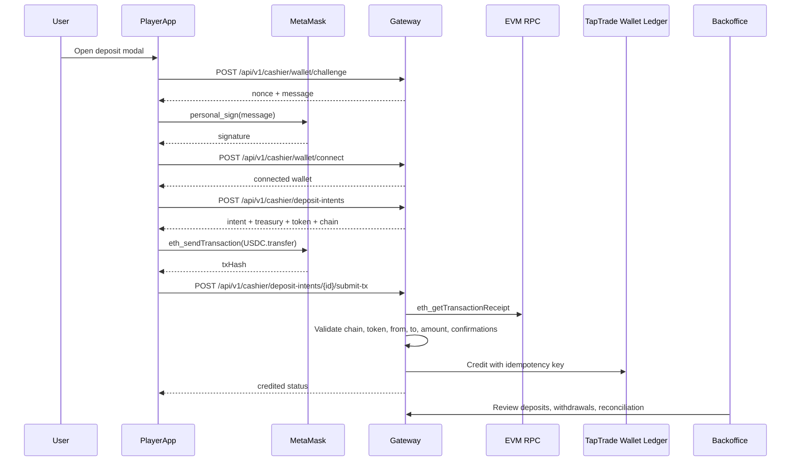

# TapTrade Custodial USDC Cashier Plan

**Status:** Closed Alpha and Beta execution plan.
**Decision date:** 2026-05-27.
**Scope:** MetaMask-funded USDC deposits into a TapTrade-controlled treasury, credited to the existing TapTrade internal wallet ledger.

This document captures the staged payment-rails plan and expands Stage 1 into an implementation plan that Codex can follow to build the service.

## Decision Summary

For closed Alpha, TapTrade should not wait for a PSP, on-ramp, or Polymarket-style non-custodial settlement stack. The fastest credible real-money rail is:

```text
MetaMask -> USDC transfer -> TapTrade treasury wallet -> verified chain event -> internal TapTrade balance -> trading -> manual withdrawal review
```

This is intentionally a custodial V1/V2 path. Non-custodial settlement is deferred to V3. The near-term goal is to create a narrow, feature-flagged way to test real USDC-funded prediction-market workflows with invited users and low limits.

## Stage 1: Closed Alpha

Goal: get real USDC deposits working with the smallest safe surface area.

Build a custodial MetaMask-funded wallet flow:

1. User connects MetaMask.
2. TapTrade verifies wallet ownership with a signed message.
3. User creates a deposit intent.
4. Frontend asks MetaMask to send USDC to one TapTrade treasury wallet.
5. Frontend submits the transaction hash to TapTrade.
6. Backend verifies the on-chain ERC-20 transfer.
7. Backend credits the user's internal TapTrade wallet.
8. Trading uses existing TapTrade internal balances.
9. Withdrawals are manual admin-approved only.

Stage 1 is allowed to use one treasury wallet, one EVM chain, one token, and manual withdrawal operations. It is not allowed to auto-credit unverified transactions, support multiple assets, broadcast withdrawals without admin review, or pretend KYC/geofence is complete.

## Stage 2: Beta / V2

Goal: make the custodial cashier credible for a larger invite-only beta without adding PSP complexity or moving to non-custodial settlement.

Upgrade from one treasury wallet plus manual operations to a hardened crypto cashier:

1. Per-user deposit addresses or deterministic smart deposit wallets.
2. Automated deposit watcher/indexer.
3. Automated deposit crediting after confirmations.
4. Withdrawal queue with risk scoring and optional manual review.
5. Hot wallet and cold wallet separation.
6. Internal solvency dashboard.
7. Reconciliation jobs.
8. Alerts for stuck, duplicate, underpaid, overpaid, or suspicious transactions.

Stage 2 should still keep KYC/geofence/compliance enforcement behind feature flags if product policy says Alpha/Beta is crypto-native and invite-only. The code paths should exist; enforcement can remain disabled until the business turns it on. Stage 2 should not spend engineering effort on non-custodial trading or settlement unless it directly reduces future V3 migration risk.

## Stage 3: V3 / Later

Goal: revisit whether TapTrade remains custodial or evolves toward a Polymarket-style non-custodial settlement model.

Options:

1. Stay custodial and professionalize with custody provider, MPC or KMS signer, automated treasury management, fiat PSP/on-ramp partners, and stronger compliance workflows.
2. Move toward Polymarket-style non-custodial settlement with per-user smart wallets, signed orders, on-chain settlement, tokenized positions, audited market contracts, and relayer infrastructure.
3. Run a hybrid model with internal-ledger Alpha/Beta users and non-custodial wallet paths for advanced users or market makers.

Stage 3 is the first stage where non-custodial should become an implementation candidate. It should be treated as a product and legal architecture decision, not as a payment-adapter swap.

---

# Stage 1 Detailed Implementation Plan

## Stage 1 Product Scope

### In Scope

- MetaMask connection from the player app.
- Wallet ownership proof via signed message.
- One configured EVM chain.
- One configured ERC-20 stablecoin, defaulting to USDC.
- One configured TapTrade treasury address.
- User-created deposit intent with exact amount.
- MetaMask ERC-20 transfer to treasury.
- User-submitted transaction hash.
- Backend receipt/log verification.
- Idempotent credit to the existing TapTrade wallet ledger.
- Player deposit status UI.
- Player withdrawal request UI.
- Backoffice deposit/withdrawal review UI.
- Manual withdrawal completion by operators.
- Daily ledger-to-treasury reconciliation report.
- Kill switches and Alpha limits.

### Out of Scope

- External PSPs.
- Card, bank, PIX, UPI, mobile-money, or local fiat rails.
- Automatic on-chain withdrawal broadcasting.
- Multiple chains in the first cut.
- Multiple tokens in the first cut.
- Per-user deposit addresses.
- Smart contract market settlement.
- Polymarket-style tokenized positions.
- Bridge/on-ramp provider integration.
- KYC at signup.

## Stage 1 Chain Policy

Use one chain per deployment. The implementation should be env-configurable, but the Alpha deployment should choose a single chain before users are invited.

Recommended defaults:

| Setting | Default | Notes |
|---|---:|---|
| `ALPHA_CASHIER_ENABLED` | `false` | Must be explicitly enabled. |
| `ALPHA_CASHIER_CHAIN_ID` | `8453` | Base mainnet by default; can be changed to Polygon `137`. |
| `ALPHA_CASHIER_CHAIN_NAME` | `base` | Display name and logs. |
| `ALPHA_CASHIER_RPC_URL` | unset | Required when enabled. |
| `ALPHA_CASHIER_TOKEN_SYMBOL` | `USDC` | Stablecoin only. |
| `ALPHA_CASHIER_TOKEN_ADDRESS` | unset | Required when enabled. |
| `ALPHA_CASHIER_TOKEN_DECIMALS` | `6` | USDC is 6 decimals on common EVM deployments. |
| `ALPHA_CASHIER_TREASURY_ADDRESS` | unset | Required when enabled. |
| `ALPHA_CASHIER_CONFIRMATIONS` | `12` | Can be lower on Base, but keep conservative for Alpha. |
| `ALPHA_CASHIER_MIN_DEPOSIT_CENTS` | `100` | $1.00 default. |
| `ALPHA_CASHIER_MAX_DEPOSIT_CENTS` | `25000` | $250.00 default for closed Alpha. |
| `ALPHA_CASHIER_DAILY_DEPOSIT_LIMIT_CENTS` | `100000` | $1,000.00 default. |
| `ALPHA_CASHIER_WITHDRAWALS_ENABLED` | `false` | Request UI can exist; manual completion only. |
| `ALPHA_CASHIER_WITHDRAWAL_REVIEW_REQUIRED` | `true` | Must remain true for Stage 1. |
| `ALPHA_CASHIER_WITHDRAWAL_BROADCAST_ACK` | `false` | Required only if deployed envs intentionally set withdrawals enabled; do not enable for Stage 1 live Alpha. |
| `KYC_ENFORCEMENT` | `false` | Verification deferred until withdrawal policy changes. |
| `GEO_ENFORCEMENT` | `false` | Keep hooks, do not block Alpha users unless policy changes. |

Do not reuse `CRYPTO_RPC_URL`, `CRYPTO_ASSET_CONTRACT`, or `CRYPTO_DEPOSIT_ADDRESS_SOURCE`. The current gateway intentionally blocks those legacy custodial crypto rail variables in production. Stage 1 should use new `ALPHA_CASHIER_*` variables to keep the Alpha rail explicit and isolated.

### Stage 1 Environment Example

Keep the rail disabled in committed samples and enable it only in the deployed
environment after chain/RPC/treasury values are reviewed:

```bash
ALPHA_CASHIER_ENABLED=false
ALPHA_CASHIER_CHAIN_ID=8453
ALPHA_CASHIER_CHAIN_NAME=base
ALPHA_CASHIER_RPC_URL=
ALPHA_CASHIER_TOKEN_SYMBOL=USDC
ALPHA_CASHIER_TOKEN_ADDRESS=
ALPHA_CASHIER_TOKEN_DECIMALS=6
ALPHA_CASHIER_TREASURY_ADDRESS=
ALPHA_CASHIER_CONFIRMATIONS=12
ALPHA_CASHIER_MIN_DEPOSIT_CENTS=100
ALPHA_CASHIER_MAX_DEPOSIT_CENTS=25000
ALPHA_CASHIER_DAILY_DEPOSIT_LIMIT_CENTS=100000
ALPHA_CASHIER_WITHDRAWALS_ENABLED=false
ALPHA_CASHIER_WITHDRAWAL_REVIEW_REQUIRED=true
ALPHA_CASHIER_WITHDRAWAL_BROADCAST_ACK=false
```

For a live Alpha, set `ALPHA_CASHIER_ENABLED=true` only after selecting one
chain, funding and labeling the TapTrade treasury wallet, provisioning redundant RPC
access, and confirming the production token contract address from chain-native
sources. Manual withdrawals remain an operator process outside the app; the app
must not hold payout private keys in Stage 1.

## Stage 1 Architecture



## Data Model

Create a new gateway migration:

```text
apps/Phoenix-Predict-Combined/go-platform/services/gateway/migrations/030_alpha_cashier.sql
```

Add matching rollback if the migration convention requires it.

### `alpha_wallet_connections`

Stores verified wallet ownership.

Required columns:

- `id UUID PRIMARY KEY DEFAULT gen_random_uuid()`
- `user_id TEXT NOT NULL`
- `chain_type TEXT NOT NULL DEFAULT 'evm'`
- `chain_id BIGINT NOT NULL`
- `wallet_address TEXT NOT NULL`
- `normalized_address TEXT NOT NULL`
- `signature TEXT NOT NULL`
- `message TEXT NOT NULL`
- `nonce TEXT NOT NULL`
- `verified_at TIMESTAMPTZ NOT NULL DEFAULT NOW()`
- `last_seen_at TIMESTAMPTZ NOT NULL DEFAULT NOW()`
- `created_at TIMESTAMPTZ NOT NULL DEFAULT NOW()`

Constraints and indexes:

- Unique on `(user_id, chain_id, normalized_address)`.
- Index on `(normalized_address)`.
- Index on `(user_id, last_seen_at DESC)`.

### `alpha_wallet_challenges`

Stores short-lived signed-message challenges.

Required columns:

- `nonce TEXT PRIMARY KEY`
- `user_id TEXT NOT NULL`
- `chain_id BIGINT NOT NULL`
- `wallet_address TEXT NOT NULL`
- `message TEXT NOT NULL`
- `expires_at TIMESTAMPTZ NOT NULL`
- `consumed_at TIMESTAMPTZ`
- `created_at TIMESTAMPTZ NOT NULL DEFAULT NOW()`

Constraints and indexes:

- Index on `(user_id, created_at DESC)`.
- Challenge expiry should be 10 minutes.
- Verification must consume the challenge exactly once.

### `alpha_deposit_intents`

Stores expected user deposits.

Required columns:

- `id UUID PRIMARY KEY DEFAULT gen_random_uuid()`
- `user_id TEXT NOT NULL`
- `wallet_connection_id UUID REFERENCES alpha_wallet_connections(id)`
- `chain_id BIGINT NOT NULL`
- `chain_name TEXT NOT NULL`
- `token_symbol TEXT NOT NULL`
- `token_address TEXT NOT NULL`
- `token_decimals INT NOT NULL`
- `treasury_address TEXT NOT NULL`
- `from_address TEXT NOT NULL`
- `amount_cents BIGINT NOT NULL CHECK (amount_cents > 0)`
- `amount_units NUMERIC(78,0) NOT NULL CHECK (amount_units > 0)`
- `status TEXT NOT NULL`
- `tx_hash TEXT`
- `credited_wallet_entry_id TEXT`
- `failure_reason TEXT`
- `idempotency_key TEXT NOT NULL`
- `expires_at TIMESTAMPTZ NOT NULL`
- `created_at TIMESTAMPTZ NOT NULL DEFAULT NOW()`
- `updated_at TIMESTAMPTZ NOT NULL DEFAULT NOW()`
- `submitted_at TIMESTAMPTZ`
- `confirmed_at TIMESTAMPTZ`
- `credited_at TIMESTAMPTZ`

Allowed statuses:

- `created`
- `submitted`
- `confirmed`
- `credited`
- `expired`
- `failed`
- `quarantined`

Constraints and indexes:

- Unique on `(user_id, idempotency_key)`.
- Unique on `(chain_id, tx_hash)` where `tx_hash IS NOT NULL` for Stage 1 exact single-transfer submissions.
- Index on `(user_id, created_at DESC)`.
- Index on `(status, created_at DESC)`.

### `alpha_chain_transactions`

Stores verified on-chain transfer evidence.

Required columns:

- `id UUID PRIMARY KEY DEFAULT gen_random_uuid()`
- `deposit_intent_id UUID REFERENCES alpha_deposit_intents(id)`
- `chain_id BIGINT NOT NULL`
- `tx_hash TEXT NOT NULL`
- `log_index BIGINT NOT NULL`
- `block_number BIGINT NOT NULL`
- `block_hash TEXT NOT NULL`
- `token_address TEXT NOT NULL`
- `from_address TEXT NOT NULL`
- `to_address TEXT NOT NULL`
- `amount_units NUMERIC(78,0) NOT NULL`
- `confirmations INT NOT NULL`
- `receipt_status TEXT NOT NULL`
- `raw_log JSONB NOT NULL`
- `created_at TIMESTAMPTZ NOT NULL DEFAULT NOW()`

Constraints and indexes:

- Unique on `(chain_id, tx_hash, log_index)`.
- Index on `(deposit_intent_id)`.
- Index on `(from_address, created_at DESC)`.
- Index on `(to_address, created_at DESC)`.

### `alpha_withdrawal_requests`

Stores manual withdrawal requests.

Required columns:

- `id UUID PRIMARY KEY DEFAULT gen_random_uuid()`
- `user_id TEXT NOT NULL`
- `chain_id BIGINT NOT NULL`
- `token_symbol TEXT NOT NULL`
- `token_address TEXT NOT NULL`
- `destination_address TEXT NOT NULL`
- `amount_cents BIGINT NOT NULL CHECK (amount_cents > 0)`
- `amount_units NUMERIC(78,0) NOT NULL CHECK (amount_units > 0)`
- `status TEXT NOT NULL`
- `wallet_reservation_id TEXT`
- `requested_at TIMESTAMPTZ NOT NULL DEFAULT NOW()`
- `reviewed_at TIMESTAMPTZ`
- `reviewed_by TEXT`
- `review_note TEXT`
- `broadcast_tx_hash TEXT`
- `completed_at TIMESTAMPTZ`
- `failure_reason TEXT`
- `idempotency_key TEXT NOT NULL`
- `created_at TIMESTAMPTZ NOT NULL DEFAULT NOW()`
- `updated_at TIMESTAMPTZ NOT NULL DEFAULT NOW()`

Allowed statuses:

- `requested`
- `under_review`
- `approved`
- `rejected`
- `broadcasted`
- `completed`
- `failed`
- `cancelled`

Constraints and indexes:

- Unique on `(user_id, idempotency_key)`.
- Index on `(status, created_at DESC)`.
- Index on `(user_id, created_at DESC)`.

Stage 1 withdrawal requests should hold funds through the existing wallet reservation system, but should not broadcast on-chain transfers automatically.

### `alpha_cashier_audit_events`

Stores append-only operator and system events.

Required columns:

- `id UUID PRIMARY KEY DEFAULT gen_random_uuid()`
- `subject_type TEXT NOT NULL`
- `subject_id TEXT NOT NULL`
- `event_type TEXT NOT NULL`
- `actor_type TEXT NOT NULL`
- `actor_id TEXT`
- `event_payload JSONB NOT NULL DEFAULT '{}'::jsonb`
- `created_at TIMESTAMPTZ NOT NULL DEFAULT NOW()`

Indexes:

- `(subject_type, subject_id, created_at DESC)`.
- `(event_type, created_at DESC)`.
- `(actor_type, actor_id, created_at DESC)`.

## Backend Implementation

Implement Stage 1 inside the Go gateway, not in the standalone `services/cashier-api` Node prototype. The Go gateway already owns session auth, the wallet ledger, payment routes, prediction trading, and backoffice APIs.

Recommended package:

```text
apps/Phoenix-Predict-Combined/go-platform/services/gateway/internal/alphacashier/
```

Use `alphacashier` rather than `cashier` so this Alpha custodial path does not blur with the existing `internal/cashier` non-custodial helper package.

### Backend Files

Create:

- `internal/alphacashier/config.go`
- `internal/alphacashier/types.go`
- `internal/alphacashier/repository.go`
- `internal/alphacashier/sql_repository.go`
- `internal/alphacashier/service.go`
- `internal/alphacashier/evm.go`
- `internal/alphacashier/signature.go`
- `internal/alphacashier/handlers.go`
- `internal/alphacashier/admin_handlers.go`
- `internal/alphacashier/reconciliation.go`
- `internal/alphacashier/metrics.go` if metrics are not kept in service.

Create tests:

- `internal/alphacashier/config_test.go`
- `internal/alphacashier/signature_test.go`
- `internal/alphacashier/service_test.go`
- `internal/alphacashier/evm_test.go`
- `internal/alphacashier/handlers_test.go`
- `internal/alphacashier/admin_handlers_test.go`
- `internal/alphacashier/reconciliation_test.go`

### Backend Dependencies

Add `github.com/ethereum/go-ethereum` to the gateway module only if needed for:

- EIP-191 message hash.
- secp256k1 public key recovery.
- Ethereum address normalization.
- ERC-20 transfer topic constants and log decoding.

Do not write custom cryptography unless a local, reviewed helper already exists. It does not.

### Config Rules

`LoadConfigFromEnv()` should:

- Return disabled config when `ALPHA_CASHIER_ENABLED` is false or unset.
- Fail startup when enabled but required env vars are missing.
- Validate chain ID is positive.
- Validate token decimals are between 0 and 30.
- Validate treasury and token addresses are EVM hex addresses.
- Validate min/max deposit limits.
- Reject `ALPHA_CASHIER_WITHDRAWAL_REVIEW_REQUIRED=false` in production/staging.
- Reject `ALPHA_CASHIER_WITHDRAWALS_ENABLED=true` for Stage 1 unless `ALPHA_CASHIER_WITHDRAWAL_BROADCAST_ACK=true` is also set.

Wire config validation into:

```text
apps/Phoenix-Predict-Combined/go-platform/services/gateway/cmd/gateway/main.go
```

Keep the existing production block on legacy `CRYPTO_*` variables.

### API Contract

All user routes are session-protected by the gateway auth middleware.

User routes:

| Method | Route | Purpose |
|---|---|---|
| `GET` | `/api/v1/cashier/alpha/config` | Return enabled state, chain, token, limits, treasury redacted or full depending on UX. |
| `POST` | `/api/v1/cashier/alpha/wallet/challenge` | Create signed-message challenge for a wallet address. |
| `POST` | `/api/v1/cashier/alpha/wallet/connect` | Verify signature and store wallet connection. |
| `GET` | `/api/v1/cashier/alpha/wallets` | List verified wallets for session user. |
| `POST` | `/api/v1/cashier/alpha/deposit-intents` | Create deposit intent for exact amount. Requires `Idempotency-Key`. |
| `GET` | `/api/v1/cashier/alpha/deposit-intents` | List user's deposit intents. |
| `GET` | `/api/v1/cashier/alpha/deposit-intents/{id}` | Read one deposit intent owned by session user. |
| `POST` | `/api/v1/cashier/alpha/deposit-intents/{id}/submit-tx` | Submit tx hash for verification and crediting. Requires `Idempotency-Key`. |
| `POST` | `/api/v1/cashier/alpha/withdrawal-requests` | Create manual withdrawal request and hold funds. Requires `Idempotency-Key`. |
| `GET` | `/api/v1/cashier/alpha/withdrawal-requests` | List user's withdrawal requests. |

Admin routes:

| Method | Route | Purpose |
|---|---|---|
| `GET` | `/api/v1/admin/cashier/alpha/deposits` | List deposits by status, user, tx hash. |
| `GET` | `/api/v1/admin/cashier/alpha/withdrawals` | List withdrawal requests. |
| `POST` | `/api/v1/admin/cashier/alpha/withdrawals/{id}/approve` | Mark request approved for manual payout. |
| `POST` | `/api/v1/admin/cashier/alpha/withdrawals/{id}/reject` | Reject request and release wallet hold. |
| `POST` | `/api/v1/admin/cashier/alpha/withdrawals/{id}/mark-broadcasted` | Store manually broadcast tx hash. |
| `POST` | `/api/v1/admin/cashier/alpha/withdrawals/{id}/mark-completed` | Capture held funds after manual payout confirmation. |
| `GET` | `/api/v1/admin/cashier/alpha/reconciliation` | Return treasury-vs-ledger reconciliation summary. |
| `GET` | `/api/v1/admin/cashier/alpha/preflight` | Return launch-readiness checks for config, limits, ledger wiring, RPC, treasury, and withdrawal flags. |
| `GET` | `/api/v1/admin/cashier/alpha/audit-events` | Search audit events. |

### Wallet Ownership Flow

Challenge creation:

- Require session user.
- Require requested wallet address.
- Normalize address to lowercase checksum-compatible form.
- Build message with:
  - product name: `TapTrade`
  - action: `Connect wallet`
  - user ID
  - wallet address
  - chain ID
  - nonce
  - issued-at timestamp
  - expiry timestamp
  - origin/domain when available
- Store challenge with 10 minute expiry.

Signature verification:

- Require exact nonce.
- Require unexpired, unconsumed challenge.
- Recover signer from EIP-191 `personal_sign` signature.
- Require recovered address equals challenge wallet address.
- Store or update `alpha_wallet_connections`.
- Mark challenge consumed.
- Write audit event `alpha_cashier.wallet.connected`.

Tests:

- Valid signature connects wallet.
- Wrong signer rejected.
- Wrong user rejected.
- Expired nonce rejected.
- Replayed nonce rejected.
- Address case normalization is stable.

### Deposit Intent Flow

`POST /api/v1/cashier/alpha/deposit-intents`

Request:

```json
{
  "walletAddress": "0x...",
  "amountCents": 2500
}
```

Behavior:

- Require `ALPHA_CASHIER_ENABLED=true`.
- Require `Idempotency-Key`.
- Bind to session user only.
- Require verified wallet connection for `walletAddress`.
- Enforce min, max, and daily deposit limits.
- Convert cents to token units:
  - for USDC 6 decimals: `$25.00 -> 25000000`.
- Create intent with `created` status and expiry, for example 30 minutes.
- Return:
  - intent ID
  - chain ID
  - token contract
  - token decimals
  - treasury address
  - from address
  - exact amount units
  - exact amount display
  - expiry.

Do not credit on intent creation.

### MetaMask Transfer Flow

Frontend should use MetaMask to send an ERC-20 `transfer(treasury, amountUnits)` transaction from the connected wallet.

For Stage 1, prefer adding `ethers@5` to the player app because the current app does not already ship an EVM helper library. Use it for:

- provider access.
- chain switching or chain validation.
- USDC unit formatting.
- ERC-20 transfer transaction construction.

The frontend must:

- Check `ethereum` provider exists.
- Require active chain equals `ALPHA_CASHIER_CHAIN_ID`.
- Ask user to switch chain if supported.
- Send token transfer to `ALPHA_CASHIER_TOKEN_ADDRESS`.
- Submit tx hash to backend.
- Poll intent status until `credited`, `failed`, `quarantined`, or expired.

### Transaction Verification Flow

`POST /api/v1/cashier/alpha/deposit-intents/{id}/submit-tx`

Request:

```json
{
  "txHash": "0x..."
}
```

Backend verification:

1. Require enabled config.
2. Require session user owns the intent.
3. Lock deposit intent row with `FOR UPDATE`.
4. Reject if intent is already `credited`.
5. Reject if intent is expired.
6. Fetch receipt via `eth_getTransactionReceipt`.
7. Require receipt exists.
8. Require receipt status success.
9. Fetch latest block number.
10. Require configured confirmations.
11. Decode ERC-20 `Transfer(address,address,uint256)` logs.
12. Find exactly one matching transfer where:
    - log contract address equals configured token address.
    - `from` equals intent `from_address`.
    - `to` equals configured treasury address.
    - amount units equals intent amount units.
13. Reject duplicate `(chain_id, tx_hash, log_index)`.
14. Insert `alpha_chain_transactions`.
15. Credit wallet with idempotency key:

```text
alpha-cashier:deposit:<chainId>:<txHash>:<logIndex>
```

16. Update intent to `credited`.
17. Write audit events:
    - `alpha_cashier.deposit.tx_verified`
    - `alpha_cashier.deposit.credited`

If receipt exists but has insufficient confirmations, return `202 Accepted` with status `submitted` or `confirming`, not a hard failure.

If the tx sends the wrong amount, wrong asset, wrong recipient, or wrong sender, mark `quarantined` rather than `failed` if funds reached the treasury but cannot be safely matched.

### Wallet Credit Rules

Use existing wallet ledger service:

```text
apps/Phoenix-Predict-Combined/go-platform/services/gateway/internal/wallet/service.go
```

Required behavior:

- Credit once only.
- Store ledger reason like `alpha USDC deposit <chainId>/<txHash>`.
- Use wallet idempotency conflict detection as a second defense.
- Do not credit from frontend state.
- Do not credit from pending tx hashes.
- Do not credit if receipt is still unconfirmed.
- Do not bypass wallet reservations or prediction order accounting.

### Withdrawal Request Flow

`POST /api/v1/cashier/alpha/withdrawal-requests`

Request:

```json
{
  "destinationAddress": "0x...",
  "amountCents": 2500
}
```

Behavior:

- Require session user.
- Require `Idempotency-Key`.
- Validate destination EVM address.
- Enforce minimum and maximum withdrawal limits.
- If `KYC_ENFORCEMENT=true`, call existing KYC gate.
- Always create a manual-review withdrawal request in Stage 1.
- Hold wallet funds using existing wallet reservation support.
- Write audit event `alpha_cashier.withdrawal.requested`.

Admin rejection:

- Release wallet reservation.
- Mark `rejected`.
- Require review note.
- Write audit event.

Admin approval:

- Mark `approved`.
- Do not capture funds yet.
- Operator manually sends USDC outside the app.
- Operator returns and enters tx hash with `mark-broadcasted`.

Admin completion:

- Verify manual payout tx if RPC support exists in the same verifier.
- Capture wallet reservation only after payout is confirmed.
- Mark `completed`.
- Write audit event.

If manual payout fails, mark `failed` and release the hold.

### Reconciliation

Create a daily reconciliation function:

- Sum all credited deposits in cents.
- Sum all completed withdrawals in cents.
- Sum open wallet liabilities from wallet balances plus active reservations.
- Fetch treasury USDC balance from RPC.
- Convert treasury units to cents.
- Report:
  - treasury balance cents.
  - user available balances cents.
  - reserved balances cents.
  - pending withdrawal cents.
  - net credited deposit cents.
  - completed withdrawal cents.
  - unexplained drift cents.

Stage 1 acceptance threshold:

- Drift must be zero for launch.
- Any non-zero drift should fail the canary and show red in backoffice.

## Frontend Implementation

Primary app area:

```text
apps/Phoenix-Predict-Combined/phoenix-frontend-brand-viegg/packages/app-core/
```

Likely files to add:

- `services/go-api/cashier-alpha/cashier-alpha-client.ts`
- `services/go-api/cashier-alpha/cashier-alpha-hooks.ts`
- `services/go-api/cashier-alpha/cashier-alpha-types.ts`
- `components/cashier/alpha-usdc-deposit.tsx`
- `components/cashier/alpha-wallet-connect.tsx`
- `components/cashier/alpha-withdrawal-request.tsx`

Likely files to modify:

- `components/pages/cashier/index.tsx`
- `components/cashier/index.tsx`
- `lib/slices/cashierSlice.ts`
- `translations/en/cashier.js`
- other active locale files only if the app requires translation keys at build time.

Player UX requirements:

- Show Alpha rail only when backend config returns enabled.
- Keep existing cashier shell intact if Alpha rail is disabled.
- Connect MetaMask.
- Sign TapTrade wallet ownership message.
- Show verified wallet address.
- Let user enter deposit amount.
- Display exact network, token, treasury address, amount, and expiry.
- Trigger MetaMask transfer.
- Submit tx hash.
- Poll status.
- Show pending confirmations.
- Show credited state and refresh wallet balance.
- Show clear support state for quarantined tx.
- Let user create withdrawal request.
- Explain that withdrawals are manually reviewed in Alpha.

Do not show "instant withdrawal" language in Stage 1.

## Backoffice Implementation

Backoffice area:

```text
apps/Phoenix-Predict-Combined/talon-backoffice/packages/office/
```

Likely files to add or extend:

- `containers/provider-ops/cashier-review.tsx`
- `app/(dashboard)/cashier/page.tsx`
- `lib/slices/alphaCashierSlice.ts`
- `translations/en/page-cashier-alpha.js`

Backoffice UX requirements:

- Deposits table:
  - user ID
  - wallet address
  - amount
  - status
  - tx hash
  - confirmations
  - created/submitted/credited timestamps
  - quarantine reason.
- Withdrawals table:
  - user ID
  - destination address
  - amount
  - status
  - reservation ID
  - reviewer
  - manual tx hash
  - approve/reject/mark broadcasted/mark completed actions.
- Reconciliation panel:
  - treasury balance
  - ledger liabilities
  - active holds
  - pending withdrawals
  - drift.
- Audit event drawer for any row.

Admin actions must require existing admin/RBAC authorization. If no cashier-specific RBAC permission exists, add one rather than relying on generic admin access.

## Security Controls

Stage 1 launch blockers:

- Alpha cashier disabled by default.
- Startup fails if enabled without chain, token, treasury, or RPC config.
- Session user is the only user accepted on player routes.
- Wallet signatures are verified server-side.
- Deposit intent amount is exact.
- Backend verifies chain receipt, token contract, sender, recipient, amount, log index, and confirmations.
- Duplicate tx hashes cannot credit twice.
- Duplicate transfer logs cannot credit twice.
- Wallet ledger idempotency key cannot be replayed with different payload.
- Withdrawals hold funds before admin review.
- Withdrawal completion captures held funds only after manual payout confirmation.
- All operator actions write audit events.
- All value routes return fail-closed when config is disabled.
- No KYC/geofence signup blockers, but enforcement hooks remain behind flags.

Do not log:

- Full auth tokens.
- Full signatures unless needed in an audit table with restricted access.
- RPC credentials.
- Private keys.

Stage 1 should not require TapTrade to hold private keys in code. Manual payout keys must remain outside the app until Stage 2 chooses a signing/custody approach. Non-custodial keys, smart wallets, tokenized positions, and on-chain market settlement are V3 concerns.

## Test Plan

Backend unit tests:

- Config disabled default.
- Config enabled missing env fails.
- Wallet challenge creation.
- Signature verification success/failure.
- Deposit limit enforcement.
- Idempotent deposit intent create.
- Tx hash duplicate rejection.
- Receipt pending returns confirming.
- Wrong chain rejected.
- Wrong token rejected.
- Wrong sender rejected.
- Wrong treasury recipient quarantined.
- Wrong amount quarantined or rejected per policy.
- Successful verified transfer credits wallet once.
- Replayed verification returns existing credited intent.
- Wallet credit idempotency conflict is handled.
- Withdrawal request holds funds.
- Withdrawal rejection releases hold.
- Withdrawal completion captures hold.
- Audit events written for mutating operations.

Backend integration tests:

- Run gateway tests with a fake `EVMClient`.
- Run migration validation:

```sh
cd apps/Phoenix-Predict-Combined
make validate-go-migrations
```

- Run Go tests:

```sh
cd apps/Phoenix-Predict-Combined/go-platform/services/gateway
go test ./...
```

Frontend tests:

- Cashier config disabled hides Alpha rail.
- Missing MetaMask shows actionable error.
- Wrong chain shows switch-chain prompt.
- Connected wallet signs challenge.
- Deposit intent renders exact transfer details.
- Submitted tx status polling handles credited and quarantined states.
- Withdrawal request shows manual-review state.

Backoffice tests:

- Deposits render by status.
- Withdrawals render by status.
- Approve/reject/mark-completed buttons call correct APIs.
- Reconciliation drift red state renders.

Smoke tests:

- Local fake RPC receipt credits a test wallet.
- Duplicate tx smoke test does not change balance.
- Manual withdrawal request creates a hold and admin rejection releases it.

## Rollout Plan

1. Land backend schema and service behind disabled flags.
2. Land frontend Alpha UI hidden by backend config.
3. Land backoffice review UI hidden by RBAC/config.
4. Deploy disabled.
5. Configure staging with fake or test RPC.
6. Execute local and staging smoke tests.
7. Configure production Alpha env with low limits but keep disabled.
8. Enable for internal admin account only if cohort controls exist; otherwise enable during a supervised test window.
9. Invite first Alpha users after reconciliation canary is green.

## Stage 1 Handoff

The Stage 1 handoff is the Phoenix Predict Go gateway Alpha cashier, not the old
`services/cashier-api` prototype and not the legacy `internal/payments`
`CRYPTO_*` rail. The handoff surface is:

- Gateway module: `apps/Phoenix-Predict-Combined/go-platform/services/gateway/internal/alphacashier/`.
- Gateway migration: `apps/Phoenix-Predict-Combined/go-platform/services/gateway/migrations/030_alpha_cashier.sql`.
- Player Alpha client/UI: `apps/Phoenix-Predict-Combined/talon-backoffice/packages/app/app/cashier/`.
- Backoffice review surface: `apps/Phoenix-Predict-Combined/talon-backoffice/packages/office/app/(dashboard)/cashier/page.tsx`, backed by `apps/Phoenix-Predict-Combined/talon-backoffice/packages/office/containers/provider-ops/cashier-review.tsx`.
- Operator docs/env samples: this plan, `docs/cashier/README.md`, `apps/Phoenix-Predict-Combined/README.md`, `apps/Phoenix-Predict-Combined/DEVELOPMENT.md`, `apps/Phoenix-Predict-Combined/DEPLOYMENT.md`, and `apps/Phoenix-Predict-Combined/docker-compose.demo.yml`.

Remaining live-chain setup before inviting Alpha users:

1. Choose the single Alpha chain and final USDC contract address.
2. Create the TapTrade treasury wallet, record operator ownership, and keep payout
   keys outside the app.
3. Provision primary and backup RPC providers; store only the active RPC URL in
   deployment secrets.
4. Apply the gateway migration and deploy with `ALPHA_CASHIER_ENABLED=false`.
5. Smoke test config, admin preflight, wallet challenge, deposit intent
   creation, tx submission, duplicate tx replay, manual withdrawal request, and
   reconciliation against a fake or test RPC.
6. Set low Alpha limits, enable for the supervised cohort, and run daily
   ledger-to-treasury reconciliation before expanding access.

## Codex Execution Checklist

Use this order. Do not skip ahead to UI before the backend money invariants exist.

### Task 1: Repo Orientation

- Read this document.
- Read `docs/cashier/README.md`.
- Read `internal/wallet/service.go`.
- Read `internal/payments/db_service.go`.
- Read `internal/http/handlers.go`.
- Read `cmd/gateway/main.go`.
- Confirm the active frontend cashier files.
- Confirm the active backoffice route conventions.

Acceptance:

- Codex can state where wallet balances are credited, where routes are registered, and how session auth is applied.

### Task 2: Gateway Migration

- Add `030_alpha_cashier.sql`.
- Add indexes and constraints.
- Add rollback if migration style requires it.
- Update migration README if needed.
- Run migration validation.

Acceptance:

- Clean database migrates successfully.
- Re-running migrations is safe according to existing project conventions.

### Task 3: `alphacashier` Domain Types and Config

- Add package skeleton.
- Add config loader.
- Add decimal conversion helpers.
- Add address normalization helpers.
- Add unit tests.

Acceptance:

- Disabled config is safe.
- Enabled config fails closed without required env.
- Cents-to-token-unit conversions are exact.

### Task 4: Repository Layer

- Implement SQL repository.
- Implement challenge, wallet connection, deposit intent, chain transaction, withdrawal, and audit methods.
- Use transactions and row locks for value transitions.
- Add repository tests with a DB test helper or fake where local DB helpers are unavailable.

Acceptance:

- Idempotency and uniqueness are enforced at DB and service level.

### Task 5: Wallet Signature Verification

- Add `go-ethereum` dependency if needed.
- Implement EIP-191 personal-sign recovery.
- Add challenge creation and connection verification service methods.
- Add tests with known private key/address/signature fixtures.

Acceptance:

- Wrong signature cannot bind a wallet.
- Replayed challenge cannot bind twice.

### Task 6: EVM Receipt Verifier

- Define `EVMClient` interface.
- Implement JSON-RPC client for `eth_getTransactionReceipt`, `eth_blockNumber`, and optional `eth_call` balance checks.
- Implement ERC-20 Transfer log decoder.
- Add fake client tests for every verification branch.

Acceptance:

- Verifier returns structured evidence only for exact expected transfers.

### Task 7: Deposit Service

- Implement create intent.
- Implement submit tx and credit flow.
- Use wallet credit idempotency.
- Add audit events.
- Add tests for success, duplicate, pending, wrong token/sender/recipient/amount.

Acceptance:

- A verified deposit credits exactly once.

### Task 8: Withdrawal Service

- Implement request with wallet hold.
- Implement admin reject with release.
- Implement admin approve.
- Implement admin mark broadcasted.
- Implement admin mark completed with capture.
- Add tests.

Acceptance:

- User available balance is reduced while withdrawal is under review.
- Rejection restores available balance.
- Completion captures funds exactly once.

### Task 9: HTTP Handlers

- Register user and admin routes in gateway.
- Keep routes session-protected.
- Add admin/RBAC checks.
- Add handler tests.

Acceptance:

- Cross-user access is rejected.
- Missing idempotency keys are rejected for mutations.
- Disabled feature returns fail-closed responses.

### Task 10: Reconciliation

- Implement reconciliation summary.
- Add admin endpoint.
- Add tests with fake treasury balance and wallet balances.

Acceptance:

- Drift is computed and exposed.

### Task 11: Player Frontend

- Add cashier Alpha API client/hooks.
- Add MetaMask connect/sign/transfer UI.
- Add deposit status polling.
- Add withdrawal request UI.
- Add tests.

Acceptance:

- User can complete the Alpha deposit flow against fake/local backend state.

### Task 12: Backoffice

- Add cashier Alpha review page or extend existing cashier review container.
- Add deposit, withdrawal, reconciliation, and audit views.
- Add admin action calls.
- Add tests.

Acceptance:

- Operator can review and move withdrawal requests through Stage 1 states.

### Task 13: End-to-End Smoke

- Start local stack.
- Use fake EVM verifier or test RPC fixture.
- Connect test wallet.
- Create deposit intent.
- Submit verified tx fixture.
- Confirm wallet balance updates.
- Place a small prediction order using credited balance.
- Request withdrawal.
- Reject withdrawal and confirm funds release.
- Repeat withdrawal and complete it.
- Confirm reconciliation is green.

Acceptance:

- Closed Alpha flow works without PSP, without KYC at signup, and without automatic withdrawal broadcasting.

## Final Stage 1 Definition of Done

Stage 1 is complete when:

- Real USDC deposits can be verified and credited in a controlled environment.
- Duplicate transaction crediting is impossible through API replay.
- User balances and reserved funds remain consistent with prediction trading.
- Withdrawal requests are manual-review only.
- Backoffice can review deposits, withdrawals, audit events, and reconciliation.
- Alpha rail is feature-flagged and disabled by default.
- Production startup refuses unsafe partial configuration.
- Tests cover all money-moving branches.
- Live Alpha deployment has low limits and a documented operator runbook.
