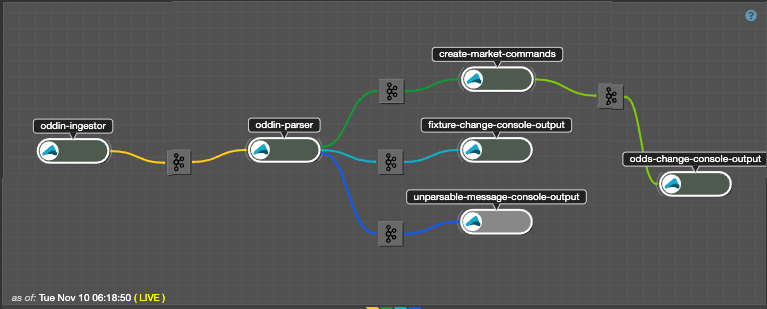

# Phoenix Oddin - Data Ingestion

## Overview
This application collects eSports market and price data from Oddin. It uses the Cloudflow framework to define a data processing pipeline. The stages of this pipeline each define a discrete piece of functionality which can be deployed and configured as a single deployable unit and then re-configured/re-deployed independently, if necessary.

## Quick Start
Cloudflow uses an SBT plugin which provides useful functionality for building/deploying applications and also for running those applications locally.

```shell script
sbt runLocal
```

That's it!

When you `runLocal` Cloudflow works through a couple of steps:

1. Compiles the application code
2. Verifies the `blueprint` (the description of how the pipeline stages are connected together to form the application)
3. Starts each pipeline stage in a Docker container.

You'll see output something like this:

```shell script
[info] Streamlet 'phoenix.oddin.streamlets.OddsChangeConsoleOutput' found
[info] Streamlet 'phoenix.oddin.streamlets.UnparsableMessageHandler' found
[info] Streamlet 'phoenix.oddin.streamlets.OddinMessageIngestor' found
[info] Streamlet 'phoenix.oddin.streamlets.OddinMessageParser' found
[info] Streamlet 'phoenix.oddin.streamlets.CreatePhoenixCommands' found
[info] Streamlet 'phoenix.oddin.streamlets.FixtureChangeConsoleOutput' found
SLF4J: Actual binding is of type [ch.qos.logback.classic.util.ContextSelectorStaticBinder]
[info] Streamlet 'phoenix.oddin.streamlets.OddsChangeConsoleOutput' found
[info] Streamlet 'phoenix.oddin.streamlets.UnparsableMessageHandler' found
[info] Streamlet 'phoenix.oddin.streamlets.OddinMessageIngestor' found
[info] Streamlet 'phoenix.oddin.streamlets.OddinMessageParser' found
[info] Streamlet 'phoenix.oddin.streamlets.CreatePhoenixCommands' found
[info] Streamlet 'phoenix.oddin.streamlets.FixtureChangeConsoleOutput' found
[success] /Users/tbm/projects/flip/phoenix-oddin/ingestion-pipeline/src/main/blueprint/blueprint.conf verified.
                                        ┌──────────────┐
                                        │oddin-ingestor│
                                        └───────┬──────┘
                                                │
                                                v
                                       ┌────────────────┐
                                       │[oddin-messages]│
                                       └────────┬───────┘
                                                │
                                                v
                                         ┌────────────┐
                                         │oddin-parser│
                                         └───┬──┬──┬──┘
                                             │  │  │
                            ┌────────────────┘  │  └────────────────────────┐
                            │               ┌───┘                           │
                            v               │                               │
                 ┌────────────────────┐     │                               │
                 │[oddin-odds-changes]│     │                               │
                 └───────────┬────────┘     │                               │
                             │              │                               │
                             v              │                               │
                 ┌──────────────────────┐   │                               │
                 │create-market-commands│   │                               │
                 └───────────┬──────────┘   │                               │
                             │              │                               │
                ┌────────────┘              │                               │
                │                           │                               │
                v                           v                               v
   ┌────────────────────────┐   ┌───────────────────────┐   ┌───────────────────────────┐
   │[oddin-phoenix-commands]│   │[oddin-fixture-changes]│   │[oddin-unparsable-messages]│
   └───────────┬────────────┘   └────────────┬──────────┘   └──────────────────┬────────┘
               │                             │                                 │
               v                             v                                 v
 ┌──────────────────────────┐ ┌─────────────────────────────┐ ┌─────────────────────────────────┐
 │odds-change-console-output│ │fixture-change-console-output│ │unparsable-message-console-output│
 └──────────────────────────┘ └─────────────────────────────┘ └─────────────────────────────────┘
---------------------------- Streamlets per project ----------------------------
phoenix-oddin-ingestion-pipeline - output file: file:/var/folders/sv/m4mtfg7s5wdc3ztsyj5s3jpw0000gn/T/cloudflow-local-run53560408157445842/phoenix-oddin-ingestion-pipeline-local.log

	create-market-commands [phoenix.oddin.streamlets.CreatePhoenixCommands]
	fixture-change-console-output [phoenix.oddin.streamlets.FixtureChangeConsoleOutput]
	oddin-ingestor [phoenix.oddin.streamlets.OddinMessageIngestor]
	oddin-parser [phoenix.oddin.streamlets.OddinMessageParser]
	odds-change-console-output [phoenix.oddin.streamlets.OddsChangeConsoleOutput]
	unparsable-message-console-output [phoenix.oddin.streamlets.UnparsableMessageHandler]

phoenix-oddin-ingestion-lib - output file: file:/var/folders/sv/m4mtfg7s5wdc3ztsyj5s3jpw0000gn/T/cloudflow-local-run53560408157445842/phoenix-oddin-ingestion-lib-local.log

	create-market-commands [phoenix.oddin.streamlets.CreatePhoenixCommands]
	fixture-change-console-output [phoenix.oddin.streamlets.FixtureChangeConsoleOutput]
	oddin-ingestor [phoenix.oddin.streamlets.OddinMessageIngestor]
	oddin-parser [phoenix.oddin.streamlets.OddinMessageParser]
	odds-change-console-output [phoenix.oddin.streamlets.OddsChangeConsoleOutput]
	unparsable-message-console-output [phoenix.oddin.streamlets.UnparsableMessageHandler]

--------------------------------------------------------------------------------

------------------------------------ Topics ------------------------------------
[oddin-fixture-changes]
[oddin-messages]
[oddin-odds-changes]
[oddin-phoenix-commands]
[oddin-unparsable-messages]
--------------------------------------------------------------------------------

----------------------------- Local Configuration -----------------------------
Using Sandbox local configuration file: ingestion-pipeline/src/main/resources/local.conf
--------------------------------------------------------------------------------

------------------------------------ Output ------------------------------------
Pipeline log output available in folder: /var/folders/sv/m4mtfg7s5wdc3ztsyj5s3jpw0000gn/T/cloudflow-local-run53560408157445842
--------------------------------------------------------------------------------

Running phoenix-oddin-ingestion-pipeline
To terminate, press [ENTER]
```

## Stages

### oddin-ingestor

* Connects to the Oddin AMQP queue and consumes the Odds/Fixture/Bet change events. 
* Creates a `correlation-id` for the event
* Wraps the two together into an `OddinMessage` and sends it downstream

### oddin-parser

* Reads the Oddin messages from `oddin-ingestor` and splits them into 3 downstream channels:
  * OddsChange XML 
  * FixtureChange XML
  * Unparsable Messages
  
### create-market-commands

Consumes the OddsChange events as input and converts them into the event types the Phoenix Backend can consume. This requires a couple of steps:

* Pulls the Fixture Details (the 'catalogue' for the Fixture - names, competitors, etc)
* Pulls the Market Descriptions (the 'catalogue' for the Markets - the names of the markets and the outcomes)
* Converts the Oddin ids to Phoenix ids

All three steps are cached - the first two steps make REST calls to Oddin and cache the results, the third makes a database call and caches the result.

> Note: In that last `Output` stage you're given the location of a directory. In that directory you'll find a log file for each runtime (currently, there's only a single runtime being used - Akka). Tailing the log will allow you to see the logs of the running pipeline stages.

### everything else

All the other stages are just logging output - they're placeholders at this point.

### Deploying

> Before deploying you'll need to ensure the Slick config secret is present and correct. There's a template for this secret in `/deploy/remote/slick.conf.yaml.template`

Deploying to a running Kubernetes cluster is also handled by the framework.

There are 2 steps:

1. Build the application
2. Define the configuration values
3. Deploy the application

#### Build the application

```shell script
sbt buildApp
```

This will compile code and build a docker container for each sub project that has a `*CloudflowLibrary` plugin enabled.

It also outputs the location of the `*.json` file which defines the config that the Cloudflow operator running on the cluster requires in order to create/configure all the CustomResources necessary to execute the pipeline.

#### Define the configuration values

There's a template in `/deploy/remote/values.conf.template` - create a copy and ensure all the `[changeme]` entries have been changed to the correct values

#### Deploy the application

You can now use the output from the first two steps to correctly configure the application.

```shell script
kubectl cloudflow deploy <path/to/application.json> --values <path/to/values.conf>
```

You can then view the deployed application in the Console:


